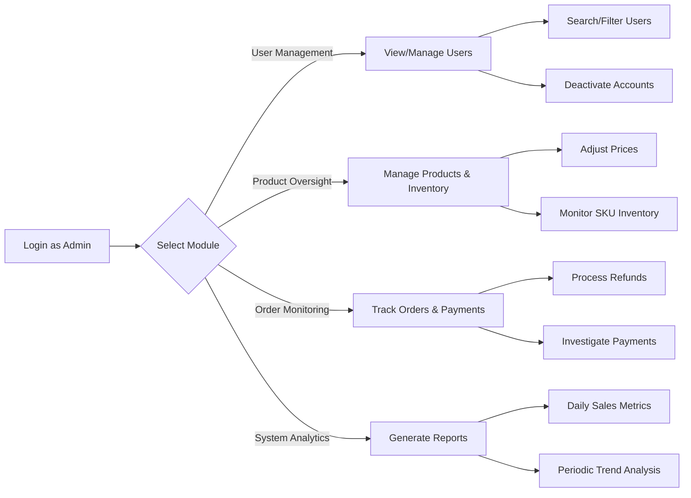

## Admin Dashboard Requirements

### Business Model

This e-commerce platform enables businesses to establish a digital storefront for selling physical products through a unified marketplace. The admin dashboard serves as the central control hub for managing all business operations including user activities, product listings, order fulfillment, and performance analytics. The dashboard is critical for maintaining platform integrity, ensuring seamless transactions, and optimizing marketplace growth.

### Core Admin Responsibilities

The admin dashboard provides comprehensive oversight required to maintain platform operations, ensure business continuity, and support business development initiatives through data-driven decision making.

### User Actor Definition: Admin

- **Name**: admin
- **Role**: System administrators with full platform access
- **Description**: Authorized personnel responsible for managing users, products, orders, and system analytics. Admins require complete visibility into all platform activities without restrictions, with specific capabilities for monitoring, intervention, and system configuration.

### Functional Requirements

#### User Management

WHEN an admin requires to view all user accounts, THE system SHALL display a complete list of users with their registration date, current activity status, and account type (customer/seller), including search functionality filtering by user name, email, or account status.

WHEN an admin attempts to deactivate a user account, THE system SHALL prompt for confirmation and require justification for deactivation, with the action recorded in audit logs.

WHEN a user's account is flagged for suspicious activity by the system, THE system SHALL notify admins in the dashboard through a dedicated alert section with recommended actions.

#### Product Oversight

WHEN an admin needs to review all active products, THE system SHALL display a paginated list with product name, category, pricing, current stock status (low inventory threshold: <5 units), and seller attribution.

WHEN an admin identifies a product with inconsistent pricing, THE system SHALL allow immediate price adjustments with approval workflow to prevent revenue leakage.

WHILE inventory is tracked at SKU level, THE system SHALL display color/size variant-specific stock levels in the product management interface, with automatic alerts when any variant falls below 5 units.

#### Order Monitoring

WHEN an admin views the order management section, THE system SHALL display orders grouped by status (new, processing, shipped, delivered, canceled), with filtering by date range and user account.

WHEN an admin needs to investigate a failed payment, THE system SHALL provide full payment transaction details including gateway response codes, transaction IDs, and user account information for resolution.

WHILE processing a refund request, THE system SHALL require admin approval with reason justification, and record the refund amount, method, and corresponding order ID in audit logs.

#### System Analytics

WHEN an admin accesses the analytics dashboard, THE system SHALL provide real-time metrics including total daily orders, revenue by category, top-selling products, and user registration trends.

WHEN an admin selects a 7-day timeframe in analytics, THE system SHALL display performance comparisons against the previous period with visual trend indicators.

WHILE viewing sales performance, THE system SHALL automatically highlight products with below-average conversion rates (<20%) and suggest potential optimization steps.

### Business Rules and Validation

**User Management Business Rules**

- An admin SHALL NOT delete user accounts, only deactivate or suspend them temporarily
- Account suspension SHALL require a mandatory reason text of at least 25 characters
- Suspended accounts SHALL automatically be reactivated after 30 days without admin intervention unless further suspension is requested

**Inventory Management Constraints**

- Stock levels SHALL be updated immediately upon order placement or product receipt
- Low stock alerts SHALL trigger when variant inventory falls to less than 5 units
- Inventory adjustments SHALL record both the change value and the admin who made the adjustment

**Payment and Refund Policies**

- Refunds SHALL require manual admin approval before processing
- Refund amounts SHALL match the original transaction value minus applicable fees
- Failed payment investigations SHALL include a timestamped audit trail of all actions taken

### Error Handling Requirements

WHEN an admin attempts to access the dashboard without authentication, THE system SHALL redirect to login screen with a friendly error message.

WHEN a requested report cannot be generated due to system load, THE system SHALL display a message indicating processing time estimate (maximum 15 minutes) and provide a retry option.

WHEN attempting to update stock levels for a product without sufficient inventory data, THE system SHALL show specific missing data requirements and prevent further progress until provided.

### Performance Requirements

WHEN loading the main dashboard, THE system SHALL display all critical metrics within 2 seconds.

WHILE browsing the product catalog, THE system SHALL load product data in batches of 25 items with no delay.

WHEN generating a complex analytics report for a 30-day period, THE system SHALL complete within 5 seconds under normal load conditions.

### Mermaid Diagram: Admin Dashboard Workflow

