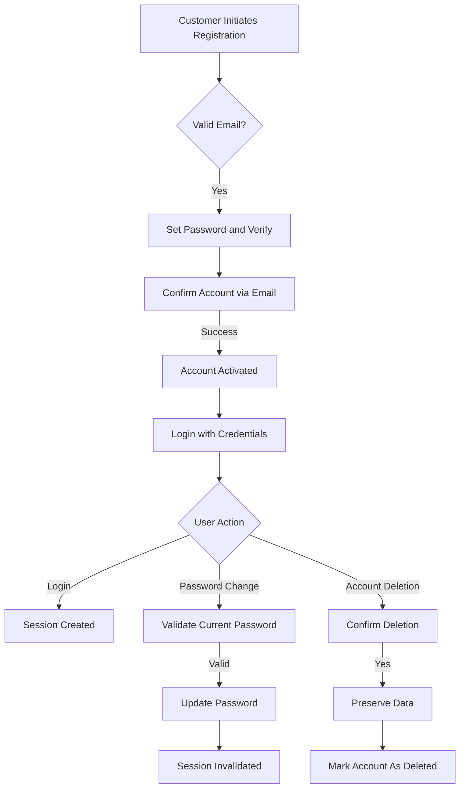
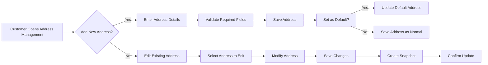
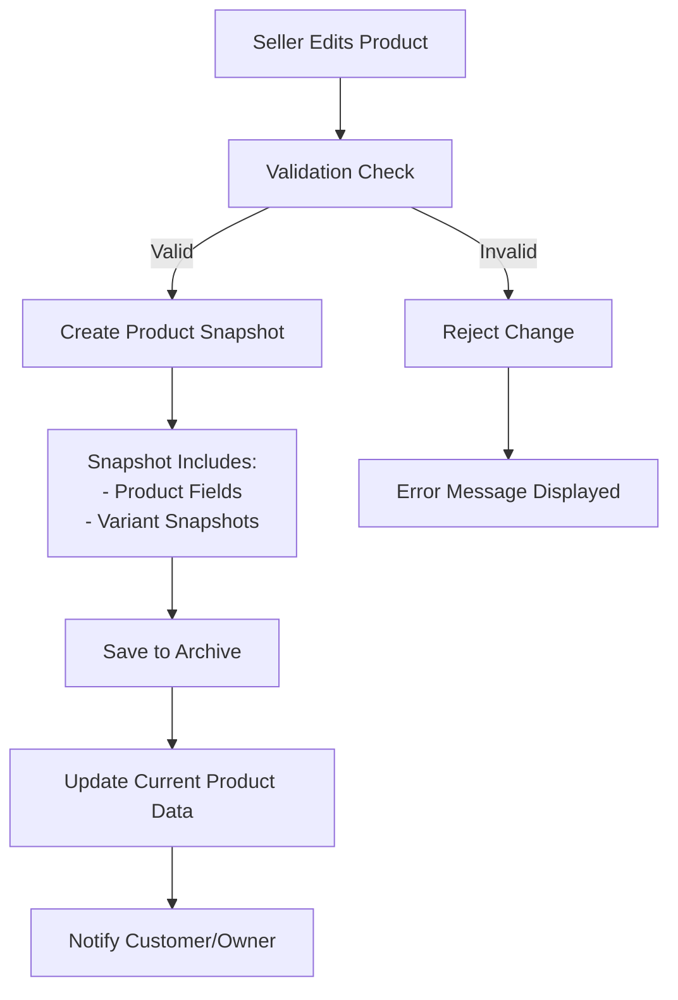

# E-Commerce Shopping Mall Platform Requirements Specification

## Customer Account Management

### Core Business Requirements

WHEN a new customer attempts to register using an email address, THE system SHALL validate the email format and ensure it's not already registered.

WHEN a customer submits a valid email and password during registration, THE system SHALL create a new account record with encrypted password storage.

WHEN a customer submits valid email and password for login, THE system SHALL authenticate credentials and issue a session token.

WHEN a customer requests password change, THE system SHALL require password confirmation before updating credentials.

WHEN a customer requests account deletion, THE system SHALL preserve profile data, order history, and reviews while marking them as associated with a deleted user.

### Business Context and Requirements

- Account creation requires email-verified sign-up for account security
- All customer accounts must use strong password requirements (minimum 12 characters, special characters)
- Account authentication uses stateless JWT tokens with 30-minute expiration
- Customer authentication must support password reset via email verification
- Account deletion follows strict legal compliance for data retention
- The platform must distinguish between customer actions and guest behaviors

### Customer Account Workflow

## Customer Profile Management

### Core Business Requirements

WHEN a customer updates their display name, THE system SHALL validate its length (min 2, max 50 characters) and disallow special characters.

WHEN a customer updates their phone number, THE system SHALL format the number according to ISO 3166-1 country codes.

WHEN a customer views their profile, THE system SHALL display the current name and phone number.

WHEN a customer has no phone number specified, THE system SHALL display 'Not provided' with a notification to update.

### Business Context and Requirements

- Profile details are required for order fulfillment and customer service
- Display name must not be identical to existing user names
- Phone number validation prevents failed deliveries
- Profile updates require immediate reflection in all customer-facing interfaces
- Profile data must be encrypted at rest and in transit

## Address Management

### Core Business Requirements

WHEN a customer adds a new shipping address, THE system SHALL validate required fields (recipient, street, city, country).

WHEN a customer selects a default address, THE system SHALL ensure only one default address exists.

WHEN a customer edits an address, THE system SHALL preserve the previous version as a snapshot.

WHEN a customer deletes an address, THE system SHALL confirm the action and update active addresses.

### Business Context and Requirements

- Multiple shipping addresses improve customer convenience for different locations
- Address validation must support local postal systems across all supported countries
- Default address must be the most frequently used shipping location
- All address modifications trigger snapshot creation for audit purposes
- Address search must support autocomplete for common locations

### Address Management Flow

## Seller Account Management

### Core Business Requirements

WHEN a new seller registers with email and password, THE system SHALL create an account with status 'pending' requiring admin approval.

WHEN an admin reviews a seller registration, THE system SHALL display rejection reasons if the request is rejected.

WHEN a seller requests account deletion, THE system SHALL verify no pending orders or pending requests exist.

WHEN a seller deletes their account, THE system SHALL preserve product data and order history in archival storage.

### Business Context and Requirements

- Seller approval adds security and quality control to the marketplace
- Rejection reasons must comply with platform policies and legal requirements
- Seller deletion requires careful validation to avoid business disruption
- The platform must track seller approval status throughout the lifecycle
- Seller profiles must be visible to customers for trust building

## Seller Profile Management

### Core Business Requirements

WHEN a seller updates their shop name, THE system SHALL validate uniqueness across all sellers.

WHEN a seller updates their shop description, THE system SHALL limit text length to 500 characters.

WHEN a seller updates their profile image, THE system SHALL resize for optimal display and store in CDN.

EVERY change to seller profile SHALL create a new snapshot of the updated content.

### Business Context and Requirements

- Shop name must be unique and reflect business identity
- Shop description must be compelling to drive customer engagement
- Profile images must meet minimum size requirements for display
- Historical snapshots enable transparency during disputes
- Seller profiles should load quickly to maintain user engagement

## Product Management and Snapshots

### Core Business Requirements

WHEN a seller edits any product property (name, description, price), THE system SHALL create a new product snapshot.

WHEN a product variant is edited, THE system SHALL include a snapshot of all variant details at the time of change.

WHEN a product is deleted, THE system SHALL preserve all product and variant snapshots.

EVERY DATA MODIFICATION MUST BE RECORDED IN A SNAPSHOT WITH THE FOLLOWING INFORMATION:
- Timestamp
- What was changed
- Previous values
- New values
- Who made the change

### Business Context and Requirements

- Snapshot preservation enables dispute resolution and historical analysis
- Snapshot data must be immutable for legal compliance
- Snapshots must be accessible to owners and administrators
- The platform must manage storage for potentially large snapshot volumes
- Product snapshots provide accurate historical pricing and availability data

### Product Snapshot Implementation

## Order Management

### Core Business Requirements

WHEN a customer places an order with payment success, THE system SHALL decrease inventory quantities for all purchased variants.

WHEN an order item is cancelled, THE system SHALL restore inventory quantities for the specific variant.

WHEN an order is updated with new status, THE system SHALL trigger relevant notifications to customers and sellers.

WHEN an order item is refunded, THE system SHALL restore inventory quantities and trigger payment reversal in payment gateway.

### Business Context and Requirements

- Order management must maintain accurate inventory counts across all variants
- Notifications improve customer experience through transparency
- Status updates must reflect order progress accurately
- Refunds must be processed immediately upon approval for customer satisfaction
- Order history must be preserved for all transactions

## Administrative Functions

### Core Business Requirements

WHEN a customer or seller requests administrator status, THE system SHALL create a pending approval request.

WHEN an admin reviews a request, THE system SHALL record the approval or rejection reason.

WHEN a seller is suspended, THE system SHALL prevent new product creation while maintaining existing order processing capability.

WHEN an admin deletes a product, THE system SHALL provide audit logging of the action.

### Business Context and Requirements

- Admin approval process must ensure platform security and quality
- Suspended sellers maintain operational integrity for existing orders
- Administrative actions must be fully traceable for compliance
- Admin interfaces must provide comprehensive oversight of all platform activities
- Policy violations require immediate administrative action with documented reasons

## Data Integrity and Compliance

### Core Business Requirements

ALL DATA MODIFICATIONS SHALL BE PRESERVED THROUGH SNAPSHOT MECHANISMS.

THE SYSTEM SHALL MAINTAIN COMPLETE AUDIT TRAILS FOR ALL DATA CHANGES.

THE SYSTEM SHALL IMPLEMENT STRONG DATA ENCRYPTION FOR ALL PERSONAL INFORMATION.

THE SYSTEM SHALL SUPPORT GDPR COMPLIANCE FOR CUSTOMER DATA RETENTION.

### Business Context and Requirements

- Data integrity is critical for maintaining trust with all users
- Compliance with global data protection regulations is mandatory
- Audit trails prevent internal and external disputes
- Encryption protects user data from unauthorized access
- Business continuity depends on reliable data preservation across all operations