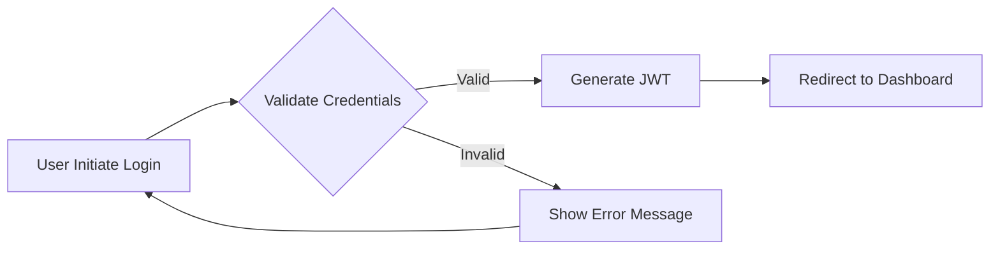

# E-Commerce Platform Requirements Analysis

## Business Model

### Why This Platform Exists
The e-commerce shopping mall platform addresses the growing demand for specialized marketplaces where independent sellers can efficiently manage product catalogs and inventory while providing customers with comprehensive shopping experiences. Current solutions either focus solely on direct sales (like Shopify) or lack robust inventory management for multi-variant products (like basic WooCommerce implementations). Our platform fills this gap by combining seamless customer journeys with granular seller inventory capabilities through a unified backend system.

### Revenue Strategy
The platform monetizes through:
- 5% commission on each successful transaction (capped at $50 per order)
- Premium seller subscription tier ($29.99/month) with advanced analytics and marketing tools
- Featured product placement in search results at $15.00 per feature per week
- API access fees for enterprise integrations ($99/month for basic, $299/month for premium)

### Success Metrics
- **Active Customer Base**: 50,000+ monthly active users within first year
- **Seller Adoption**: 5,000+ verified seller accounts in first 18 months
- **Order Volume**: 10,000+ orders processed monthly at peak
- **Customer Retention**: 30% repeat purchase rate within 3 months

## User Actors & Permissions

### Core Actor Definitions
- **Customer**: Basic authenticated user for browsing, purchasing, and managing personal data
- **Seller**: Business user for product management, inventory management, and sales analytics
- **Admin**: System overseer for platform management and security

### Permission Matrix
| Feature | Customer | Seller | Admin |
|---------|----------|--------|-------|
| Register & Manage Account | ✅ | ✅ | ✅ |
| Browse Product Catalog | ✅ | ✅ | ✅ |
| Add to Shopping Cart | ✅ | ❌ | ❌ |
| View Order History | ✅ | ✅ | ✅ |
| Manage Product Inventory | ❌ | ✅ | ❌ |
| Generate Sales Reports | ❌ | ✅ | ✅ |
| View All Orders | ❌ | ❌ | ✅ |
| Approve/Deny Seller Accounts | ❌ | ❌ | ✅ |

### Authentication Flow

