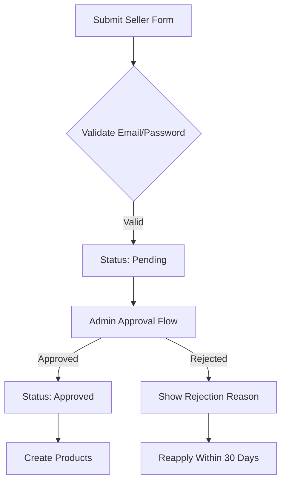

# E-Commerce Shopping Mall Platform

## 1. Functional Requirements Specification

### 1.1 Customer Account Management

#### 1.1.1 Account Creation and Authentication
- WHEN a new user submits registration form, THE system SHALL require valid email and password (minimum 8 characters, including numbers/symbols)
- THE system SHALL validate email format against RFC 5322 standards
- WHEN registration is successful, THE system SHALL send confirmation email with activation link
- WHEN user attempts to log in with invalid credentials, THE system SHALL display "Email or password incorrect" within 1.5 seconds

#### 1.1.2 Account Deletion
- WHEN a customer requests account deletion, THE system SHALL:
  - Verify no active orders with paid/shipped status exist
  - Verify no pending cancellation/refund requests exist
  - Display confirmation modal: "Permanently delete account? This will preserve all order history for legal purposes"
- WHEN deletion is confirmed, THE system SHALL:
  - Mark account status as 'deleted' with timestamp
  - Preserve all order history and reviews with 'deleted user' display
  - Remove personal data from profile fields (phone, address)
- THE system SHALL NOT allow deletion if any condition is unfulfilled

### 1.2 Customer Profile Management

#### 1.2.1 Profile Editing
- WHEN customer updates profile, THE system SHALL:
  - Validate display name (3-50 characters, alphanumeric with spaces)
  - Validate phone number (E.164 format, country code included)
  - Create snapshot with before/after values and timestamp
  - Preserve all previous profile versions
- THE system SHALL display "Profile updated. New version saved" confirmation
- WHEN a profile version is viewed, THE system SHALL show "View previous versions" link

### 1.3 Address Management

#### 1.3.1 Address Workflow
- WHEN customer adds shipping address, THE system SHALL:
  - Require recipient name, street address, city, country
  - Validate postal code against country-specific format
  - Allow multiple addresses (max 5 per customer)
- WHEN customer sets default address, THE system SHALL:
  - Update default address flag
  - Display "Default address changed" notification
  - Clear default from other addresses
- WHEN address is deleted, THE system SHALL:
  - Verify no active orders use this address
  - Remove address from customer profile
  - Preserve address data in history records

### 2. Seller Account Management

#### 2.1 Seller Registration Workflow


- WHILST account status is 'pending', THE system SHALL:
  - Restrict all seller features (product listing, order management)
  - Prevent login attempts with 'pending' status
  - Display message: "Seller account verification pending. Please wait for admin approval."
- WHEN admin rejects registration, THE system SHALL:
  - Require rejection reason (minimum 10 characters)
  - Store rejection reason in historical records
  - Send email notification to seller

#### 2.2 Seller Product Management
- WHEN seller attempts to create product with 'pending' status, THE system SHALL:
  - Display error: "Seller account not approved. Please wait for admin approval."
  - Block product creation
  - Log access attempt timestamp
- WHEN seller deletes product, THE system SHALL:
  - Verify no pending order items exist for any variant
  - Verify no pending cancellation/refund requests exist
  - Delete variant and inventory records
  - Preserve product and variant snapshots
  - Remove product from search category listings

### 3. Snapshot Policy Implementation

#### 3.1 Snapshot Creation Triggers
| Business Action | Snapshot Type | Preservation Period |
|-----------------|---------------|---------------------|
| Account deletion | User profile | Permanent |
| Profile edit | Profile version | 10 years |
| Product edit | Product variant | Permanent |
| Order item status change | Order item snapshot | 7 years |

#### 3.2 Snapshot Data Requirements
- ALL snapshots SHALL include:
  - Timestamp (ISO 8601 format)
  - User ID who initiated change
  - Before value (JSON blob)
  - After value (JSON blob)
  - Action type (create/update/delete)
- THE system SHALL NOT allow snapshot deletion or modification
- WHEN viewing snapshot, THE system SHALL display difference between versions

### 4. Business Process Coverage

#### 4.1 Account Deletion Workflow
```mermaid
graph TB
  A[User Requests Deletion] --> B{Verify Pending Orders?}
  B -->|Yes| C[Show Error: "Pending orders exist"]
  B -->|No| D{Verify Pending Requests?}
  D -->|Yes| E[Show Error: "Pending requests exist"]
  D -->|No| F[Confirm Deletion]
  F --> G[Mark Account Deleted]
  G --> H[Preserve Order History]
  H --> I[Update UI: "Deleted User"]
```

#### 4.2 Seller Approval Workflow
- ADMINISTRATOR sees pending requests:
  - Registration date/time
  - Submitted email
  - Shop name
  - Status (pending/approved/rejected)
- WHEN admin approves:
  - Send confirmation email
  - Update status to 'approved'
  - Grant product creation permissions
- WHEN admin rejects:
  - Require reason text (min 10 chars)
  - Send rejection email with reason
  - Allow reapplication within 30 days

### 5. Validation Constraints

#### 5.1 Required Validation Rules
| Field | Validation Rules | Error Message |
|-------|------------------|---------------|
| Password | 8+ chars, min 1 number, 1 symbol | "Password must be 8+ characters including numbers and symbols" |
| Phone | E.164 format with country code | "Invalid phone number format" |
| Shop Name | 3-30 chars, alphanumeric | "Shop name must be 3-30 characters, alphanumeric only" |
| Postal Code | Country-specific pattern | "Invalid postal code for selected country" |

#### 5.2 Error Handling Requirements
- ALL error messages SHALL be displayed within 2 seconds of user action
- ERROR states SHALL NOT include technical details
- Error states SHALL provide actionable guidance (e.g., "Fix password format")
- USER session SHALL NOT be terminated on validation errors

## 6. Business Rules Summary

### 6.1 Core Constraints
- **Account deletion preserves historical data**: Order history and reviews remain accessible but marked as deleted
- **Seller approval required for all features**: Pending statuses restrict all business operations
- **Snapshot immutability**: Once created, snapshots cannot be modified or deleted
- **Product deletion requires multiple verifications**: Orders and requests must be resolved first

### 6.2 Data Preservation Logic
- Order history, snapshots, and historical data ARE preserved for legal compliance
- Deletion of user account only affects active profile data, not historical records
- Seller account status (suspended/pending) affects feature availability but not historical data access

> *This document defines business requirements only. All technical implementations are the responsibility of the development team. No database schemas or API specifications are included as they are handled in subsequent pipeline phases.*