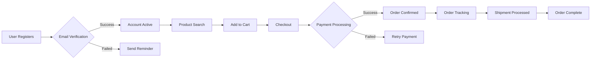
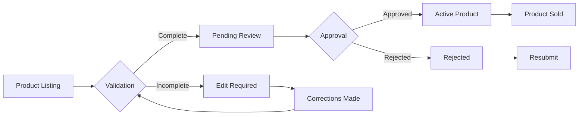

# E-commerce Shopping Mall Platform - Requirements Analysis Document

## 1. Functional Requirements Overview

This document specifies comprehensive business requirements for the e-commerce shopping mall platform, following the EARS (Event-Condition-Action-Response) format for all requirements. All requirements are presented in natural language with business context and specific measurable criteria.

## 2. User Management

### 2.1 User Registration and Authentication

**Event-driven Requirement**: WHEN a new user attempts to register for the platform, THE system SHALL:

- Collect required user information including name, email, and password
- Validate email format as a business email address (not personal domains like gmail)
- Send account verification email with a 24-hour validity period
- Create user account in "UNVERIFIED" state until email verification completes
- Store passwords using industry-standard hashing with minimum 128-bit salt

**State-driven Requirement**: WHILE the user's account is in "UNVERIFIED" state, THE system SHALL:

- Prevent access to any commerce features
- Allow account verification via email link or code entry
- Send reminder email after 2 hours of pending verification
- Allow password reset requests through the verification email flow

**Performance Requirement**: FOR 95% of new registrations, THE system SHALL complete account creation within 3 seconds.

### 2.2 Address Management

**Event-driven Requirement**: WHEN a user adds or edits shipping address, THE system SHALL:

- Enforce address fields including street, city, postal code, and country
- Validate postal codes using country-specific patterns
- Allow users to set default addresses for primary shipping method
- Store address history for all users for reference

**Error Handling**: IF the system detects invalid postal code format for country, THEN THE system SHALL prevent submission and display specific error: "Invalid postal code format for [Country]. Please use standard format."

## 3. Product Catalog Management

### 3.1 Product Catalog and Search

**Event-driven Requirement**: WHEN a user conducts product search, THE system SHALL:

- Allow search by product name, category, or keyword
- Filter results by price range (minimum $5.00 to maximum $5,000.00)
- Order results by relevance (popularity, newest, best-rated)
- Display clear product thumbnails with minimum 1000x1000 pixel resolution

**Business Requirement**: THE system SHALL provide "show more" or pagination for product listings with 20+ items per page.

**Performance Requirement**: FOR common search queries (with 5+ results), THE system SHALL return results within 2 seconds.

### 3.2 Product Variants (SKU) Management

**Event-driven Requirement**: WHEN a seller adds a new product variant, THE system SHALL:

- Generate SKU based on product ID + color/size combination
- Store variant-specific inventory quantity (must be positive integer)
- Apply product price variation based on variant (e.g., $5.00 for colors, $10.00 for sizes)
- Ensure variant availability status syncs with inventory count

**State-driven Requirement**: WHILE a variant has inventory count below 5 items, THE system SHALL:

- Display "Low stock" badge on product page
- Notify seller via email with SKU and current quantity
- Prevent adding to cart when inventory is 0

## 4. Shopping Experience

### 4.1 Shopping Cart and Wishlist

**Event-driven Requirement**: WHEN a user adds product to cart, THE system SHALL:

- Verify product availability for requested quantity
- Calculate subtotal, tax, and shipping costs in real-time
- Store cart contents for anonymous users via session ID
- Allow adding multiple variants to cart (e.g., same product different colors)

**Business Requirement**: THE system SHALL allow users to save cart for future use for 14 days.

**Error Handling**: IF a user attempts to add out-of-stock item to cart, THEN THE system SHALL:

- Prevent adding to cart
- Identify specific out-of-stock variant
- Suggest similar available products
- Display error: "Product variant is currently out of stock. Available versions: [List]"

### 4.2 Order Placement and Processing

**Event-driven Requirement**: WHEN a user proceeds to checkout, THE system SHALL:

- Verify all items in cart have sufficient inventory
- Display full order summary with itemized pricing
- Allow selection of shipping method (standard, express, pickup)
- Require shipping address selection if none previously saved

**State-driven Requirement**: WHILE order is in "ORDER_CONFIRMED" state, THE system SHALL:

- Prevent modification of order contents
- Display order tracking details from shipping provider
- Allow cancellation ONLY within 15 minutes of confirmation
- Initiate payment processing upon confirmation

**Performance Requirement**: FOR 95% of checkout processes, THE system SHALL complete place order within 3 seconds.

## 5. Order Management

### 5.1 Order Tracking and Shipping Status

**State-driven Requirement**: WHEN order status transitions to "SHIPPED", THE system SHALL:

- Capture carrier tracking number in system
- Update order tracking page with carrier name and tracking link
- Display estimated delivery window using carrier standard
- Allow customers to request shipping speed changes with fee calculation

**Performance Requirement**: FOR 95% of shipping updates from carriers, THE system SHALL display updated tracking info within 1 hour.

### 5.2 Product Reviews and Ratings

**Event-driven Requirement**: WHEN a user completes a purchase, THE system SHALL:

- Trigger review request after 7 days (to give time for experience)
- Allow rating on 1-5 scale with star visual feedback
- Require review text of minimum 50 characters
- Apply review moderation rules before public display

**Moderation Rules**: IF review text contains personal information or profanity, THEN THE system SHALL:

- Prevent review submission
- Display specific error message
- Suggest edits to remove prohibited content

## 6. Seller Management

### 6.1 Seller Product Management

**Event-driven Requirement**: WHEN a seller accesses their product management dashboard, THE system SHALL:

- Display their active, pending, and rejected products
- Allow bulk update of product prices or variants
- Show inventory levels for each SKU
- Provide sales metrics for each product

**Business Rule**: THE system SHALL allow seller to mark products as "sold out" when inventory reaches 0.

### 6.2 Inventory Management

**Event-driven Requirement**: WHEN an order is confirmed, THE system SHALL:

- Reduce inventory count for each purchased SKU by ordered quantity
- Update inventory status across all product views
- Trigger supplier notification when inventory drops below 5 items

**Performance Requirement**: FOR 95% of order confirmations, THE system SHALL complete inventory update within 2 seconds.

## 7. Order History and Support

### 7.1 Order History and Cancellations

**Event-driven Requirement**: WHEN a user requests order cancellation, THE system SHALL:

- Verify cancellation eligibility (within 15 minutes of confirmation)
- Calculate refund amount based on order status
- Process refund within payment provider's 24-hour window
- Notify user of cancellation confirmation with tracking ID

**State-driven Requirement**: WHILE order is in "CANCELLED" state, THE system SHALL:

- Prevent further modifications to order details
- Display "Cancelled" status with reason on order history
- Allow request for full refund after return process completes

### 7.2 Refund and Return Requests

**Event-driven Requirement**: WHEN a user initiates refund request, THE system SHALL:

- Verify refund request eligibility (within 30 days of order completion)
- Capture product condition details
- Request proof of purchase for review
- Allow request for store credit option if full refund not eligible

**Business Requirement**: THE system SHALL process valid refund requests within 72 hours.

## 8. Admin Management

### 8.1 Admin Dashboard

**Event-driven Requirement**: WHEN an admin accesses the dashboard, THE system SHALL:

- Display key metrics: daily orders, sales volume, new users
- Allow filtering of orders by status, date, or product category
- Show inventory alerts for low-stock items
- Provide user management tools for account actions

**Business Requirement**: THE system SHALL refresh key metric dashboard views every 5 minutes.

## 9. Mermaid Diagrams for Workflow Validation

> *Important Note: This document specifies business requirements only. Technical implementation details (database design, APIs, etc.) are reserved for development team. All requirements are in natural language and follow EARS format for specificity and testability.*