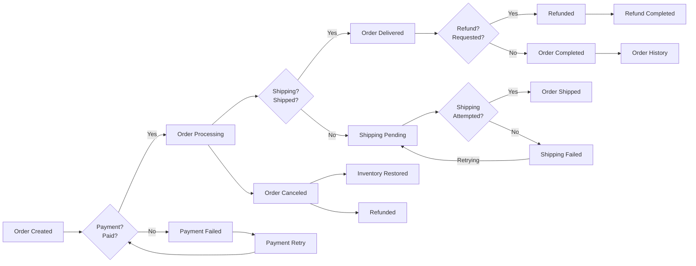

## Business Rules and System Constraints Analysis

### Business Model
The shoppingMall platform addresses three core market needs:
- Enables small businesses to sell physical products online without complex technical setup
- Provides customers with a streamlined shopping experience including variant selection and address management
- Creates monetization opportunities through transaction fees (5%) on seller product sales

Key value proposition: A single platform where sellers can manage products and inventory while customers enjoy shopping features like product variants and wishlist functionality, all within a unified commerce ecosystem.

### User Actor Permissions
All permissions are defined in business terms with clear boundaries between actors:

#### Customer
- Can register, login, and manage multiple addresses
- Can view product catalog and place orders
- Can add to cart and wishlist
- Can create order within 24 hours of cart creation
- Can cancel orders within 2 hours of placement
- Can request refunds for undelivered orders only
- Cannot view seller inventory management tools

#### Seller
- Can register with business documentation validation
- Can manage product catalog including categories and variants
- Can track inventory at SKU level (colors/sizes)
- Can view sales reports for their products
- Can set product prices and discounts (up to 20%)
- Cannot access customer addresses or order financials
- Can create product variants with pre-defined option lists

#### Admin
- Can view all user accounts and manage permissions
- Can oversee all product catalog entries
- Can process order cancellations beyond customer limits
- Can manage payment gateway configurations
- Can generate system-wide analytics reports
- Can deactivate sellers and customers for policy violations

### Transaction Rules

#### Order Cancellation Policy
WHEN a customer attempts to cancel an order more than 2 hours after placement, THE system SHALL display 'Order cancellation period has expired' and prevent cancellation.
WHEN a customer successfully cancels an order within 2 hours, THE system SHALL update inventory for all products in the order and refund any processed payments.
WHEN an admin cancels an order for policy violations, THE system SHALL notify the customer with 'Order canceled by platform administrator', update inventory, and process refund.

#### Payment Processing
WHEN a customer initiates payment, THE system SHALL redirect to configured payment gateway (Stripe/PayPal) and require successful processor response.
IF payment processing fails after three attempts, THEN THE system SHALL display 'Payment failed - please try another payment method' and prevent order completion.
WHEN payment is successfully processed, THE system SHALL create payment record with timestamp, transaction ID, and amount.

#### Inventory Management
WHEN a customer selects a product variant (e.g., 'Red, Size M'), THE system SHALL check available inventory count for that SKU.
IF inventory count is zero, THE system SHALL display 'Product variant unavailable' and prevent selection.
WHEN inventory reaches 10 units or below, THE system SHALL notify seller via email with 'Inventory low for [Product Name]'.

### Error Handling Scenarios

#### Order Processing Errors
WHEN a customer attempts to add out-of-stock product to cart, THE system SHALL display 'This variant is currently unavailable' immediately.
WHEN a customer submits an order with invalid address format, THE system SHALL display 'Please enter a valid address format with postal code' and highlight the field.
WHEN a payment gateway is unavailable, THE system SHALL display 'Payment service temporarily unavailable - please try again shortly' without allowing order submission.

#### Authentication Errors
WHEN a user attempts to log in with incorrect credentials, THE system SHALL display 'Email or password is incorrect. Please try again.'
WHEN a user submits a password reset request for an unregistered email, THE system SHALL display 'No account found with this email address' without specifying which field is invalid.
WHEN a user's session expires during checkout, THE system SHALL redirect to login page with 'Your session has expired. Please log in to continue.'

#### Seller Management Errors
WHEN a seller tries to set invalid variant options (e.g., color 'Red' with size 'X-Large'), THE system SHALL display 'Invalid combination - please select color and size from provided lists' and prevent submission.
WHEN a seller attempts to list a product with duplicate SKU, THE system SHALL display 'SKU [value] already in use' and require correction.

### System Performance Requirements

#### User Experience
WHEN a customer searches for products, THE system SHALL load results within 1.5 seconds for 95% of queries.
THE system SHALL maintain responsive shopping cart updates during product selection with less than 0.5 second delay.
WHEN displaying product categories on homepage, THE system SHALL load all categories within 1 second.

#### Bulk Actions
WHEN generating monthly sales report, THE system SHALL complete within 10 seconds during off-peak hours (1-3 AM UTC).
THE system SHALL handle 100+ product variant updates within 5 seconds during bulk inventory management.

#### Error Recovery
WHEN a payment processor is temporarily unavailable, THE system SHALL retry up to 3 times with increasing 3-second intervals before failing.
WHEN multiple address management attempts occur within 30 seconds, THE system SHALL rate limit to 2 attempts per 10 seconds to prevent abuse.

### Order Status Workflow

