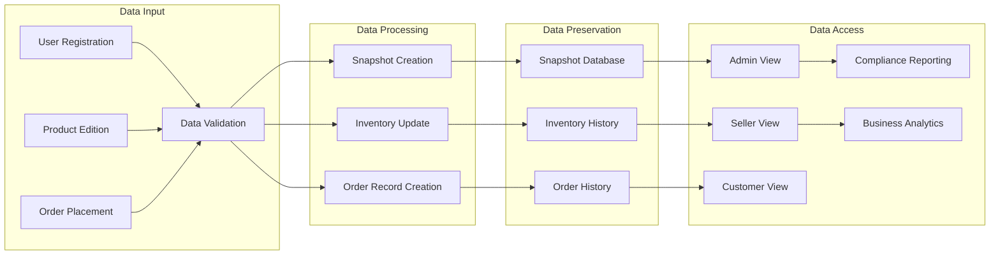

# E-Commerce Shopping Mall Platform - Requirements Specification

## Introduction
This document defines the comprehensive business requirements for the E-Commerce Shopping Mall Platform, focusing on business value and user experience. The platform enables registered customers to browse products, purchase from verified sellers, and manage their shopping experience, while sellers can list products and manage their shops under administrative oversight.

## 1. Service Overview

### 1.1 Core Value Proposition
WHEN a customer visits the platform, THE system SHALL provide a comprehensive marketplace connecting buyers and verified sellers with a focus on secure transactions and reliable delivery. THE platform SHALL support multi-vendor product listings with consistent quality and compliance with legal requirements.

### 1.2 Target Audience and Use Cases
THE platform primarily serves:
- Customers seeking diverse products from verified sellers
- Sellers establishing online marketplaces for product sales
- Administrators ensuring platform compliance and seller quality

A standard user journey includes:
1. Customer registration → Product search → Purchase → Order tracking
2. Seller registration → Product listing → Order processing → Shop management

## 2. Customer Account Management

### 2.1 Account Creation and Activation
WHEN a new customer provides email and password, THE system SHALL store the email (hashed) and password (hashed with bcrypt) in the database while initializing the account status to 'pending'.

IF the email already exists in the system, THEN THE system SHALL return an error message indicating 'Email already registered'.

### 2.2 Account Modification and Deletion
WHEN a customer changes their profile information (display name or phone number), THE system SHALL create a snapshot recording the previous values and new values.

WHEN a customer initiates account deletion, THE system SHALL preserve all profile information as "deleted user" while removing active access privileges. All order history, reviews (as deleted), and address records SHALL be preserved for legal compliance.

### 2.3 Password Management
WHEN a customer requests a password change, THE system SHALL validate the current password, then prompt for a new password conforming to security policies. THE system SHALL store the new password (hashed) and invalidate all current sessions.

## 3. Seller Account Management

### 3.1 Seller Registration Process
WHEN a new seller submits registration details, THE system SHALL create a pending status record with the provided information, requiring administrator approval.

IF the email is already registered as a customer, THEN THE system SHALL reject the registration with an error message specifying 'Email already registered as customer'.

### 3.2 Approval and Suspension Process
WHEN an administrator approves a seller account, THE system SHALL update the status to 'approved' and grant full seller privileges including product listing.

WHEN an administrator rejects a seller registration, THE system SHALL send a notification with the rejection reason and update the status to 'rejected'. Rejected sellers SHALL be permitted to re-apply with new information.

### 3.3 Account Termination
WHEN a seller requests account deletion, THE system SHALL verify that:
- All orders for product listings have shipped or been canceled
- No active cancellation or refund requests exist for their products

IF requirements are satisfied, THE system SHALL preserve all product listings as historical records while removing active access. Products SHALL remain visible as 'historical' in search results.

## 4. Product Management

### 4.1 Product Creation and Modification
WHEN a seller creates a new product, THE system SHALL record all product fields (name, description, category, base price) in the current product record. All required fields SHALL be verified before processing.

WHEN a seller edits any product field, THE system SHALL create a complete product snapshot including all fields and variants' current state. The snapshot SHALL include timestamp, user who made modifications, and previous/new values.

### 4.2 Product Availability and Visibility
IF a product's primary variant has stock quantity greater than zero, THEN THE system SHALL display the product in search results and category listings. A warning SHALL be shown for 'out of stock' variants.

WHEN a product has no variants, THE system SHALL display it as 'unavailable' with a message indicating 'No available variants for this product' and prevent purchase.

### 4.3 Product Deletion Requirements
WHEN a seller attempts to delete a product, THE system SHALL verify all product variants have zero pending orders. THE system SHALL check for any pending cancellation or refund requests for any variant of the product.

IF verification succeeds, THE system SHALL preserve all product snapshots, variant snapshots, and inventory history for legal audit purposes while deleting the active product record.

## 5. Order Processing

### 5.1 Order Creation and Status Transition
WHEN an order is placed successfully, THE system SHALL record the current product, variant, and seller profile snapshots with each order item. The exact price, product description, and seller image at time of purchase SHALL be preserved as historical data within the order item.

WHEN order item status changes (from paid to shipped to delivered), THE system SHALL maintain all previous status history as historical data. Each transition SHALL require valid authorization based on the current actor privileges.

### 5.2 Order Cancellation and Refund Processing
WHEN a customer requests cancellation for an item with status 'paid', THE system SHALL create a cancellation request record with the reason. THE seller SHALL be notified and may approve or reject the request.

IF the seller approves, THEN the item SHALL be cancelled and a refund processed for that item only. Stock quantities SHALL be restored through inventory records. The remaining items in the order SHALL continue processing normally.

## 6. Data Lifecycle & Snapshots

### 6.1 Snapshot Creation and Management
WHEN any editable data is modified, THE system SHALL automatically create a snapshot recording:
- Timestamp of the change
- Fields that were modified
- Values before and after change
- User who made the change

THE system SHALL maintain all snapshots indefinitely without deletion, modification, or expiration. Only authorized actors (customers, administrators) may view relevant snapshots.

### 6.2 Snapshot Data Preservation
THE system SHALL preserve snapshots for:
- Product modifications (all fields and variants)
- Seller profile edits (shop name, description, logo)
- Order items (product, variant, and seller profile at time of purchase)
- Reviews (rating, text content)
- Cancellation/refund requests (reason, status changes)

### 6.3 Data Flow Diagram

## 7. Shopping Functionality

### 7.1 Product Search and Filtering
WHEN a customer searches for products, THE system SHALL return results showing:
- Main product image
- Product name
- Base price (or price range for variants)
- Seller shop name
- Average rating (if reviews exist)

CUSTOMERS SHALL be able to filter results by:
- Category (single selection)
- Price range (minimum and maximum values)
- In-stock only (boolean filter)

### 7.2 Wishlist and Cart Management
WHEN a customer adds a product to their wishlist, THE system SHALL record the product ID and associated account. Products SHALL be displayed in the wishlist with main images and names.

WHEN a customer views their cart, THE system SHALL show:
- Product name and variant options
- Quantity, price, and subtotal per item
- Total price for all items

IF a variant's stock is less than the cart quantity, THE system SHALL show a warning message indicating 'Item quantity exceeds available stock'.

## 8. Admin Management

### 8.1 Administrative Privileges
WHEN an administrator is promoted to super administrator, THE system SHALL grant all administrator privileges including the ability to promote/demote administrators.

SUPER administrators SHALL be unable to promote or demote themselves.

### 8.2 Seller and Product Oversight
WHEN an administrator views a seller's account, THE system SHALL display:
- Account status (pending, approved, suspended, rejected)
- Product count (active)
- Pending cancellation requests
- Pending refund requests

ADMINISTRATORS SHALL be able to force-cancel individual items or entire orders for any product across all sellers.

## 9. Additional Requirements

### 9.1 Security Policies
THE system SHALL implement:
- Password policies (minimum 8 characters, mixed case, special characters)
- Session management (expiration after 30 minutes of inactivity)
- Rate limiting on login attempts (5 attempts per minute)

### 9.2 Performance Requirements
THE system SHALL:
- Load product listings within 1.5 seconds for 95% of searches
- Process order creation within 500ms on average
- Support 1,000 concurrent users during peak hours without degradation

This document represents the complete business requirements specification for the E-Commerce Shopping Mall Platform, designed to guide the development team through implementation with no ambiguity or missing requirements. All specified business rules, user workflows, and data management policies are now fully defined and ready for technical implementation.