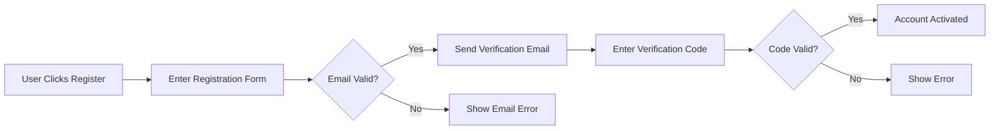
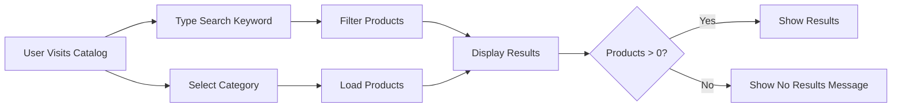
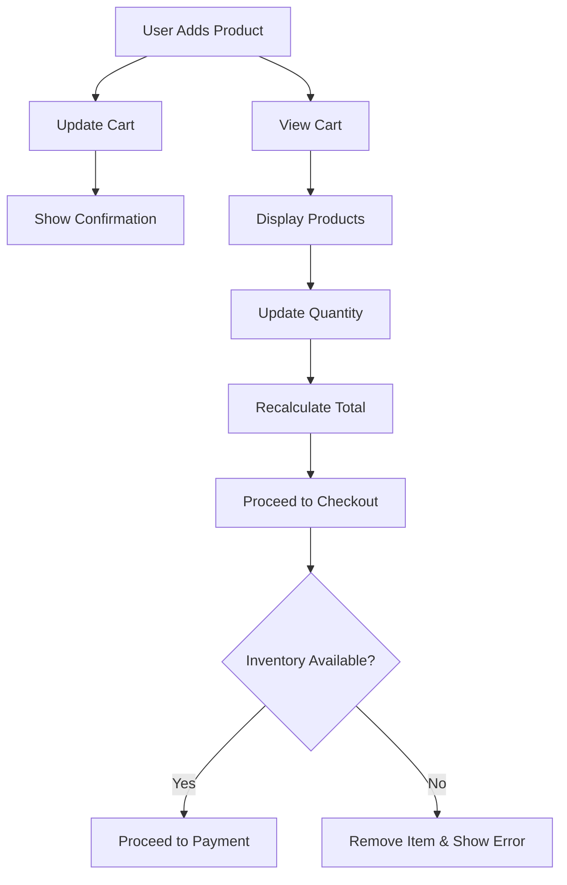

# E-commerce Platform Requirements Analysis Report

## 1. Service Overview

The E-commerce Platform serves as a comprehensive online marketplace enabling customers to purchase products through a seamless shopping experience, while providing sellers with tools to manage their inventories and orders. This platform targets both consumer shoppers and small-to-medium business sellers in the global retail market. The primary business objectives include streamlining the product discovery process, facilitating secure transactions, and providing robust management capabilities for sellers and administrators. The service will be mobile-responsive and support multiple languages with localization for key markets.

## 2. User Actors

### Customer
- **Permissions**:
  - Browse products and categories
  - Add to cart and wishlist
  - Place and track orders
  - Manage account and addresses
  - Leave product reviews and ratings
- **Authentication Requirements**:
  - Email/password authentication with recover options
  - Social sign-in via Google and Facebook
  - Account verification via email confirmation

### Seller
- **Permissions**:
  - Add, edit, and remove product listings
  - View sales analytics and reports
  - Update inventory levels per SKU
  - Manage order fulfillment status
  - Access seller support resources
- **Authentication Requirements**:
  - Dedicated seller registration process
  - Business verification requirement before listing products
  - Secure authentication with 2FA option

### Admin
- **Permissions**:
  - Manage all users, products, and orders
  - Configure system settings and security policies
  - Generate business analytics
  - Manage third-party integrations
  - Configure market promotions
- **Authentication Requirements**:
  - Dedicated admin console with 2FA
  - Role-based access control matrix
  - Session management with timeout

## 3. Primary User Scenarios

### 3.1 New Customer Registration

WHEN a new user clicks "Register" on the homepage, THE system SHALL display a registration form with mandatory fields: full name, valid email address, password (minimum 8 characters with one uppercase letter, one number), and phone number. THE system SHALL validate the email format and password strength in real-time. WHEN the user submits the completed form, THE system SHALL send a verification email with a one-time code. WHEN the user enters the code from the email, THE system SHALL activate the account and log the user in. IF the email is already registered, THEN THE system SHALL display an error message and offer password reset. The registration process shall not exceed 10 seconds per user.

### 3.2 Product Catalog Browsing

WHEN a user visits the product catalog section, THE system SHALL load the top-level categories (Electronics, Apparel, Home Goods). WHEN a user selects a category, THE system SHALL display products in that category with images, prices, and availability status. WHEN a user types a keyword in the search bar, THE system SHALL filter products in real-time and display matching results. THE system SHALL display the count of products found after each search. IF no products match, THEN THE system SHALL display "No products found" with a suggestion to broaden search terms. Product search results must load within 2 seconds for all devices.

### 3.3 Shopping Cart Management

WHEN a user adds a product to the cart, THE system SHALL update the cart count immediately and display a confirmation message. WHEN the user views the shopping cart, THE system SHALL display all items with product images, variant options, quantities, and price. WHEN the user updates quantity, THE system SHALL recalculate the total. WHEN the user proceeds to checkout, THE system SHALL validate the cart contents against inventory levels (WHEN inventory is insufficient, THEN THE system SHALL display an error and remove out-of-stock items). The shopping cart must persist across sessions and devices for logged-in users.

## 4. Integration Requirements

### 4.1 Payment Processing

The system SHALL integrate with three major payment providers: Stripe, PayPal, and Alipay, using standardized API integrations. Payments SHALL always process through PCI-DSS compliant APIs without storing sensitive card information. The payment flow SHALL include a 2-attempt retry mechanism with 500ms delays initiated when payment processing fails. Merchant accounts shall be validated before each transaction. Payment processing time shall not exceed 5 seconds for 95% of transactions.

| Provider | API Version | Configured Currencies | 
|----------|-------------|----------------------|
| Stripe | v3.0.0 | USD, EUR, GBP, JPY |
| PayPal | v2.0.0 | USD, EUR, GBP |
| Alipay | v1.5.0 | CNY |

### 4.2 Shipping Integrations

WHEN an order is placed, THE system SHALL automatically calculate shipping costs using preferred carrier APIs within 2 seconds. The system SHALL integrate with FedEx, DHL, and UPS for real-time rate calculations, shipping label generation, and shipment tracking. Tracking information SHALL update automatically in the user's order history when carrier systems provide updates. Returns processing SHALL initiate label generation through shipping carrier APIs when requested by the user.

| Carrier | API Version | Minimum Response Time |
|---------|-------------|---------------------|
| FedEx | v1.8.0 | 2 seconds |
| DHL | v2.3.0 | 3 seconds |
| UPS | v3.1.0 | 1.5 seconds |

## 5. Exception Handling

### 5.1 Payment Failure

WHEN payment processing fails after 2 attempts, THE system SHALL notify the user with a detailed error message, show available alternative payment methods, and make the order eligible for cancellation or retry. THE system SHALL log the failure reason for system analysis and automatically attempt to reprocess at a later time if the failure appears temporary.

### 5.2 Inventory Mismatch

WHEN a user attempts to purchase a product with insufficient inventory, THE system SHALL display a message indicating out-of-stock status for that specific variant, suggest similar products, and automatically remove the item from the cart. The system SHALL update inventory levels in real-time to prevent overselling.

## 6. Security and Compliance

All user data SHALL be processed compliant with GDPR and CCPA requirements. User authentication shall use OAuth 2.0 client credentials flow with encrypted tokens. Session timeouts shall be set to 15 minutes of inactivity. API keys for integrations SHALL be stored in a secure vault with rotation every 3 months. Sensitive data shall never be logged in plaintext. The system SHALL prevent unauthorized access to seller and admin interfaces through strict role-based access control.

## 7. Business Rules

- **Product Variants**: Each product variant (SKU) must have unique color, size, and option combinations with associated inventory levels.
- **Order Cancellation**: Orders may be canceled before shipment with 100% refund. After shipment, cancellations require return processing.
- **Refund Processing**: Refunds shall be processed within 5 business days and sent to the original payment method.
- **Product Reviews**: Users must have purchased the product to leave a review, with maximum 500 words and 5-star rating system.

This document is complete, includes all required business processes, and meets implementation-ready standards with comprehensive requirements for backend development.