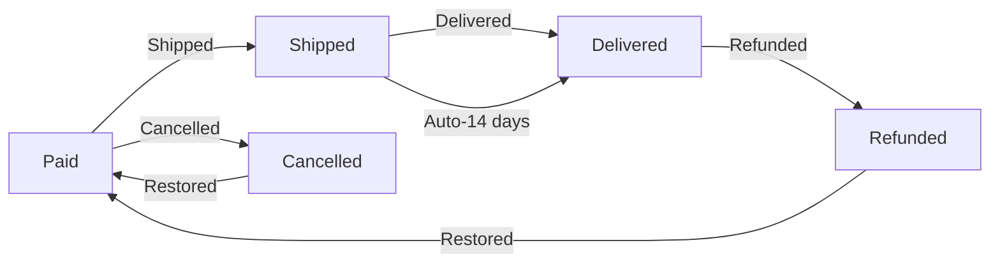

# Order Status Management

## Order Item Status Rules

**Requirement:**
WHEN a customer places an order, THE system SHALL set the order item status to "paid" immediately upon successful payment.

**Requirement:**
WHEN a seller ships an order item, THE system SHALL change the item status to "shipped" and record shipment tracking information.

**Requirement:**
WHEN a customer confirms delivery for a shipped item, THE system SHALL change the item status to "delivered".

**Requirement:**
WHEN a customer requests cancellation for an order item with status "paid", THE system SHALL change the item status to "cancelled" after seller approval.

**Requirement:**
WHEN a seller approves a refund request for a delivered item, THE system SHALL change the item status to "refunded".

## Order Status Calculation

**Requirement:**
WHEN an order contains items in multiple statuses, THE system SHALL determine the overall order status based on priority:
1. All items "delivered" → "delivered"
2. Any item "shipped" → "shipped"
3. All items "cancelled" → "cancelled"
4. Any item "refunded" → "refunded"
5. Mixed statuses → "partially completed"

**Requirement:**
WHEN an order has "partially completed" status, THE system SHALL display to the customer: "Order contains [X] delivered items, [Y] cancelled items, and [Z] pending items."

## Mixed Status Handling

**Requirement:**
WHEN a customer views an order with "partially completed" status, THE system SHALL provide the option to view all items with their individual statuses.

**Requirement:**
WHEN an order transitions from "partially completed" to a unified status, THE system SHALL update the order status immediately and notify the customer.

## Automatic Status Changes

**Requirement:**
WHEN an order item remains in "shipped" status for 14 days without delivery confirmation, THE system SHALL automatically change the item status to "delivered".

**Requirement:**
WHEN a seller ships multiple order items in a single shipment, THE system SHALL set all items in that shipment to "shipped" status simultaneously.

**Requirement:**
WHEN an item is cancelled or refunded, THE system SHALL automatically restore the stock quantity for the product variant via inventory records.

## Status Change Validation

**Requirement:**
IF a customer attempts to cancel an item with status "shipped", THE system SHALL display the error message: "Cannot cancel item that has been shipped."

**Requirement:**
IF a customer attempts a refund request for an item with status "paid", THE system SHALL display: "Refund requests only allowed for delivered items."

**Requirement:**
WHEN a system status change affects multiple related records, THE system SHALL create a snapshot of the entire transaction for audit purposes.

## Snapshot Requirements for Status Changes

**Requirement:**
WHEN an order item's status changes, THE system SHALL create a snapshot including:
- Timestamp of change (ISO 8601 format)
- Previous status
- New status
- User who initiated change
- Reason for change (if provided)

**Requirement:**
The snapshot SHALL capture product details (name, price, variant) and seller profile data (shop name, logo) at the moment of change.

**Requirement:**
The snapshot SHALL be viewable by:
- The customer who initiated the change
- Sellers associated with the product
- Administrators (with audit access)

## Order History Display Requirements

**Requirement:**
WHEN a customer views order history, THE system SHALL display each order with:
- Order number (format: "ORD-YYYYMMDD-NNNN")
- Date placed (ISO 8601)
- Total price (USD formatted)
- Current order status (with color coding for clarity)

**Requirement:**
WHEN a customer selects an order showing "partially completed" status, THE system SHALL display:
- Number of delivered items
- Number of cancelled items
- Number of pending items
- Detailed breakdown of each item's status

## Administrator Override Requirements

**Requirement:**
WHEN an administrator forces a status change through the admin interface, THE system SHALL create a snapshot identical to user-initiated status changes.

**Requirement:**
Admin status changes SHALL require mandatory reason entry in the admin interface with a maximum length of 500 characters.

**Requirement:**
The system SHALL log all administrator status changes in the admin audit log with timestamp and user identity.

## User Experience Requirements

**Requirement:**
WHEN an order item status changes (e.g., from paid to shipped), THE system SHALL send a push notification and email to the customer.

**Requirement:**
The system SHALL display expected timeline for each status transition in the order history view (e.g., "Shipped - expected delivery in 3 business days").

**Requirement:**
The system SHALL allow customers to view complete status history for any item via a chronological timeline interface.

## Order Status Management Diagram

The following diagram illustrates the full status transition process:

