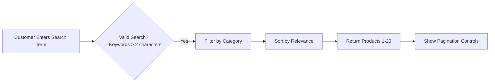
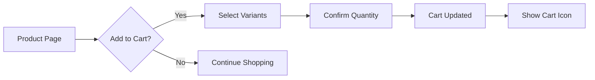
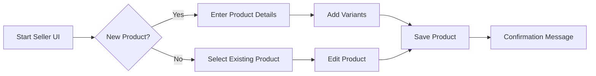
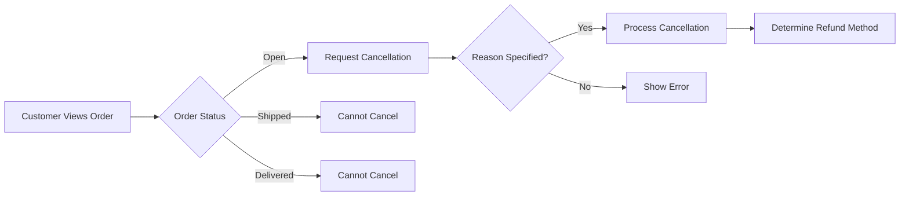
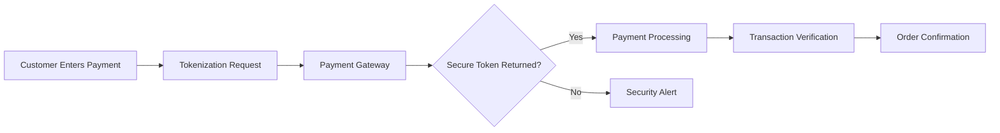

# E-Commerce Shopping Mall Platform Requirements Analysis

## Executive Summary
The E-Commerce Shopping Mall Platform is designed to provide a comprehensive solution for online shopping with robust user management, product catalog, and order processing capabilities. This analysis documents all essential business requirements to guide backend development.

## Service Vision & Overview
The platform aims to create seamless shopping experiences for customers while providing sellers with efficient inventory and order management tools. The system will support 10,000+ concurrent users with 99.5% uptime and process 500+ orders daily with under 3-second response times.

## Core Value Proposition
The platform delivers:
- Unified experience for customers across product discovery, ordering, and post-purchase services
- Intuitive seller tools for product management and inventory tracking
- Robust security and compliance with global data protection standards
- Scalable architecture supporting future integrations with payment and shipping services

## User Actors & Permissions

### Customer Workflow Requirements
WHEN a customer registers with valid email and password, THE system SHALL create a new account with the provided email and password, ensuring the email is unique across the platform.

WHEN a customer searches for products using keywords, THE system SHALL return results within 2 seconds, filtering by active categories and applying automatic spelling correction.

WHEN a customer adds a product variant to their cart, THE system SHALL immediately update the cart total and display the change without page refresh.

### Seller Capabilities Requirements
WHEN a seller adds a new product, THE system SHALL validate all required fields including product name, category, SKU variants, and initial inventory.

WHEN a seller updates stock levels for a product variant, THE system SHALL prevent negative inventory and automatically adjust available quantity.

WHEN a seller requests order cancellation, THE system SHALL verify the order status (only open orders can be canceled) and initiate the process.

### Admin Privileges Requirements
WHEN an admin creates a new user account, THE system SHALL assign initial permissions based on role (customer, seller, admin) and require email verification.

WHEN an admin views platform metrics, THE system SHALL display real-time statistics on registrations, active orders, payment success rates, and system uptime.

## Primary User Scenarios

### Product Search Journey

WHEN a customer enters a search term with 3+ characters, THE system SHALL return results within 1.5 seconds based on matching product names, descriptions, and categories.

WHEN the search returns no results, THE system SHALL suggest similar products based on popular items in the category.

### Shopping Cart Path

WHEN a customer adds an item to cart with selected variants, THE system SHALL display a confirmation toast and update the cart count immediately.

## Secondary User Scenarios

### Seller Product Management

WHEN a seller attempts to create a new product, THE system SHALL require a unique product name (2-100 characters) across categories.

WHEN a seller specifies product variants, THE system SHALL validate each variant has unique color-size combination and numeric pricing.

### Order Cancellation Path

WHEN a customer clicks "Cancel Order" on an open order, THE system SHALL require a minimum 5-character cancellation reason.

## Exception Handling

### Payment Failure Scenarios
WHEN payment processing fails due to insufficient funds, THE system SHALL display "Your payment was declined due to insufficient funds. Please verify your account balance or try an alternative payment method."

WHEN payment gateway times out, THE system SHALL automatically retry once within 10 seconds before showing error, with option to "Retry Payment" or "Select Different Payment Method."

### Inventory Mismatch
WHEN an order processing fails due to inventory inconsistency, THE system SHALL hold the order for 15 minutes to recheck stock levels, then cancel if still unavailable.

## Security Protocols

### Data Protection Requirements
WHEN collecting personal data, THE system SHALL obtain explicit consent for non-essential information and retain data only as long as necessary.

WHEN a customer requests account deletion, THE system SHALL comply within 72 hours and confirm deletion to the user.

### Payment Security
THE system SHALL never store raw card details or CVV codes. All payment data transmission SHALL occur over TLS 1.2+ encryption.

## Business Rules Summary
- All product variants require unique color-size combinations (e.g., 'Red-S')
- Order cancellation is allowed only on 'Open' status orders
- Inventory deductions happen only after payment confirmation
- Refund processing completed within 72 hours
- 5 failed login attempts within 15 minutes locks account for 30 minutes

## Compliance Standards
The platform will comply with:
- GDPR for European users with automatic data collection notices
- CCPA for California residents with 'Do Not Sell My Information' option
- PCI-DSS standards for payment processing

This document serves as the authoritative requirements specification for backend developers to guide the implementation of the E-Commerce Shopping Mall Platform.