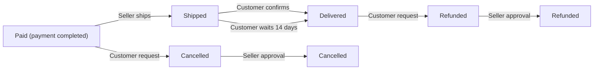

# 11-Order Management Requirements

## Order Creation Process

### Core Order Creation Requirements

- **WHEN** a customer proceeds to checkout with valid cart items (at least one in-cart item with sufficient stock), **THE** system **SHALL** create a new order record with status "paid" for payment processing.
- **WHEN** payment processing succeeds (after third-party gateway confirmation), **THE** system **SHALL**:
  - Deduct stock quantities from all purchased variants via negative inventory records (quantity = -purchased quantity)
  - Remove purchased items from customer cart (cart item count updated to zero)
  - Create order items with status "paid"
  - Save product snapshots (including all variant states at time of purchase) with each order item
  - Save seller profile snapshots (including shop name and logo at time of purchase) with each order item
- **WHEN** payment processing fails (gateway returns error or timeouts after 3 attempts), **THE** system **SHALL** not create an order and return HTTP 402 error code with "Payment declined - please try another method" message.

## Order Item Tracking Requirements

### Individual Item Management

- **EACH** order item **MUST** have:
  - Unique product variant identifier (e.g., 70a08d8b-5a1a-4d2e-94e2-3c3e9d1f0a9c)
  - Quantity purchased (≥1)
  - Price at time of purchase (float, USD)
  - Status ("paid", "shipped", "delivered", "cancelled", "refunded")
- **WHEN** an order item is cancelled, **THE** system **SHALL** restore stock quantities via positive inventory records (quantity = +original purchased quantity)
- **WHEN** a refund is processed for an item, **THE** system **SHALL** restore stock quantities via positive inventory records (quantity = +original purchased quantity)

### Status Transition Rules

**Status Transition Business Rules**:
- **WHEN** all order items are "delivered", **THE** system **SHALL** set overall order status to "delivered".
- **WHEN** any item is "shipped" and no items are delivered yet, **THE** system **SHALL** set order status to "shipped".
- **WHEN** payment has been made but no items are shipped, **THE** system **SHALL** set order status to "paid".
- **WHEN** any item transitions to "cancelled" or "refunded", **THE** system **SHALL** set order status to "partially completed".

## Shipping and Tracking Requirements

### Multi-Seller Order Handling

- **WHEN** an order contains items from multiple sellers (e.g., 2 sellers), **THE** system **SHALL** automatically create separate shipments for each seller.
- **WHEN** a seller ships items, **THE** system **SHALL**:
  - Group all order items from same seller into single shipment
  - Assign unique carrier and tracking number (e.g., FedEx: 940012345678)
  - Update all grouped items' status to "shipped"
- **WHEN** a shipment's carrier is "USPS", **THE** system **SHALL** use USPS-specific tracking format (e.g., 94001234567890123456).

### Tracking Management

- **WHERE** shipment tracking information exists (carrier + tracking number), **THE** system **SHALL** display full tracking details to customers on order history page.
- **WHEN** a shipment is created, **THE** system **SHALL** require mandatory carrier selection (dropdown: FedEx, UPS, USPS) and 10+ character tracking number.
- **WHEN** order items have shipping status "shipped", **THE** system **SHALL** prevent customers from changing shipping address or adding/removing items in cart.

## Cancellation Handling Requirements

### Item-Level Cancellation

- **WHEN** an order item has status "paid" and the seller has not shipped it, **THE** system **SHALL** allow cancellation requests from customer.
- **WHEN** a cancellation request is submitted (within 24 hours of payment), **THE** system **SHALL**:
  - Create snapshot of current state (request status, time, reason)
  - Notify seller via email ("Cancellation requested for order #12345 item B")
  - Allow seller to approve/reject within 48 hours
- **IF** seller approves cancellation within 48 hours, **THEN** the system **SHALL**:
  - Update order item status to "cancelled"
  - Create positive inventory record (quantity = +purchased quantity)
  - Initiate partial refund to customer
- **IF** all order items are cancelled, **THEN** the system **SHALL** set overall order status to "cancelled" and notify customer via email.

## Refund Processing Requirements

### Item-Level Refund

- **WHEN** an order item has status "delivered" and the customer requests refund within 7 days of delivery, **THE** system **SHALL** allow refund requests.
- **WHEN** a refund request is submitted, **THE** system **SHALL**:
  - Create snapshot of current state (request status, time, reason)
  - Notify seller via email ("Refund requested for order #12345 item C")
  - Allow seller to approve/reject within 72 hours
- **IF** seller approves refund within 72 hours, **THEN** the system **SHALL**:
  - Update order item status to "refunded"
  - Create positive inventory record (quantity = +purchased quantity)
  - Process full refund amount to customer
- **IF** all order items are refunded, **THEN** the system **SHALL** set overall order status to "refunded".

## Order History Management Requirements

### Customer Order Visibility

- **WHEN** a customer views order history, **THE** system **SHALL** display:
  - Order number (format: OR-YYYYMMDD-NNNN)
  - Order date (ISO 8601 format)
  - Total price (USD, formatted as $XX.XX)
  - Overall status (e.g., "delivered", "partially completed")
- **WHEN** a customer views a specific order (e.g., OR-20240206-0001), **THE** system **SHALL** display:
  - Product images (150x150px thumbnail)
  - Product names and descriptions
  - Variant details (e.g., "Red / Large")
  - Current item status (e.g., "delivered")
  - Shipping address (full address string)
  - List of shipments with carrier names and tracking numbers
- **WHEN** an order's status changes (e.g., paid → shipped), **THE** system **SHALL** update the customer's order history view within 5 seconds via real-time notification.

## Inventory Impact Requirements

### Stock Management

- **WHEN** an order is placed successfully, **THE** system **SHALL** create negative inventory record for each purchased variant (quantity = -purchased quantity)
- **WHEN** a cancellation is approved, **THE** system **SHALL** create positive inventory record for restored stock (quantity = +purchased quantity)
- **WHEN** a refund is processed, **THE** system **SHALL** create positive inventory record for restored stock (quantity = +purchased quantity)
- **WHEN** variant stock reaches 0, **THE** system **SHALL** mark variant as "out of stock" (display "Not Available" in product listings).

## Snapshot Integration Requirements

### Order-Level Snapshots

- **WHEN** order is created, **THE** system **SHALL** create snapshot of:
  - Product data (name, description, images at time of purchase)
  - Variant data (SKU, price, options at time of purchase)
  - Seller profile data (shop name, logo URL at time of purchase)
- **WHEN** order item status changes (e.g., paid → shipped), **THE** system **SHALL** create snapshot of current state.
- **WHEN** cancellation request is submitted, **THE** system **SHALL** create snapshot of request state (reason, time, customer ID).
- **WHEN** refund request is submitted, **THE** system **SHALL** create snapshot of request state (reason, time, customer ID).

## Status Consistency Rules

- **ALL** order status **MUST** accurately reflect status of all order items (no discrepancies).
- **WHEN** any item's status changes, **THE** system **SHALL** recalculate and update overall order status immediately.
- **IF** any item transitions to "cancelled" or "refunded", **THEN** the system **SHALL** consider the order status as "partially completed".
- **IF** any item transitions to "paid", **THEN** the system **SHALL** consider it as active order processing state.

## Performance Requirements

- **WHEN** a customer views their order history (up to 20 orders), **THE** system **SHALL** load results within 2 seconds (95% percentile).
- **WHEN** an order detail page is accessed (for OR-20240206-0001), **THE** system **SHALL** render all 10 items within 3 seconds (95% percentile).
- **WHEN** a shipment tracking update is made (e.g., shipped → delivered), **THE** system **SHALL** reflect the change in real-time to customer (1 second max latency).

## Error Handling Requirements

- **IF** stock is insufficient for order item (e.g., 0 stock available), **THEN** the system **SHALL** display error: "Item [name] stock limit reached. Please select fewer units or choose another variant." and prevent checkout.
- **IF** payment fails multiple times (3 attempts), **THEN** the system **SHALL** limit retries to 3 and display: "Payment failed. Please try another payment method."
- **IF** cancellation request has expired (more than 24 hours), **THEN** the system **SHALL** show error: "Cancellation request has expired. Contact support for assistance."
- **IF** refund request has expired (more than 7 days), **THEN** the system **SHALL** show error: "Refund request has expired. Contact support for assistance."

## Data Integrity Requirements

- **ALL** order management operations **MUST** maintain data integrity (ACID-compliant atomic operations).
- **NO** order item **SHALL** be modified after order is created (e.g., price change, quantity adjustment).
- **WHEN** snapshots are created, **THE** system **SHALL** make them immutable (no editing or deletion possible).
- **WHEN** a product is deleted, **THE** system **SHALL** preserve all product snapshots related to orders (including historical prices and variants).