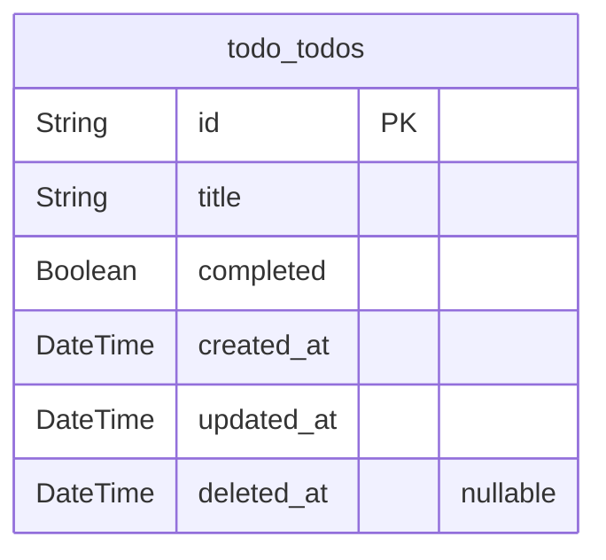

# Prisma Markdown

> Generated by [`prisma-markdown`](https://github.com/samchon/prisma-markdown)

- [Todo](#todo)

## Todo

### `todo_todos`

Represents individual to-do items with their title and completion status.

Properties as follows:

- `id`: Primary Key.
- `title`: The to-do item title, required for each item.
- `completed`: Whether the to-do item has been completed (true) or not (false).
- `created_at`: The timestamp when the to-do item was created.
- `updated_at`: The timestamp when the to-do item was last updated.
- `deleted_at`: The timestamp when the to-do item was deleted (soft delete).
