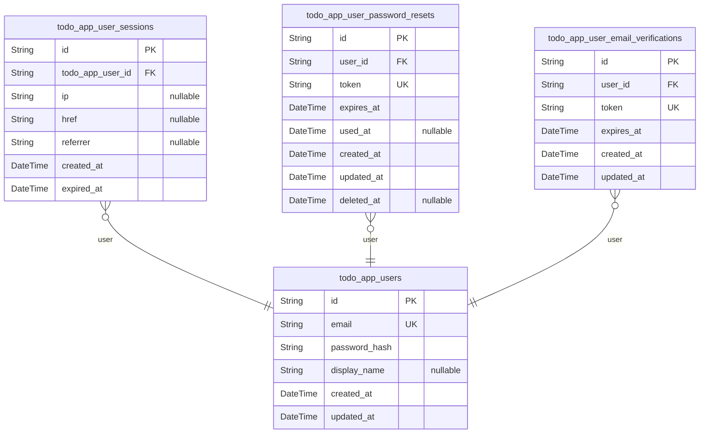
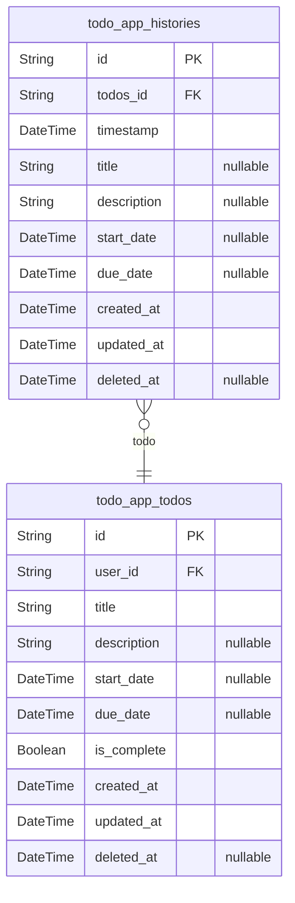

# Prisma Markdown

> Generated by [`prisma-markdown`](https://github.com/samchon/prisma-markdown)

- [Actors](#actors)
- [Todo](#todo)

## Actors

### `todo_app_users`

User accounts with email/password credentials, verification status, and
display name. Serves as the primary identity record for all
authentication flows and permission structures. All business operations
related to user accounts originate from this model.

Key relationships:
- Governed by session table: todo_app_user_sessions
- Manages password reset tokens via: todo_app_user_password_resets
- Handles email verification via: todo_app_user_email_verifications
- User-owned todos tracked through: todo_app_todos table

Properties as follows:

- `id`: Primary Key.
- `email`
  > Registered email address used for account identification. Must be unique
  > across all user accounts.
- `password_hash`: Securely hashed password representation. Never stores plaintext passwords.
- `display_name`
  > User's customizable display name visible to other users. Max 30
  > characters.
- `created_at`: Timestamp when the user account was created.
- `updated_at`: Timestamp when user profile was last modified.

### `todo_app_user_sessions`

JWT session tokens with access and refresh capabilities for authenticated
user sessions.

Properties as follows:

- `id`: Primary Key.
- `todo_app_user_id`: The user associated with this session.
- `ip`: IP address used during login.
- `href`: Current URL of the session.
- `referrer`: Referrer URL for the session.
- `created_at`: Session creation time.
- `expired_at`: Session expiration time.

### `todo_app_user_password_resets`

Password reset tokens with 15-minute expiration and usage tracking.

Properties as follows:

- `id`: Primary Key.
- `user_id`
  > The user associated with this password reset token. {@link
  > todo_app_users.id}.
- `token`: The unique password reset token for user account restoration.
- `expires_at`: Expiration timestamp in UTC. Valid for 15 minutes from token creation.
- `used_at`
  > Timestamp when the reset token was used to successfully update the
  > password.
- `created_at`: Timestamp when this password reset record was created.
- `updated_at`
  > Timestamp when this password reset record was last updated (e.g., expiry
  > reset).
- `deleted_at`: Timestamp when this password reset record was soft deleted.

### `todo_app_user_email_verifications`

Email verification tokens with expiration for registration completion.

Properties as follows:

- `id`: Primary Key.
- `user_id`: User who requested email verification. [todo_app_users.id](#todo_app_users)
- `token`: Unique verification token for email validation.
- `expires_at`: Expiration timestamp of the verification token.
- `created_at`: Timestamp of token creation.
- `updated_at`: Timestamp of last update to the token record.

## Todo

### `todo_app_histories`

Audit log of all todos' edit history, capturing field changes including
title, description, start date, and due date. Each history entry
references the corresponding todo and stores the timestamp of the edit.
Maintains temporal data including creation and update times, with
optional soft deletion support for the history entry itself.

Properties as follows:

- `id`: Primary Key.
- `todos_id`: The todo this history entry belongs to. [todo_app_todos.id](#todo_app_todos)
- `timestamp`: The timestamp of when the edit event occurred.
- `title`: Previous value of the title field before edit.
- `description`: Previous value of the description field before edit.
- `start_date`: Previous value of the start date field before edit.
- `due_date`: Previous value of the due date field before edit.
- `created_at`: Timestamp when the history entry was created.
- `updated_at`: Timestamp of the last update to the history entry.
- `deleted_at`: Timestamp when the history entry was soft-deleted (if applicable).

### `todo_app_todos`

User-owned todo records with title, status, dates, and soft-delete tracking.

This table represents the core business entity for todo management,
allowing users to create, filter, sort, and manage their todos with full
soft-delete support. All todos are bound to a single user via user_id
foreign key. The table maintains historical state through soft-deletion
and is intended for independent CRUD operations via API endpoints.

Properties as follows:

- `id`: Primary Key.
- `user_id`: Owner user's [todo_app_users.id](#todo_app_users).
- `title`: Todo title (up to 150 characters)
- `description`: Todo description (optional)
- `start_date`: Start date for the todo
- `due_date`: Due date for the todo
- `is_complete`: Completion status (default false)
- `created_at`: Record creation timestamp
- `updated_at`: Record last update timestamp
- `deleted_at`: Soft delete timestamp (null for active records)
