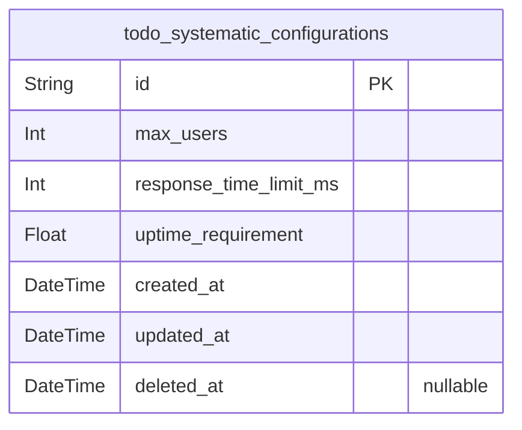
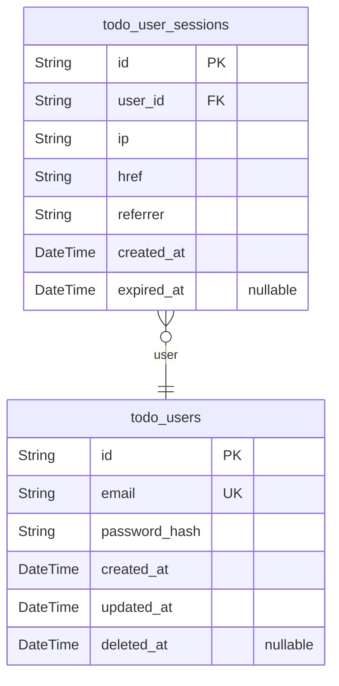

# Prisma Markdown

> Generated by [`prisma-markdown`](https://github.com/samchon/prisma-markdown)

- [Systematic](#systematic)
- [Actors](#actors)
- [Tasks](#tasks)

## Systematic

### `todo_systematic_configurations`

Central storage for all system-wide configuration parameters, including
capacity limits, performance thresholds, and uptime requirements that
define the operating parameters for the application. This table is
managed directly by administrators through dedicated API endpoints for
system configuration management. Stores critical service parameters that
affect platform behavior and user experience.

All configuration values are business-critical system settings that
require administrative oversight and direct management. The singleton
nature of this configuration table ensures central governance of system
parameters while maintaining historical context through temporal fields.

Properties as follows:

- `id`: Primary Key.
- `max_users`
  > Maximum number of registered users allowed in the system. Reflects
  > capacity limits for user management and resource allocation.
- `response_time_limit_ms`
  > Maximum acceptable response time in milliseconds for all user-facing API
  > operations. Sets performance requirements for system operations.
- `uptime_requirement`
  > Required system uptime percentage with measured over time periods.
  > Business metric for service availability commitments.
- `created_at`: Timestamp when the configuration record was initially created.
- `updated_at`: Timestamp when the configuration record was last modified.
- `deleted_at`
  > Timestamp when the record was soft-deleted. Empty indicates current
  > active configuration.

## Actors

### `todo_users`

Platform users with authentication credentials and profile information
for the Todo application.

Represents authenticated users who can create, manage, and interact with
to-do items within the platform. Users are the core entities for
authentication, session management, and identity concerns.

Each user record contains secure password hashing for authentication,
email for account identification, and temporal tracking for user
lifecycle management. The system supports user account creation, login,
and account management flows through this table.

Soft deletion is implemented to maintain audit trails while enabling
account management operations such as temporary deactivation without data
loss.

Properties as follows:

- `id`: Primary Key.
- `email`
  > User's email address used for authentication. Must be unique across all
  > users.
- `password_hash`: Securely hashed password. Never store plaintext passwords.
- `created_at`: User account creation timestamp.
- `updated_at`: Timestamp of the last account modification.
- `deleted_at`: Timestamp when the account was soft-deleted.

### `todo_user_sessions`

Authentication sessions for users, tracking login state and token validity.

This table stores session data for user authentication including
connection context, IP tracking, and session management. Each session is
explicitly linked to a user through the user_id foreign key, and sessions
are managed through the identity system rather than being independently
managed by users.

The table includes all required fields as specified in the session
pattern documentation: IP address, connection URL, referrer, creation
timestamp, and session expiration timestamp. Session timestamps are
managed as required to enable tracking and expiry logic. The composite
index on user_id and created_at facilitates efficient querying of active
sessions and session history per user.

Properties as follows:

- `id`: Primary Key.
- `user_id`: Authenticated user's [todo_users.id](#todo_users).
- `ip`: IP address of client connecting to the application.
- `href`: Connection URL used to establish the session.
- `referrer`: Referrer URL that led to the session creation.
- `created_at`: Session creation time.
- `expired_at`
  > Session expiration time. Allows for timer-based management to conserve
  > resources.

## Tasks

### `todo_tasks`

Core user task storage for to-do management with title, completion
status, and audit timestamps.

Stores all user-created tasks with their associated title, completion
status, and lifecycle timestamps. Each task is independent and can be
managed without dependency on other entities. Support for soft deletion
maintains audit trails while allowing content moderation. The title field
implements strict 1-100 character validation as specified in
requirements.

Tasks maintain their state across platform updates, ensuring historical
accuracy for completed items. Users can create, search, filter, and
manage tasks independently, including performing actions on tasks
regardless of their completion status. The system tracks task creation
and modification times for analytics and support purposes.

Properties as follows:

- `id`: Primary Key.
- `title`
  > Task title description with 1-100 character length limit. Represents
  > user's main task summary that appears in list views.
- `completed`
  > Indicates task completion status. True = task completed, False = task
  > pending.
- `created_at`
  > Timestamp when the task was created. Always populated when task is first
  > created.
- `updated_at`
  > Timestamp when the task was last modified. Updated on any change to title
  > or status.
- `deleted_at`
  > Timestamp when task was logically deleted for audit trail purposes. Null
  > = active task.
