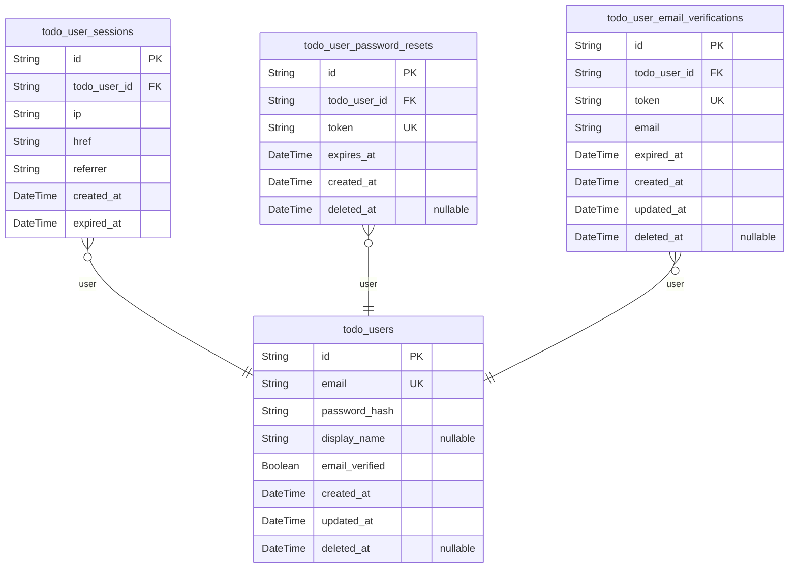
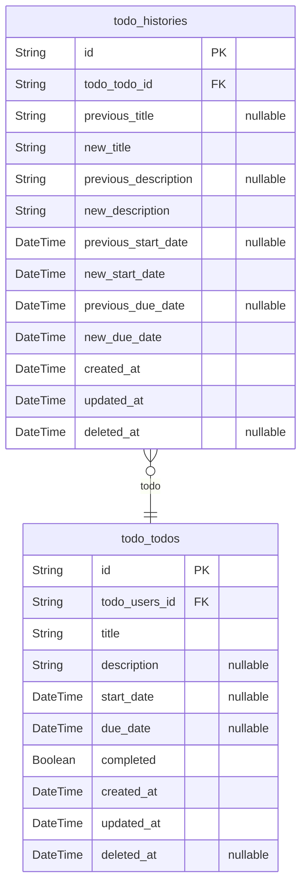

# Prisma Markdown

> Generated by [`prisma-markdown`](https://github.com/samchon/prisma-markdown)

- [Actors](#actors)
- [Todos](#todos)

## Actors

### `todo_users`

User account profiles with email authentication and profile information
for the todo application.

Stores verified user details including email, password hash for secure
authentication, and optional profile display name. Each user account is
uniquely identified and requires email verification before full access.

Email verification status is tracked to prevent unauthorized access. User
accounts support soft deletion through the deleted_at field while
preserving historical user data. The user's display name can be
optionally set but is only visible to the user themselves.

Properties as follows:

- `id`: Primary Key.
- `email`: Email address for login and verification, must be unique across all users.
- `password_hash`
  > Secure hash of user's password for authentication, never stored as
  > plaintext.
- `display_name`: Optional public display name visible only to the user themselves.
- `email_verified`: Indicates if the user has completed email verification process.
- `created_at`: Timestamp when user account was created.
- `updated_at`: Timestamp when user account details were last updated.
- `deleted_at`
  > Timestamp when user account was soft deleted. Null indicates active
  > account.

### `todo_user_sessions`

JWT session tokens for user authentication with access and refresh
tokens, 15-minute expiration.

Stores connection metadata for user login sessions including IP address,
connection URL, and referrer URL. Each session is tied to a specific user
account and expires after 15 minutes for security.

Uses append-only audit trail pattern with created_at and expired_at
timestamps. Follows strict authorization session management standards for
the todo application.

Properties as follows:

- `id`: Primary Key.
- `todo_user_id`: User of this session's [todo_users.id](#todo_users).
- `ip`: Client IP address used to establish the connection.
- `href`: Original connection URL used during session establishment.
- `referrer`: Source URL that referred the user to this connection.
- `created_at`: Timestamp when the session was created.
- `expired_at`: Timestamp when the session expires after 15 minutes.

### `todo_user_password_resets`

Stores password reset tokens for users with expiration times to securely
reset user account passwords.

Each token is uniquely associated with a user account and automatically
expires after a predefined period. Tokens are generated during password
recovery workflows and require verification before resetting credentials.
The table supports soft deletion to manage expired or canceled tokens
without data loss.

This table is managed through the user account entity and requires no
independent API endpoints.

Relationship summary:
- One user can have multiple password reset tokens (1:N)
- Tokens reference user account for validation context

Properties as follows:

- `id`: Primary Key.
- `todo_user_id`: User's ID this password reset is for. [todo_users.id](#todo_users).
- `token`
  > Unique token string generated for password reset process. Must be long
  > and cryptographically secure for security.
- `expires_at`
  > Expiration timestamp of the password reset token. After this time, the
  > token becomes invalid for password resets.
- `created_at`: Timestamp when the password reset token was generated.
- `deleted_at`
  > Timestamp when the token was deleted (soft delete). If non-null, token is
  > considered expired or canceled.

### `todo_user_email_verifications`

Email verification tokens used during user registration to confirm new
account activation.

Stores tokens generated when users sign up for the application, requiring
email verification before account activation. Each token includes an
expiration to prevent abuse and ensure timely verification.

Tokens are tied to specific user accounts and emails, with expiration
automatically triggering token invalidation after a set period. The
system does not store personal identity data beyond the email address
associated with the token.

Soft deletion is supported to maintain audit trails while allowing token
cleanup, with records kept for historical analysis of verification
attempts.

Properties as follows:

- `id`: Primary Key.
- `todo_user_id`
  > User account associated with this verification request. {@link
  > todo_users.id}.
- `token`
  > Unique verification token string. Must be cryptographically secure and
  > unique across all tokens.
- `email`
  > Email address being verified. Must match the email used during
  > registration.
- `expired_at`
  > Token expiration timestamp. MUST NOT NULL as tokens must expire for
  > security.
- `created_at`: Timestamp when token was generated.
- `updated_at`
  > Timestamp of last token update (should match creation if token doesn't
  > change).
- `deleted_at`: Timestamp when token was soft-deleted (NULL for active tokens).

## Todos

### `todo_todos`

Main table for storing all user todo items with required title, optional
description, start and due dates, and completion status.

Each todo item belongs to a single user and is initially created with
incomplete status by default. The table supports soft deletion to allow
trashing items without permanent removal.

Todos can be searched across all items regardless of parent context,
supporting independent user management and API operations.

Properties as follows:

- `id`: Primary Key.
- `todo_users_id`: Owner's [todo_users.id](#todo_users).
- `title`: Title of the todo item. Required for creation, cannot be blank.
- `description`: Optional description of the todo item. Can be left empty or empty string.
- `start_date`
  > Optional start date for the todo item. Can be left empty if not
  > applicable.
- `due_date`: Optional due date for the todo item. Can be left empty if not applicable.
- `completed`
  > Completion status of the todo item. New items are created with false
  > (incomplete) by default.
- `created_at`: Timestamp of when the todo item was created.
- `updated_at`: Timestamp of when the todo item was last updated.
- `deleted_at`: Timestamp of when the todo item was marked for deletion (soft delete).

### `todo_histories`

Tracks all edit history entries for todos including previous and new
values for title, description, and date fields.

The history records are automatically created whenever a todo item is
modified, capturing the previous and new values for all editable fields.
History entries are stored permanently until the associated todo item is
permanently deleted. Note that history entries are managed automatically
and users cannot directly interact with or modify history records.

Properties as follows:

- `id`: Primary Key.
- `todo_todo_id`: The main todo item that was edited. [todo_todos.id](#todo_todos)
- `previous_title`: Title value before the edit. Set to null if this was the first title set.
- `new_title`: Title value after the edit.
- `previous_description`
  > Description value before the edit. Set to null if this was the first
  > description set.
- `new_description`: Description value after the edit.
- `previous_start_date`
  > Previous start date before the edit. Null if this was the first start
  > date.
- `new_start_date`: New start date after the edit.
- `previous_due_date`: Previous due date before the edit. Null if this was the first due date.
- `new_due_date`: New due date after the edit.
- `created_at`: Timestamp of when the history entry was created.
- `updated_at`
  > Timestamp of when the history entry was last updated. This field is
  > typically the same as created_at for history entries.
- `deleted_at`
  > Optional timestamp for soft deletion. History entries are only
  > soft-deleted when the parent todo is permanently deleted.
