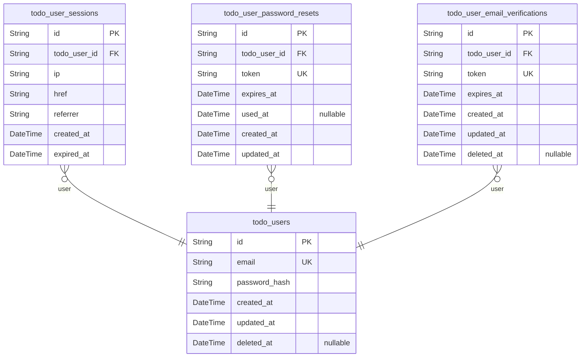
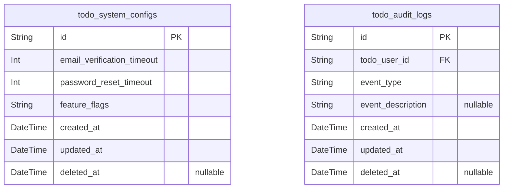
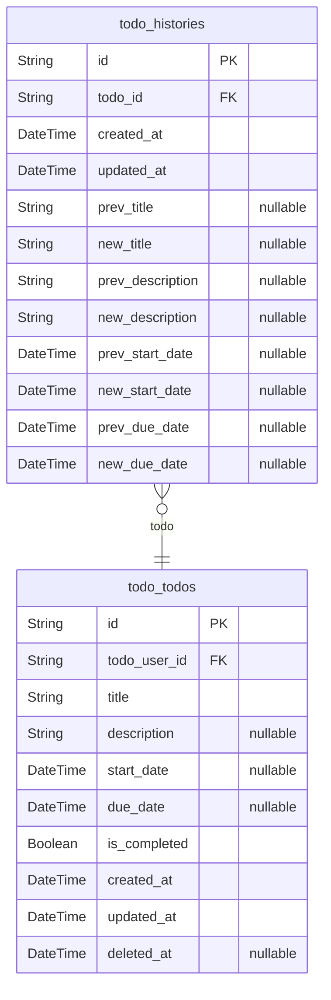
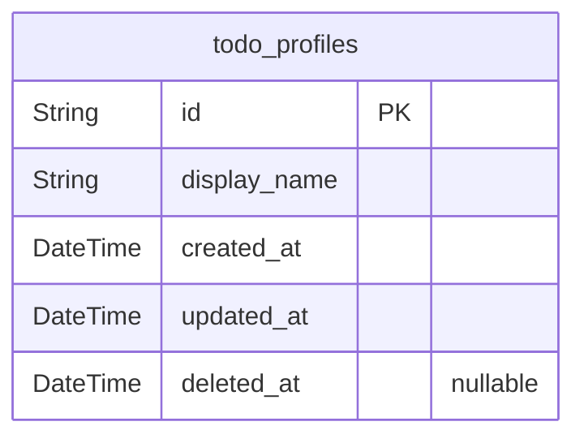

# Prisma Markdown

> Generated by [`prisma-markdown`](https://github.com/samchon/prisma-markdown)

- [Actors](#actors)
- [Systematic](#systematic)
- [Todos](#todos)
- [UserProfile](#userprofile)

## Actors

### `todo_users`

Registered user accounts with email/password credentials and
authentication metadata. Each user has a unique email address and
password hash stored using bcrypt. All personal data is isolated at user
level with strict privacy enforcement.

Properties as follows:

- `id`: Primary Key.
- `email`
  > User's email address for authentication and verification. Must be unique
  > across all users.
- `password_hash`
  > Password hash stored using bcrypt with work factor 12. Never stores
  > plaintext passwords.
- `created_at`: Timestamp when the user account was created.
- `updated_at`
  > Timestamp when the user account was last updated (password changes,
  > profile updates, etc.).
- `deleted_at`
  > Timestamp when the user account was soft-deleted. Null means active
  > account.

### `todo_user_sessions`

JWT session tokens with access/refresh support and token expiry
management. Tracks user login sessions for authentication lifecycle and
session validity. Associated with the user actor through foreign key
relationship.

Properties as follows:

- `id`: Primary Key.
- `todo_user_id`: User this session belongs to. [todo_users.id](#todo_users).
- `ip`: IP address where session was created.
- `href`: Original URL from which session was created.
- `referrer`: Referrer URL for the session.
- `created_at`: Timestamp when session was created.
- `expired_at`: Timestamp when session expires and is automatically invalidated.

### `todo_user_password_resets`

Records password reset tokens with 60-minute expiration and usage
tracking for user authentication flows. Handles secure token generation,
validation, and cleanup.

This table is managed through user authentication services without direct
user interaction, requiring:
- Unique token generation for each reset attempt
- 60-minute time-based expiration
- Usage tracking to prevent token reuse
- Secure storage of token values for verification

Properties as follows:

- `id`: Primary Key.
- `todo_user_id`
  > User account associated with this password reset request. {@link
  > todo_users.id}.
- `token`: Unique token string for password reset verification.
- `expires_at`: Timestamp when token expires (60-minute validity).
- `used_at`: Timestamp when token was successfully used to reset password.
- `created_at`: Entry creation timestamp.
- `updated_at`: Last modification timestamp.

### `todo_user_email_verifications`

Email verification tokens with 15-minute expiration for user account
verification. Stores unique tokens, target email, expiration timestamp,
and related to user account.

This is a subsidiary entity managed through the parent user account, not
requiring independent CRUD endpoints. The token is auto-generated,
unique, and expires after 15 minutes as required by authentication
process.

Properties as follows:

- `id`: Primary Key.
- `todo_user_id`
  > User account associated with this email verification token. {@link
  > todo_users.id}.
- `token`
  > Unique verification token for email confirmation. Generated as random
  > string, stored hashed.
- `expires_at`
  > Token expiration timestamp (15 minutes from creation). Required for
  > security and session management.
- `created_at`: Timestamp when the verification token was created.
- `updated_at`: Timestamp when the verification token was last modified.
- `deleted_at`: Timestamp when the verification token was soft-deleted.

## Systematic

### `todo_system_configs`

System-wide configuration parameters including email templates, timeouts,
and feature flags. Manages application-wide settings like email
templates, expiration timeouts, and feature toggles.

This table stores all system-level parameters that affect application
behavior and user experience, including:
- Email verification timeout (15 minutes as per requirements)
- Password reset timeout (60 minutes as per requirements)
- Feature flags toggle for enabling/disabling features

Properties as follows:

- `id`: Primary Key.
- `email_verification_timeout`: Time in minutes for email verification links to expire (e.g., 15).
- `password_reset_timeout`: Time in minutes for password reset tokens to expire (e.g., 60).
- `feature_flags`: Serialized JSON string of feature flags enabled for the application.
- `created_at`: Timestamp when the configuration record was created.
- `updated_at`: Timestamp when the configuration record was last updated.
- `deleted_at`
  > Timestamp when the configuration record was soft-deleted. Nullable for
  > soft delete handling.

### `todo_audit_logs`

System-wide audit log entries tracking all system-level events including
user account changes and administrative actions.

Each audit entry records the event type, description, user context, and
timestamp for complete historical tracing of system activities.

Properties as follows:

- `id`: Primary Key.
- `todo_user_id`: User who performed the audit event. [todo_users.id](#todo_users).
- `event_type`: Type of the audit event (e.g., 'user.created', 'account.deleted').
- `event_description`: Description of the audit event, with additional context if needed.
- `created_at`: Timestamp when the audit log entry was created.
- `updated_at`: Timestamp when the audit log entry was last updated.
- `deleted_at`: Timestamp when the audit log entry was soft-deleted (if applicable).

## Todos

### `todo_todos`

Core todo items that users create, view, edit, and manage. Includes
required title, optional description, start date, due date, completion
status, and soft delete tracking. Each todo item belongs to a single user
account with strict user-data isolation enforced.

Properties as follows:

- `id`: Primary Key.
- `todo_user_id`: Belongs to the user's account via [todo_users.id](#todo_users).
- `title`: Title of the todo item. Minimum 1 character required.
- `description`: Optional description of the todo item.
- `start_date`: Start date for the todo item.
- `due_date`: Due date for completing the todo item.
- `is_completed`: Completion status. Defaults to false on creation.
- `created_at`: Timestamp of when the todo item was created.
- `updated_at`: Timestamp of the last update to the todo item.
- `deleted_at`: Timestamp of soft deletion. Nullable for active items.

### `todo_histories`

Detailed record of all field modifications including timestamps, previous
values, and new values for each todo edit. Each history entry captures
atomic changes to title, description, start date, and due date fields
when a todo is modified.

Properties as follows:

- `id`: Primary Key.
- `todo_id`: Related todo item's ID.
- `created_at`: Timestamp when the edit was recorded.
- `updated_at`
  > Timestamp of the last update to the history record (should match
  > created_at for immutability).
- `prev_title`: Previous title value before edit. Null if title was not changed.
- `new_title`: New title value after edit. Null if title was not changed.
- `prev_description`
  > Previous description value before edit. Null if description was not
  > changed.
- `new_description`: New description value after edit. Null if description was not changed.
- `prev_start_date`: Previous start date value before edit. Null if start date was not changed.
- `new_start_date`: New start date value after edit. Null if start date was not changed.
- `prev_due_date`: Previous due date value before edit. Null if due date was not changed.
- `new_due_date`: New due date value after edit. Null if due date was not changed.

## UserProfile

### `todo_profiles`

Stores user display names with maximum 20 character limit and no special
characters. Display names are required for user identification and must
comply with business rules regarding length and character usage.

Properties as follows:

- `id`: Primary Key.
- `display_name`
  > User's display name shown to other users, must be between 1-20 characters
  > with no special characters (alphabetic and numeric allowed).
- `created_at`: Timestamp when the profile was created.
- `updated_at`: Timestamp when the profile was last updated.
- `deleted_at`
  > Timestamp when the profile was soft-deleted. Nullable for future soft
  > delete implementation.
