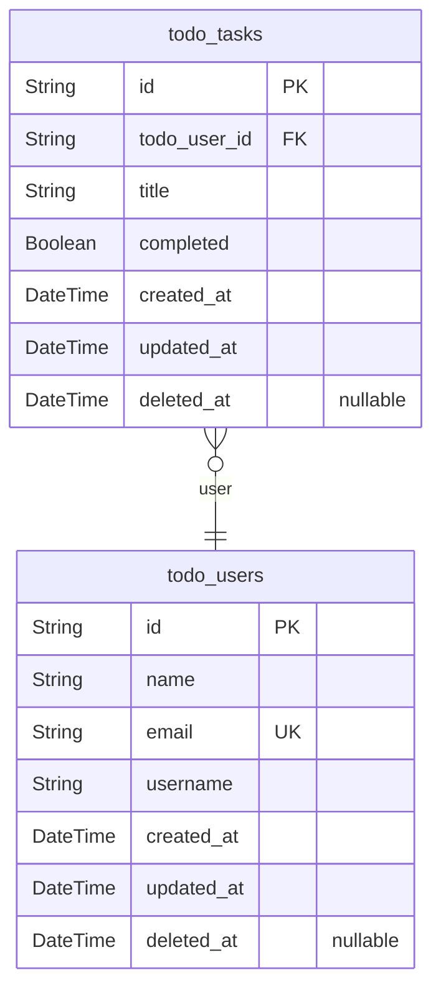

# Prisma Markdown

> Generated by [`prisma-markdown`](https://github.com/samchon/prisma-markdown)

- [ToDo](#todo)

## ToDo

### `todo_users`

User profile information for single-device personal task management.

Stores basic user information entered during initial welcome screen
setup. Each user represents the current device's user profile, with no
external authentication required. This model supports the single-user
experience by tracking name, email, and derived username for task
organization.

The model assumes a single user per device with no session or login
functionality, keeping the application minimal as required.

Properties as follows:

- `id`: Primary Key.
- `name`: User's full name
- `email`
  > User's email address used for profile identification. Must be unique
  > across all users.
- `username`: Derived username based on email. Format: first.last from email address.
- `created_at`: Timestamp when the user profile was created.
- `updated_at`: Timestamp of the last update to the user profile.
- `deleted_at`: Timestamp when the user profile was soft-deleted (if applicable).

### `todo_tasks`

Todo items created and managed by the user for personal task tracking.

Stores individual task items with their titles, completion status, and
creation timestamps. Each task belongs to a user profile and follows the
minimal requirements of having a title (3-200 characters) and a
completion flag.

Tasks are managed independently with no categories or due dates, matching
the application's focus on simplicity. Tasks automatically disappear from
the active list when marked complete.

Properties as follows:

- `id`: Primary Key.
- `todo_user_id`: User who created the task. [todo_users.id](#todo_users)
- `title`: Task title as provided by the user. Must be between 3-200 characters.
- `completed`: Indicates if the task is completed. True = completed, False = pending.
- `created_at`: Timestamp when the task was created.
- `updated_at`: Timestamp of the last update to the task.
- `deleted_at`: Timestamp when the task was soft-deleted (if applicable).
