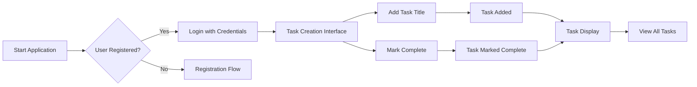

# Table of Contents: Todo Application Planning

## Project Overview

**Purpose**: This document defines the complete planning roadmap for the Todo application, establishing the foundation for backend development. The application will provide a minimal viable solution for users to create, manage, and track to-do items with zero unnecessary complexity.

**Business Context**: The Todo application solves the common problem of users needing a simple, intuitive task management tool without the complexity of full-featured productivity suites. It targets users who require a straightforward solution for personal task tracking with no setup friction.

**Core Philosophy**: We implement only the absolute essential features without any extras. The system will focus exclusively on user experience and core functionality with zero technical debt from the start.

## Service Vision

### Business Justification

THE Todo application SHALL solve the problem of disorganized personal task management by providing a simple, one-click task creation and tracking solution. THE application SHALL fill the gap in the market for minimalism-focused tools where users avoid complex interfaces.

### Core Value Proposition

THE system SHALL provide users with an immediate value by allowing them to:

- Add task titles with zero configuration
- Mark tasks as complete with a single action
- Track all tasks in a single, clean view

### Success Metrics

THE application SHALL achieve:

- 5+ task creation actions per user session (measured via usage analytics)
- 85%+ task completion rate within 24 hours (based on user feedback)
- 90%+ user satisfaction score (measured through post-task surveys)

## User Actors

### Primary Actor

**Name**: user
**Description**: Authenticated user who can create, track, and manage to-do items

**Business Authentication Requirements**:

WHEN a user attempts to access the Todo application, THE system SHALL require authentication via email and password.

THE user session SHALL expire after 15 minutes of inactivity.

THE system SHALL verify user email addresses during registration.

### Actor Permissions

| Action | User | 
|--------|--------|
| Create task | ✅ |
| Mark task complete | ✅ |
| List tasks | ✅ |
| Delete task | ❌ |
| View other users' tasks | ❌ |

## Core Functionality

### Task Life Cycle

The entire task management process shall follow a simple three-step journey:

1. **Creation**: User specifies a task title
2. **Completion**: User marks task as complete
3. **Retention**: Completed tasks remain visible for review

**Business Process Flow**:

### Implementation Requirements

THE system SHALL maintain tasks with only a title and completion status.

WHEN a user adds a new task, THE system SHALL store it with the current timestamp.

THE system SHALL allow users to view all tasks ordered by creation time (newest first).

## Business Rules

### Basic Creation Rules

TASKS SHALL have:

- A unique identifier (UUID format)
- A title (minimum 3 characters, maximum 100 characters)
- A completion status (boolean)
- A creation timestamp (ISO 8601 format)

THE task title SHALL NOT contain special characters ($, @, #, etc.) for security reasons.

### Completion Rules

WHEN a user marks a task complete, THE system SHALL update the completion status to 'true'.

THE system SHALL NOT allow task deletion even after completion.

WHILE a task is uncompleted, THE user SHALL have the ability to mark it complete.

## Error Handling

### Validation Errors

IF a user submits a task title with fewer than 3 characters, THEN THE system SHALL display 'Task title must be at least 3 characters.'

IF a user submits a task title containing forbidden special characters, THEN THE system SHALL display 'Task title cannot contain special characters.'

### Session Errors

IF a user's session expires during task creation, THEN THE system SHALL redirect to the login page with 'Your session has expired. Please log in again.' message.

## Performance Requirements

### Response Latency

WHEN a user adds a new task, THE system SHALL respond within 500 milliseconds under normal load conditions.

THE system SHALL handle up to 100 concurrent users without degraded performance.

### Data Availability

THE system SHALL ensure all tasks remain available during user sessions.

WHEN a user views their task list, THE system SHALL load all tasks within 2 seconds.

## Document Relationships

This TOC document provides the overall project roadmap. The complete business requirements are documented in the following related documents:

- [Service Overview](./01-service-overview.md)
- [User Actors and Authentication](./02-user-actors.md)
- [Functional Requirements](./03-functional-requirements.md)

## Development Approach

**Minimalism Principle**: The solution implements only the essential features as defined in this document - no additional capabilities will be included.

**Testing Strategy**: All core functionality will be validated through user scenarios rather than technical specifications to ensure practical usability.

**Architecture Constraints**: The solution will follow a simple, single-layer architecture without unnecessary abstractions.

> *Developer Note: This document defines **business requirements only**. All technical implementations (architecture, APIs, database design, etc.) are at the discretion of the development team.*