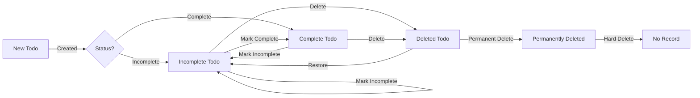

# Functional Requirements Specification: Multi-User Todo Application

## Service Overview

### Business Justification
WHEN market analysis fails to identify private task management solutions with complete edit history tracking, THE system SHALL provide a private, multi-user to-do application that prioritizes user data security and detailed activity tracking without compromising privacy.

### Market Opportunity
WHEN users express frustration with existing to-do apps that compromise privacy or lack comprehensive audit trails, THE system SHALL fill the gap by delivering a private, history-focused to-do application with no shared data elements.

### Long-Term Goals
WHEN a user's task management needs evolve over time (e.g., adding shared task features), THE system SHALL support continuous improvement through feature enhancements that maintain core privacy principles.

### Core Value Proposition
IF users value privacy and auditability in their to-do management, THEN THEY SHOULD SELECT THIS APPLICATION over competitors that lack these critical features when managing personal tasks with potential future sharing needs.

## Problem Definition

### Current Challenges for Users

WHEN users attempt to manage to-dos across multiple applications (e.g., one for personal, one for shared tasks), THEY EXPERIENCE inconsistent data across platforms and difficulty maintaining edit history.

WHILE users seek centralized to-do management, THE system SHALL not provide solution that supports both personal privacy and granular sharing at task level, forcing users to maintain multiple applications.

### Pain Points in Existing Solutions

WHEN to-do applications fail to maintain complete edit histories for private tasks, THE system SHALL avoid this limitation by implementing user-private history with automatic tracking.

IF a solution offers task sharing, THEN THE system SHALL not require team accounts for private task management, preventing users from having to create separate accounts.

### Opportunity in the Market

WHERE existing solutions compromise privacy for feature richness, THE system SHALL differentiate by providing both privacy and robust history capabilities without requiring user account sharing.

## Core Value Proposition

### Key Differentiators
THE system SHALL provide user-private data management with task-level sharing controls, complete edit history tracking, and strict no-data-sharing between user accounts.

### Unique User Value
WHEN a user seeks to manage their tasks without concern for other users accessing their personal data, THE system SHALL deliver a completely private experience where no data is shared across accounts by default.

### Competitive Advantage
THE system SHALL outperform competitors by maintaining strict privacy boundaries between user accounts while providing detailed action history for every item, eliminating the need for users to choose between privacy and functionality.

## Service Operations Overview

### User Journey Flow
WHEN a user logs in, THEY SHALL access their private to-do list directly without seeing other users' data. WHEN they create a new todo, THEY SHALL immediately see it with default incomplete status.

### Core Functionality
WHEN a user manages their to-dos, THEY SHALL perform all actions (create, edit, delete, restore) exclusively within their private space with no possibility of cross-account data access.

## User Actors

### User Actor Definition
WHEN a user signs up for the application with email and password, THEY SHALL become a single account owner with exclusive access to their to-do data.

### Permissions & Capabilities
THE system SHALL grant each user complete ownership and control over their to-do items with no exceptions. THE system SHALL never permit users to view other users' profiles, todos, or history.

### Authentication Flow
WHEN a user completes successful login, THEY SHALL establish a session for their exclusive account access with JWT tokens. WHEN password reset is requested, THEY SHALL receive verification via email to update credentials.

## Primary User Scenarios

### Sign Up and Initial Setup
WHEN a new user creates an account with email and password, THEY SHALL be immediately able to create their first to-do item. WHEN they provide a display name, THEY SHALL see it in their profile but others cannot view it.

### Creating and Managing Todos
WHEN a user creates a new to-do, THEY SHALL provide a title (required) and optional description, start date, and due date. THE system SHALL automatically mark the todo as incomplete by default.

### Viewing and Filtering Todos
WHEN a user views their to-dos, THEY SHALL see a paginated list showing title, completion status, start date (if set), due date (if set), and creation date. WHEN applying filters (All/Complete/Incomplete), THEY SHALL instantly see filtered results without reloading.

### Editing Todos
WHEN a user edits a todo's title, description, start date, or due date, THEY SHALL trigger a history entry for each change. THE system SHALL record all modifications in chronological order with timestamps.

### Viewing Edit History
WHEN a user views the edit history of a todo, THEY SHALL see a list of changes sorted from newest to oldest with specific details: previous/after values for title, description, start date, and due date.

## Secondary User Scenarios

### Bulk Actions
WHEN a user selects multiple to-dos for deletion, THEY SHALL see a confirmation dialog. WHEN confirmed, THEY SHALL move all selected to trash with individual history entries created.

### Cross-Device Sync
WHILE a user accesses their to-dos from multiple devices, THE system SHALL maintain synchronous updates across all platforms with the most recent changes visible immediately.

## Business Rules and Constraints

### Validation Rules
- WHEN a user creates a todo without title, THE system SHALL prevent creation and display "Title is required to create a todo".
- WHEN a user sets start date after due date, THE system SHALL display "Start date cannot be after due date".
- WHEN a user attempts to manage another user's todos, THE system SHALL display "You cannot edit or delete another user's todos".

### Data Storage Rules
- THE system SHALL store all dates in ISO 8601 format (YYYY-MM-DD).
- THE system SHALL automatically set completion status to incomplete for new todos.
- THE system SHALL enforce deletion as soft delete (mark deleted) without removing from database.

### Edit History Rules
- WHEN a user edits any field of a todo item, THE system SHALL create a history entry.
- WHEN a user permanently deletes a todo from trash, THE system SHALL delete all associated history entries.
- THE system SHALL not create history entries for no-actual-change operations.

### Workflow Constraints

### Privacy and Security Constraints
- THE system SHALL ensure that each user can only view todos within their own account; IF a user attempts to access another user's todos, THE system SHALL block access and display "Unauthorized access - you can only view your own todos".
- THE system SHALL automatically delete all todos associated with a user's account when they permanently delete their account (including items in trash and history).

## Performance Requirements

### Response Time
WHEN a user views a paginated todo list with 100 items, THE system SHALL load within 1 second for 95% of users.

### Scale Expectations
WHEN a user has 10,000 todos, THE system SHALL support pagination with 20 items per page at response times under 2 seconds.

### Error Handling
WHEN a system error prevents a todo from being processed, THE system SHALL display "An unexpected error occurred. Please try again." with a retry button.

## Authentication Requirements

### User Credential Management
- WHEN a user changes password, THEY SHALL receive confirmation email and previous session logs out.
- WHEN a user deletes account, THEY SHALL see confirmation dialog before permanent removal of all data.

### Session Management
- THE system SHALL use JWT tokens with 15-minute expiration for security.
- THE system SHALL invalidate tokens when password is changed or account is deleted.

## Error Handling Requirements

### User-Facing Error Scenarios
- WHEN a user tries to restore a todo not in trash, THE system SHALL display "This item is no longer in your trash".
- WHEN a user attempts to delete an item already permanently deleted, THE system SHALL display "This item has already been permanently deleted".

## Final Documentation Notes

This document represents the complete business requirements specification for the Multi-User Todo Application. All technical implementation details (database schema, API contracts, UI specifications) will be generated in subsequent pipeline phases based on this requirements specification.

> *This document defines business requirements only. All technical implementations are at the discretion of the development team.*