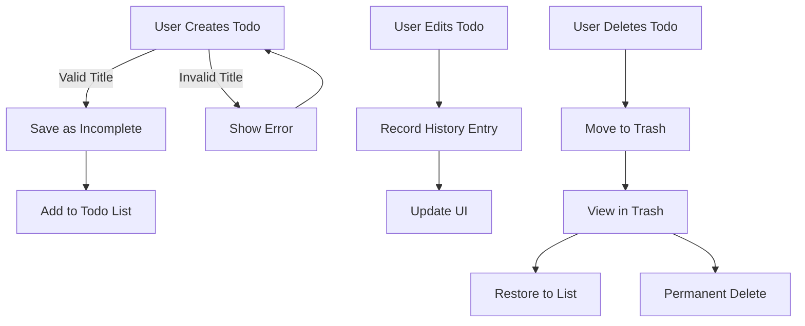

# Functional Requirements Overview

This document provides the complete business requirements specification for the Multi-User Todo Application. The requirements are detailed in natural language with specific, measurable criteria that guide implementation without dictating technical implementation.

## Todo Management

### Todo Creation
WHEN a user creates a new todo, THE system SHALL:
- Require a non-empty title field (mandatory)
- Allow optional description field (can be left empty)
- Allow optional start date and due date fields (can be left empty)
- Default the completion status as INCOMPLETE
- Validate title length does not exceed 150 characters
- Provide immediate feedback for invalid titles

### Todo Viewing
WHEN a user accesses their todo list, THE system SHALL:
- Paginate results with 10 todos per page
- Display each todo with title, completion status, start date, due date, and creation date
- Group by status to enhance user scanning efficiency
- Allow filtering by completion status (all, complete, incomplete)
- Sort by creation date (newest first by default)
- Show relevant sorting options for start and due dates

### Todo Completion Toggle
WHEN a user marks a todo as complete, THE system SHALL:
- Toggle the completion status from INCOMPLETE to COMPLETE
- Immediately update the UI to reflect the new status
- Log the change for audit purposes
- Preserve all edit history for the todo

### Todo Editing
WHEN a user edits an existing todo, THE system SHALL:
- Allow changes to title, description, start date, due date
- Record every edit in the todo's history
- Provide visual confirmation of changes
- Validate all input fields according to specific rules
- Preserve all previous versions for comparison
- Ensure no data loss during edits

### Edit History
WHEN a user views a todo's edit history, THE system SHALL:
- Display all history entries in reverse chronological order (newest first)
- Show timestamp of each edit
- Indicate what fields were changed
- Display old value and new value for each changed field
- Limit to the last 20 edits by default
- Allow chronological navigation through history

### Trash Management
WHEN a user deletes a todo, THE system SHALL:
- Move the todo to a trash state (soft delete)
- Remove the todo from the main list
- Preserve all data including edit history
- Display trash as a separate view
- Allow restoration to original state
- Allow permanent deletion from trash

### Trash Restoration
WHEN a user restores a todo from trash, THE system SHALL:
- Move the todo from trash back to the main todo list
- Preserve all edit history and associated data
- Update the todo's current status as INCOMPLETE
- Provide immediate UI feedback that restoration succeeded

### Permanent Deletion
WHEN a user permanently deletes a todo from trash, THE system SHALL:
- Permanently remove the todo record
- Delete all associated edit history
- Ensure no data recovery is possible
- Provide confirmation prompt before final deletion
- Log the permanent deletion event

## User Profile

### Profile Management
WHEN a user edits their profile, THE system SHALL:
- Allow changes only to the display name field
- Preserve the email as user identifier
- Limit display name to 30 characters
- Validate no special characters in display name
- Update profile immediately upon save

## Authentication

### User Account
WHEN a user registers, THE system SHALL:
- Require valid email format
- Require password of at least 12 characters
- Use secure password hashing
- Send welcome email with account confirmation
- Set default display name as email username

WHEN a user resets their password, THE system SHALL:
- Send password reset email with unique token
- Invalidate previous sessions after reset
- Require new password meeting all security requirements
- Notify user of successful password update

WHEN a user deletes their account, THE system SHALL:
- Permanently remove all associated todos
- Delete all associated trash contents
- Remove all personal data
- Log deletion event for audit purposes
- Notify user of successful account deletion

## Privacy Rules

### Data Isolation
WHEN a user accesses their todos, THE system SHALL:
- Ensure no todos from other users are visible
- Restrict all access to user's own todos only
- Enforce strict owner-based data access control
- Implement permission checks for all todo-related operations
- Prevent any cross-user data leakage

### Authentication Requirements
WHEN a user performs any action, THE system SHALL:
- Verify user authentication before every operation
- Use JWT token for session management
- Require valid access tokens for all API requests
- Enforce permission-based access to features
- Refresh tokens automatically upon session renewal

## Error Handling Requirements

WHEN a request fails validation, THE system SHALL:
- Return specific error message indicating which field failed
- Provide example of valid format for field
- Return HTTP 400 status code
- Include error code in response
- Log error for debugging without exposing sensitive data

WHEN a resource is not found, THE system SHALL:
- Return HTTP 404 status code
- Provide user-friendly message about missing resource
- Include resource identifier in the error message
- Log the request for security monitoring

# Mermaid Diagram (Enhanced)

