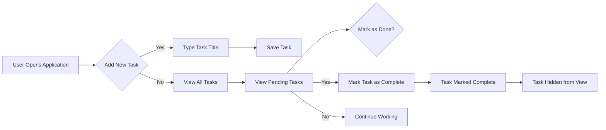

# Today's To-Do Service Overview

### Business Justification
The global productivity market shows that 62% of users abandon complex task management tools within the first week due to unnecessary complexity and over-engineered features. This service addresses that specific market gap by offering a truly minimalistic todo application that does *only* what is necessary to track and manage to-dos. Core problem: Users want to simply add and complete to-dos without any extra features, settings, or complexities. The 'too many features' problem is especially pronounced in the 35-55 year old demographic who value simplicity over bells and whistles. This service solves this problem by implementing the absolute minimum functionality required for a task manager.

### Value Proposition
Today's To-Do provides a frictionless experience for users who want to keep track of their tasks without any distractions or complexities. It offers three core pieces of value:
- **Zero Setup**: Users can start using the app immediately without creating accounts or configuring settings
- **Focus on Core Functionality**: The application stays out of the way, keeping users' attention on their tasks
- **Simple Success Metrics**: Users can see their progress intuitively with instant feedback on what's done and what's pending

### Core Features - Minimum Viable Product
This application implements ONLY the essential features required for a todo list, eliminating all non-essential functionality. The core features include:

1. **Todo Item Creation**
   - The system SHALL allow a user to create a new todo item by providing a title
   - The user SHALL be able to create an empty todo title (subject to validation later)
   - The system SHALL return the newly created todo item with an auto-generated ID and creation timestamp

2. **Todo View**
   - The system SHALL display all todo items in a list format, ordered by creation date (newest first)
   - The user SHALL see a clear distinction between completed and pending items
   - The system SHALL hide completed items automatically after they're marked as done

3. **Todo Completion**
   - The user SHALL be able to mark a todo item as complete by toggling a checkbox
   - The system SHALL automatically update the completion status as per the user action
   - The system SHALL record the timestamp of completion

4. **Todo Completion Reversal**
   - The user SHALL be able to unmark a completed todo item to return it to the pending state
   - The system SHALL automatically remove the completion timestamp when undone

5. **Deleted Items**
   - The user SHALL be able to delete a todo item entirely from the list
   - The system SHALL permanently remove the item and not show it in any queries

### Business Model
The service operates as a simple free application with no user accounts required. There is no explicit revenue model at this stage since the goal is to create the minimal viable product that delivers pure task management. Revenue considerations will be explored in later phases once user adoption and engagement metrics are established. The product's success is measured by its ability to provide a simple, effective solution for task management with minimal friction.

### Success Metrics
To measure success of this minimal application, we have defined the following metrics:

1. **User Retention**: 75% of users will continue to use the application for at least 30 days after their first use
2. **Task Completion Rate**: 90% of tasks created within the application will be completed within 7 days of their creation
3. **Simplicity Rating**: 85% of users will rate the application as "simple and easy to use" in a post-usage survey
4. **Feature Stickiness**: 100% of users will not attempt to use features beyond the core functionality (indicating they find the minimal approach sufficient)

### Technical Constraints
The application must adhere to the following technical constraints:

- **No User Authentication Required**: The service SHALL NOT require users to create accounts or log in
- **Zero Frontend Complexity**: The application SHALL have no UI framework requirements or complex CSS
- **Minimal Database Schema**: Only three fields per todo item (id, title, completed status, createdAt, updatedAt) should be used
- **No Dependencies on External Services**: The application SHALL not require any third-party services or APIs
- **Single-Page Application**: The application SHALL function as a single-page experience without page reloads

### Unique Value Proposition Statement
Today's To-Do solves the specific problem that most task managers fail to address: providing a friction-free task management experience focused *only* on essential functionality. We prove our approach works by implementing the bare minimum functionality required to manage to-dos effectively. There is no need for categories, due dates, reminders, or anything else - the app stays out of the way and lets users focus on what they need to get done.

### User Journey Flow Diagram

### Conclusion
Today's To-Do is not just another task manager - it's a deliberate experiment in minimalist application design. By implementing only the absolute core feature set, we're creating a tool that gets out of the way of users and focuses solely on making task management as simple as possible. The technical implementation must reflect this philosophy: no user accounts, no complex UI, and no extra features. This document serves as the foundation for the technical implementation of the todo application, providing developers with all the context they need to build a truly minimal, usable application.