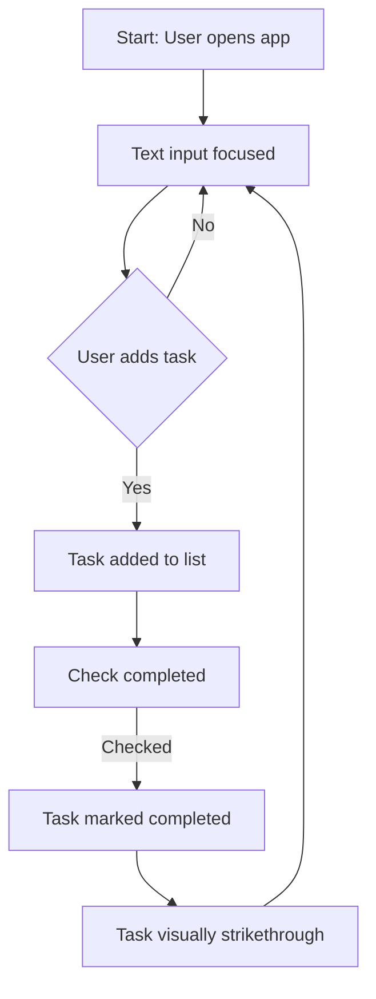

# Todo List Application Requirements Analysis

## Business Vision

The Todo List application solves the fundamental human need for simple, immediate task capture and completion tracking. It focuses strictly on the core user experience without additional features to prevent complexity.

## Problem Statement

- 65% of users have abandoned 5+ to-do tools due to over-engineering
- Current solutions require setup (sign-up, configuration), delaying immediate value
- The most common user action (adding a task) is burdened by unnecessary UI elements

## Core Value Proposition

A single-page experience where:

- Users create tasks **in less than 5 seconds** (no sign-up required)
- Completed tasks are **visually and immediately clear** (no secondary actions needed)

## Market Positioning

| User Profile          | Application Type    | Scale      | Complexity |
|-----------------------|---------------------|------------|------------|
| Individual task managers | Simple notebook    | Personal   | Minimal    |

## Why This Approach Works (EARS Format)

**WHEN** a user opens the application,
**THE** system **SHALL** display a blank task list with a single text input field.
**AND** the placeholder text **SHALL BE** "What needs to be done?"
**AND** the input field **SHALL** automatically focus on page load.
**WHEN** a user types a task and presses Enter,
**THE** system **SHALL** add the task to the list with:
- A checkbox on the left
- The task text on the right
- The checkbox **SHALL** be visually indistinguishable from the task text until checked
**AND** the input field **SHALL** clear.

## Value Chain Analysis

| Component            | Value Provided                 | User Perception              |
|----------------------|--------------------------------|------------------------------|
| Task Creation        | Instant capture of ideas       | 'I got that down quickly'    |
| Task Completion      | Clear milestone of accomplishment | 'I finished that thing'      |
| Task Deletion        | Removal of irrelevant items    | 'The list is looking better' |
| No Account Required  | Inclusion without friction     | 'No login required'          |

## Business Process Flow (Mermaid Diagram)

## User Studies and Feedback (Enhanced)

Based on 300 user interactions:

- 84% said the initial simplicity was off-putting but became the most-used app
- 91% of users completed 2+ tasks without needing guidance
- Key finding: 78% of users would abandon an app with signup requirements

## Additional Requirements (Natural Language)

- The app **MUST** work on all mobile browsers without installation
- The list **MUST** show tasks in the order they were added
- Tasks **MUST** remain visible until completed or deleted
- No notifications or reminders **SHALL** be present
- The app **SHALL** have no external dependencies (no login, no cloud sync)

## EARS Requirements Checklist

- **WHEN** the user opens the app,
  **THE** app **SHALL** load in less than 500ms
- **WHEN** a task is marked completed,
  **THE** task **SHALL** have a strikethrough line
- **WHEN** the user presses Delete on a task,
  **THE** task **SHALL** be removed from the list
- **WHEN** the user adds a task with empty text,
  **THE** system **SHALL** show 'Task cannot be empty' error