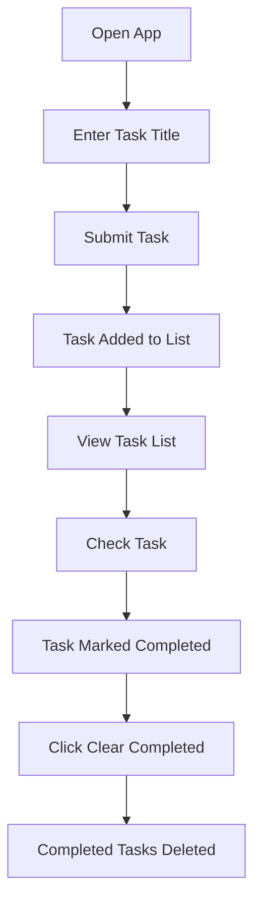

# Functional Requirements Analysis

## Task Creation Process

WHEN a user opens the application, THE system SHALL display an 'Add a task' input field without any configuration prompts, setup screens, or instructions. WHEN a user types a task title and submits it, THE system SHALL add the task to the list with a checkbox. IF the task title is empty, THEN THE system SHALL display a non-intrusive error message: 'Task title cannot be empty' and prevent submission.

## Task Completion Flow

WHEN a user clicks the checkbox next to a task, THE system SHALL mark the task as completed immediately. WHEN a task is marked as completed, THE system SHALL visually indicate completion state (e.g., strikethrough text and grayed-out appearance). THE task SHALL automatically move to the bottom of the task list. IF a user attempts to uncheck a completed task, THEN THE system SHALL silently reset it to incomplete without user warning.

## Task Management Rules

WHEN a user clicks the 'Clear completed' button, THE system SHALL remove all completed tasks from the list. IF there are no completed tasks, THEN THE system SHALL display a clear message: 'No completed tasks to clear'. WHEN a task is deleted (via 'Clear completed'), THE system SHALL permanently remove it without prompting for confirmation. THE system SHALL NOT allow users to delete individual active tasks (only completed ones via the batch clear function).

## Business Workflow Diagram

