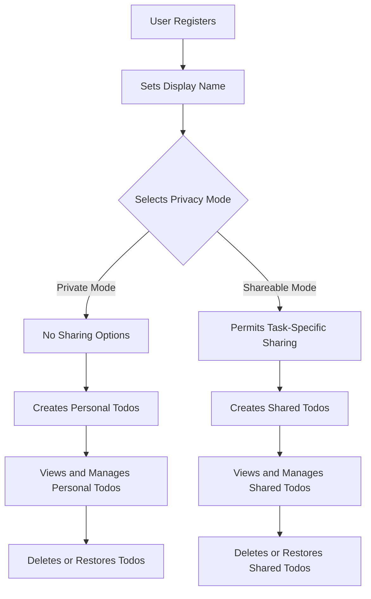

# Multi-User Todo Application

## 1. Problem Definition

### User Privacy Challenges

The current task management landscape presents significant privacy challenges for users who want to maintain both private and shared lists:

WHEN a user requires personal task management, THE system SHALL provide complete privacy without any sharing functionality.

WHEN a user wants to share specific tasks, THE system SHALL allow context-specific sharing while maintaining complete privacy for other tasks.

IF users attempt to access other users' private task lists, THEN THE system SHALL enforce strict permissions to prevent accidental data exposure.

### Fragmented Workflow Problems

Users currently need to maintain multiple applications for personal and collaborative task management:

WHEN users manage personal tasks in one application and shared tasks in another, THE system SHALL require unnecessary data migration between applications.

IF users attempt to consolidate their task management under one platform, THEN THE system SHALL not allow granular privacy controls, forcing users to choose between privacy or functionality.

## 2. Core Value Proposition

### Unified Private Task Management

OUR APPLICATION provides a single solution that supports both personal privacy and controlled multi-user access without trade-offs. The core value is that users never have to worry about accidentally exposing private tasks while still having the ability to share specific tasks when needed.

WHEN users require a completely private task list, THE system SHALL automatically isolate all data to the current user.

WHEN users want to share specific tasks with others, THE system SHALL allow them to control visibility at the task level without affecting their privacy.

### Strategic Differentiation

- **Privacy First Design**: Complete user data isolation by default (privacy as the foundation)
- **Task-Level Sharing**: Granular sharing controls at the task level, not at the user or list level
- **Unified Experience**: Single application for all user needs, eliminating need for multiple apps
- **No Data Leakage**: Explicit user controls to prevent accidental sharing of private information

## 3. Service Operation Overview

### User Journey Flow

### System Boundaries

The application includes:
- User account management (sign up, login, profile)
- Todo creation, viewing, editing, and deletion
- Private task management with no sharing capability
- Task-specific sharing functionality for selected todos
- Complete history tracking for all modifications
- Soft-deletion with trash management

## 4. User Actors

| Actor | Description | Permissions |
|-------|-------------|-------------|
| Personal User | Primary user who manages their own tasks in private mode | Can manage own todos, view own profile, no sharing ability |
| Shareable User | User who has enabled task-level sharing | Can manage own todos, view own profile, share specific todos with others |
| Admin | System administrator | Full access to all data for management purposes (not part of main user flow) |

### Authentication Requirements

WHEN a user attempts to access the application, THE system SHALL require email and password credentials for authentication.

WHEN a user creates an account, THE system SHALL validate their email address and securely store password using industry-standard hashing.

WHEN a user logs in, THE system SHALL provide a session token for subsequent API requests.

## 5. Primary User Scenarios

### Scenario 1: User Registration and Initial Setup

WHEN a user visits the registration page, THE system SHALL present a form for email and password.

IF a user provides valid email and password, THEN THE system SHALL create an account and automatically set it to private mode by default.

WHEN a user registers, THE system SHALL prompt them to set a display name for their profile.

### Scenario 2: Creating and Managing Todos

WHEN a user creates a new todo, THE system SHALL require a title field to be populated.

IF a user specifies start date or due date, THEN THE system SHALL store these values for later sorting and filtering.

WHEN a user marks a todo as complete, THE system SHALL update its status and record the timestamp of completion.

### Scenario 3: Viewing and Filtering Todos

WHEN a user views their todo list, THE system SHALL display paginated results with title, completion status, and relevant date fields.

IF a user applies a filter for only completed todos, THEN THE system SHALL restrict the list to those with completed status.

WHEN a user sorts by due date, THE system SHALL display the earliest due dates first, with todos missing due dates appearing at the end.

### Scenario 4: Editing and History Tracking

WHEN a user edits a todo, THE system SHALL create a new history entry recording the change.

IF a user modifies the title, description, start date, or due date, THEN THE system SHALL record the new value as part of the history.

WHEN a user views edit history, THE system SHALL display entries from most recent to oldest with all modified fields.

### Scenario 5: Deleting and Restoring Todos

WHEN a user deletes a todo, THE system SHALL perform a soft delete by moving it to the trash.

IF a user restores a todo from trash, THEN THE system SHALL reappear in the main todo list.

WHEN a user permanently deletes a todo from trash, THE system SHALL remove both the todo and all related history entries.

## 6. Business Rules

### Data Privacy Rules

- All todos are private by default and belong solely to the user who created them
- No user can view another user's todos under any circumstances
- Task sharing must be initiated explicitly by the owner
- Display names are visible only to users the owner chooses to share with

### Todo Management Rules

WHEN a user deletes a todo, THE system SHALL move it to the trash instead of permanent deletion.

IF a todo has been restored from trash, THEN THE system SHALL maintain all edit history for that todo.

WHEN a user permanently deletes a todo, THE system SHALL delete the todo and all associated history entries.

### Edit History Rules

WHEN a todo is edited, THE system SHALL create a new history entry with the timestamp of the change.

IF a field changes from empty to populated, THEN THE system SHALL record the new value.

IF a field changes from one value to another, THEN THE system SHALL record the old value and new value for that field.

## 7. Exception Handling

### Error Scenarios

WHEN a user attempts to view another user's todos, THE system SHALL return a 403 Forbidden error with the message "You cannot view other users' todos."

IF a user tries to create a todo without a title, THEN THE system SHALL return a 400 Bad Request with "Title is required".

WHEN a user tries to restore a todo that no longer exists, THE system SHALL return a 404 Not Found error with "Todo not found in trash."

## 8. Performance Requirements

- User authentication shall complete within 2 seconds
- Todo list loading with default pagination shall complete within 1 second
- Sorting and filtering operations shall complete within 500 milliseconds for up to 1,000 items
- History list loading shall complete within 2 seconds

## 9. Security & Compliance

### Data Protection Requirements

- All user passwords shall be stored using bcrypt with a minimum cost factor of 12
- All sensitive data shall be encrypted at rest with AES-256
- All data in transit shall be protected using TLS 1.3

### User Privacy Compliance

- All user data management shall comply with GDPR and CCPA requirements
- Users shall have the ability to export their data in a standard format
- Users shall have the ability to request complete deletion of their data

## 10. Conclusion

This application addresses the critical gap between personal task management needs and available solutions by providing a single platform that supports both privacy-first personal task management and selective sharing of specific tasks. Our solution delivers a unified user experience that eliminates the need for multiple applications while ensuring no accidental exposure of private information. The application's architecture is designed to prioritize user privacy by default and only allowing sharing through explicit, user-controlled actions at the task level.