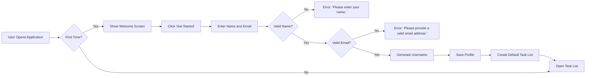

# Todo List Application Requirements Analysis

## 1. Functional Requirements

### 1.1 Task Creation

WHEN a user wants to create a new task, THE system SHALL present a simple blank text field with a submit button (via Enter key or button click). THE task description must not exceed 100 characters.

IF the user provides a description longer than 100 characters, THEN THE system SHALL display the error message: 'Task description cannot exceed 100 characters.'

WHEN the description is valid and submitted, THEN THE system SHALL save the task in the active task list with a completed status set to 'false'.

### 1.2 Task Modification

WHEN a user selects an existing task to edit, THEN THE system SHALL activate the task's text field for modification.

IF the edited description exceeds 100 characters, THEN THE system SHALL display the error message: 'Task description cannot exceed 100 characters.'

WHEN the user saves the changes, THEN THE system SHALL update the task with the new description.

### 1.3 Task Completion

WHEN a user clicks the 'Mark as Complete' action on a task, THEN THE system SHALL change the task's status to 'completed' and immediately remove it from the active task view.

WHILE the user views the active task list, THEN THE system SHALL not display any tasks with a completed status.

### 1.4 Task Deletion

WHEN a user selects 'Delete Task' for a completed task, THEN THE system SHALL permanently remove it from the database without option for recovery.

### 1.5 Task Viewing

WHEN a user accesses the application after login, THEN THE system SHALL display the active task list (only tasks with completed status 'false').

## 2. Authentication Flow

The authentication process is designed for minimal friction for non-technical users, requiring setup only once during initial use.

### Complete Authentication Workflow

WHEN the user first opens the application, THEN THE system SHALL display a welcome screen with a 'Get Started' button.

WHEN the user clicks 'Get Started', THEN THE system SHALL prompt for name and email.

IF the user does not provide a name, THEN THE system SHALL display: 'Please enter your name.'

IF the user provides an invalid email format, THEN THE system SHALL display: 'Please provide a valid email address.'

WHEN valid name and email are provided, THEN THE system SHALL generate a username from the email (e.g., 'jane.doe' from 'jane.doe@example.com').

THE system SHALL save the name, email, and generated username as the user profile.

THE system SHALL create a default task list named 'My Tasks' and open it for the user to begin adding tasks.

THE user shall not need to log in again after initial setup.

[Authentication Flow Diagram]

## 3. Permission Matrix

The user has full permissions across all task operations as they are the sole user of the application.

| Action                     | Can Perform | Business Reason                                        |
|----------------------------|-------------|--------------------------------------------------------|
| Create Task                | ✅ Yes      | User needs to add items to their to-do list            |
| Edit Task                  | ✅ Yes      | Users may need to modify tasks after creation          |
| Mark Task Complete         | ✅ Yes      | Core functionality to track completion                 |
| View Task List             | ✅ Yes      | User needs to see active tasks at a glance             |
| Delete Task                | ✅ Yes      | User may need to remove completed tasks permanently    |
| View Completed Tasks       | ❌ No       | Completed tasks automatically hidden from view        |
| Modify Default List Name   | ❌ No       | Only 'My Tasks' is allowed for the default list name   |

### Business Rules for Permissions

WHEN the user marks a task as complete, THEN THE system SHALL automatically remove it from the active task list.

WHEN the user deletes a task, THEN THE system SHALL permanently remove it from the database.

## 4. Error Handling Requirements

### Error Scenarios and Messages

- **Missing Name Error**: 'Please enter your name.' (Appears during initial setup when name field is empty)
- **Invalid Email Error**: 'Please provide a valid email address.' (Appears during initial setup when email is malformed)
- **Description Length Error**: 'Task description cannot exceed 100 characters.' (Appears when creating or editing a task that's too long)

### Error Response Protocol

ALL error messages SHALL be displayed immediately and clearly to the user.

THE system SHALL not require page reloads or additional steps to display errors.

## 5. Performance Requirements

### User Experience Guidelines

ALL user actions (creating, editing, marking complete, deleting) SHALL appear to the user without noticeable delay.

THE system SHALL not require page reloads for any functionality.

THE system SHALL provide subtle visual feedback for every user action.

## 6. Business Context and Value Proposition

The Todo List application solves the personal task management problem with minimal complexity for non-technical users. It provides a straightforward way to remember tasks without overwhelming the user with unnecessary features or complexity. The system focuses on the core user need: recording tasks, tracking completion, and keeping the active list clear by automatically removing completed items. This creates a frictionless user experience that allows users to focus on their tasks, not the application itself. The single-user design with no shared features reduces complexity while meeting the essential requirements for personal task management as clearly defined in business terms.

> *This document defines business requirements only. All technical implementations are at development team's discretion.*