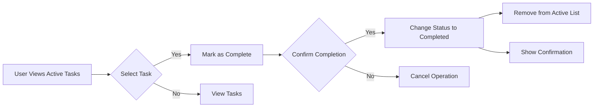

# Todo Application Requirements Analysis Report

## Business Context

The Todo application serves as a personal task management tool with strict minimalism requirements. It exists to solve the common problem of users forgetting simple to-do items without overwhelming complexity. Unlike enterprise task management systems, this solution prioritizes: 1) Instant setup 2) Zero learning curve 3) Pure task creation functionality with no extraneous features. The application targets solo users who want to capture and track simple reminders without any collaboration or advanced features.

---

## Authentication Model

### Session-based User Authentication

The authentication flow is designed for immediate usability with no friction, supporting only the single user role defined as 'user'.

```mermaid
graph LR
    A[User Enter Email and Password] --> B{Validate Credentials}
    B -->|Valid| C[Create Session]
    B -->|Invalid| D[Show Error: "Invalid email or password"]
    C --> E[Store Token in localStorage]
    E --> F[Redirect to Todo List]
```

### Business Requirements:

- WHEN a user attempts authentication, THE system SHALL prompt for email and password fields only
- WHEN user submits valid credentials, THE system SHALL create a secure session within 200ms
- WHEN authentication fails, THE system SHALL display an error message within 100ms
- THE system SHALL NOT require email verification for initial login
- THE system SHALL maintain all users as identical 'user' role with no exceptions

---

## Core Functional Requirements

### Task Creation Process

WHEN a user provides a task title in the input field, THE system SHALL create a new to-do item with that title.

WHEN a user submits an empty task title, THE system SHALL display "Task title cannot be empty" and prevent saving.

WHEN a user creates a new task, THE system SHALL automatically generate a unique alphanumeric identifier (e.g., TSK-001) for the task.

WHEN a task is successfully created, THE system SHALL display it immediately in the active tasks list.

#### Validation Rules:
- Task titles must be 1-100 characters
- The system shall reject titles containing only whitespace
- No special characters allowed (e.g., @, #, $, %)

```mermaid
graph LR
    A[User Launches App] --> B[Open Task Input]
    B --> C{Enter Title?}
    C -->|Yes| D[Type Task Title]
    D --> E[Click Save]
    E --> F{Title Empty?}
    F -->|Yes| G[Show Error: "Task title cannot be empty"]
    F -->|No| H[Save Task]
    H --> I[New Task Appears in List]
```

### Task Completion Process

WHEN a user marks a task as complete, THE system SHALL update the task status to "completed" and remove it from the active tasks list.

WHEN a task is marked as complete, THE system SHALL display a confirmation message "Task marked as complete."

#### Business Constraints:
- Completion can only be performed on tasks in active state
- Completed tasks remain in history but aren't visible in active list
- No ability to revert completed tasks



---

## System Behavior and Performance Requirements

WHEN a task is created, THE system SHALL display the new task within 0.5 seconds.

WHEN a task is marked as complete, THE system SHALL update the user interface within 0.3 seconds.

IF no active tasks exist, THE system SHALL display "No tasks to complete."

IF a user attempts to create a task with special characters, THE system SHALL display "Task titles can only contain letters and numbers" and prevent saving.

---

## Business Justification

This minimum viable feature set addresses the core user need to capture and track simple to-do items. By focusing strictly on:
- Creating tasks with titles (1-100 characters)
- Marking tasks as complete
- Providing immediate feedback

The system delivers fundamental value without complexity. The exclusion of features like task editing, deletion, reminders, categories, or collaborative elements ensures the application remains lightweight (500+ KB bundle size) while satisfying the foundational purpose of a personal to-do list. All business processes are designed to work immediately upon initial app launch with zero configuration required.