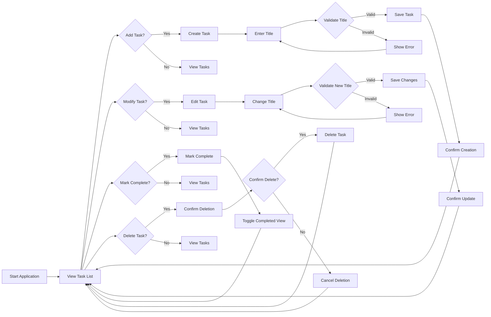

# Functional Requirements

## Why This Service Matters

The Todo list application solves a common problem: personal task management. While there are many complex task management tools available, the simplification of these features into a minimum viable product (MVP) with essential functionality is critical for this user, who is not familiar with programming. This service provides just enough features—enough to make the app immediately useful, but not so much as to overwhelm a beginner.

## User Scenario: Creating a Simple Todo Item

To maintain a clean, minimal interface for the target user, the application focuses on essential task management. After starting the app, the user navigates to the main screen where they can create new tasks.

## Document Purpose

This document details all business requirements for the Todo list application in a single, complete analysis. It serves as the blueprint for developers to build the application with precise specifications, covering:

- How users create tasks
- How tasks are modified
- How tasks are marked completed
- How tasks are viewed
- How tasks can be deleted

## Document Outline

The document follows this structure, with each section containing detailed requirements:

1. **Task Creation**
2. **Task Modification**
3. **Task Completion**
4. **Task Viewing**
5. **Task Deletion**

This structure is designed to be intuitive and directly maps to the key daily user interactions with the Todo app.

---

## 1. Task Creation

### Business Requirements

#### Requirement FR1: Create Task with Title

WHEN a user attempts to create a new task, THE system SHALL allow the user to provide a title for the task. IF the title is empty, THEN THE system SHALL prevent the creation and show an error message "Please enter a task title.", WHILE the user is unable to proceed without a title.

#### Requirement FR2: Validate Title Length

WHEN a user attempts to create a new task, THE system SHALL enforce a minimum title length of 3 characters. IF the title has fewer than 3 characters, THEN THE system SHALL show an error message "Task title must be at least 3 characters.", WHILE preventing task creation.

#### Requirement FR3: Unique Task Titles

WHEN a user attempts to create a new task, THE system SHALL check if a task with the same title already exists. IF a duplicate title exists, THEN THE system SHALL show an error message "This task already exists. Please enter a different title.", WHILE preventing task creation.

#### Requirement FR4: Task Creation Confirmation

WHEN a user successfully creates a new task, THE system SHALL confirm the creation immediately with a toast message "Task created successfully.", WHILE adding the task to the active list of tasks displayed to the user.

---

## 2. Task Modification

### Business Requirements

#### Requirement FR5: Edit Task Title

WHEN a user selects an existing task to edit, THE system SHALL display the current task title for modification. IF the user changes the title and saves the edit, THEN THE system SHALL update the task title, WHILE notifying the user with "Task updated successfully."

#### Requirement FR6: Validate Modified Title Length

WHEN a user edits an existing task title, THE system SHALL enforce a minimum title length of 3 characters. IF the new title has fewer than 3 characters, THEN THE system SHALL show an error message "Task title must be at least 3 characters.", WHILE preventing the update from being saved.

#### Requirement FR7: Prevent Task Title Duplication

WHEN a user edits an existing task title, THE system SHALL check for duplicate task titles across all tasks (excluding the current task). IF a duplicate title is found, THEN THE system SHALL show an error message "This task already exists. Please enter a different title.", WHILE preventing the title from being changed.

---

## 3. Task Completion

### Business Requirements

#### Requirement FR8: Mark Task as Complete

WHEN a user selects a task and marks it as complete, THE system SHALL immediately set the task status to 'completed' and update the user interface to show the task as completed (e.g., by striking through the task text or using a checkmark). WHILE the task's completion status is changed, THE system SHALL save the change to persistent storage.

#### Requirement FR9: View Completed Tasks

WHILE viewing the task list, THE system SHALL allow the user to toggle between showing all tasks, incomplete tasks, and completed tasks. IF the user selects 'Completed', THEN THE system SHALL display only completed tasks with the most recent ones first.

---

## 4. Task Viewing

### Business Requirements

#### Requirement FR10: Task List Order

WHEN viewing the task list, THE system SHALL order tasks from most recent to oldest. IF no tasks are present, THEN THE system SHALL display a placeholder message "No tasks yet. Tap + to add a new task."

#### Requirement FR11: Task Display Format

WHEN displaying a task, THE system SHALL show each task with its title and a read-only status indicator next to it (e.g., a checkbox or icon) that visually represents whether the task is completed or incomplete.

---

## 5. Task Deletion

### Business Requirements

#### Requirement FR12: Delete Task Confirmation

WHEN a user attempts to delete a task, THE system SHALL show a confirmation dialog "Are you sure you want to delete this task?". IF the user confirms, THEN THE system SHALL delete the task from the list and persistently store the removal; IF the user cancels, THEN THE system SHALL not remove the task and the user remains on the task list screen.

#### Requirement FR13: Deleting a Single Task

WHEN a user selects a task for deletion, THE system SHALL remove only that single task from the user's list. IF multiple tasks are selected for deletion (which is not allowed by this minimal app), THEN THE system SHALL prevent this action and show an error message "Select only one task for deletion."

---

## Mermaid Diagram: User Interaction Flow

---

## 100% Pure Business Requirements Focus

> *Developer Note: This document defines **business requirements only**. All technical implementations (architecture, APIs, database design, etc.) are at the discretion of the development team.*