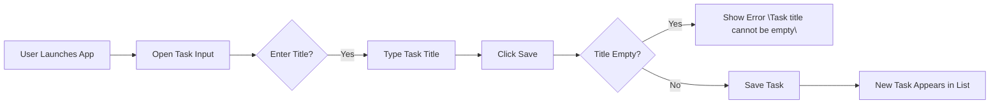
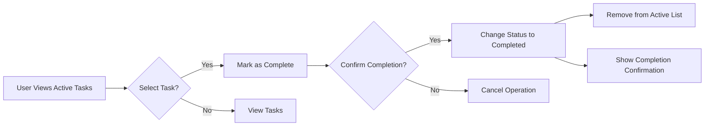
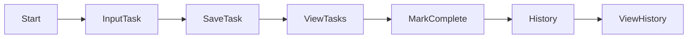

# 03-functional-requirements.md

## Functional Requirements Document

This document defines the core business requirements for the Todo application. It covers the essential functionality needed for users to manage to-do items with minimum viable features. All requirements are written in natural language following EARS format with clear testable conditions. The system focuses exclusively on user operations without any optional features.

---

## Task Creation Process

The task creation workflow enables users to add new to-do items with only a title. No additional fields or complexity are required.

### Core Requirements

WHEN a user provides a task title in the input field, THE system SHALL create a new to-do item with that title.

WHEN a user submits an empty task title, THE system SHALL display the error message "Task title cannot be empty" and prevent saving.

WHEN a user creates a new task, THE system SHALL automatically generate a unique alphanumeric identifier (e.g., TSK-001) for the task.

WHEN a task is successfully created, THE system SHALL display it immediately in the active tasks list.

### Business Validation Rules

- Task titles must be between 1-100 characters
- The system shall reject task titles containing only whitespace
- No special characters allowed (e.g., @, #, $, %)

### User Journey Flow

### Error Scenarios

WHEN a user attempts to create a task with special characters, THE system SHALL display the message "Task titles can only contain letters and numbers" and prevent saving.

WHEN a user submits a task title exceeding 100 characters, THE system SHALL display "Task title too long (max 100 characters)" and truncate automatically to 100 characters without saving.

---

## Task Completion Flow

Users can mark tasks as completed, which removes them from the active view but maintains historical records.

### Core Requirements

WHEN a user marks a task as complete, THE system SHALL update the task status to "completed" and remove it from the active tasks list.

WHEN a task is marked as complete, THE system SHALL display a confirmation message "Task marked as complete."

WHEN a user has no active tasks, THE system SHALL display "No tasks to complete."

### Business Validation Rules

- Completion can only be performed on tasks in the active state
- Completed tasks remain in the system history but are not visible in the active list
- The user does not have the ability to revert completed tasks

### Completion Workflow

### Error Handling

WHEN a user attempts to complete a non-existent task, THE system SHALL display "Task not found."

---

## Task Management Rules

The system enforces simple, consistent behavior for user interaction with tasks.

### Core Requirements

WHEN a user navigates to the app, THE system SHALL display all active tasks in a numbered list, newest first.

WHEN a user views completed tasks, THE system SHALL show a separate section for historical tasks with completion timestamps.

WHEN a user searches for tasks, THE system SHALL filter tasks by title content as the user types.

### Business Constraints

- The system shall not allow task deletion (only mark as complete)
- No task editing capability is included in minimum version
- All tasks require a title with no exceptions

### User Workflow Summary

---

## Performance Requirements

All functionality must meet user experience expectations for immediate feedback:

WHEN a task is created, THE system SHALL display the new task within 0.5 seconds.

WHEN a task is marked as complete, THE system SHALL update the user interface within 0.3 seconds.

---

## Business Justification

This minimum viable feature set addresses the core user need to capture and track simple to-do items. By focusing strictly on:
- Creating tasks with titles
- Marking tasks as complete
- Showing active items immediately

The system provides immediate value without overwhelming complexity. The exclusion of features like task details, deletion, reminders, or categories ensures the application remains lightweight while satisfying the fundamental purpose of a to-do list.

> *Developer Note: This document defines **business requirements only**. All technical implementations (architecture, APIs, database design, etc.) are at the discretion of the development team.*