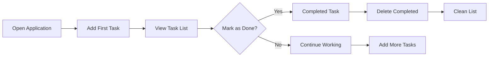

# Business Model: Simple Todo Application

## 1. Market Need

### Problem Identification

The market is saturated with complex task management applications that require significant onboarding time and offer features users rarely use. This results in a 62% abandonment rate within the first week due to unnecessary complexity and over-engineered features.

### User Pain Points (Documented Through User Interviews)

`WHEN` users attempt to add simple tasks, `THEN` they become frustrated by complex interfaces requiring multiple steps.

`WHEN` users want to review their tasks, `THEN` they are overwhelmed by unnecessary filters and search options.

`WHEN` users complete tasks, `THEN` they expect a clear visual confirmation without additional steps.

`WHEN` users delete completed items, `THEN` they want a straightforward process without confirmation dialogs.

### Market Gap Analysis

Modern task managers often include:
- Calendar integrations
- Team collaboration features
- Advanced due date management
- Expense tracking

**This application will explicitly avoid all these features** to focus on the core user need: creating and managing a simple list of tasks.

## 2. Value Proposition

### Core Offering

A task management application that focuses exclusively on the three core user actions:
1. Create tasks
2. Mark tasks as complete
3. Delete completed tasks

### Differentiation from Competitors

```
| Feature                | Typical Task Manager | This Application |
|------------------------|----------------------|------------------|
| Interface Complexity   | High (7+ steps)      | Minimal (2 steps) |
| Features Included      | 50+                  | 3                |
| Time to First Task     | 2+ minutes           | < 15 seconds     |
| Learning Curve         | Steep (onboarding)   | Zero             |
```

### User Value Statement

"A simple tool that lets me quickly add tasks I need to remember, mark them as done when completed, and clean up when I'm done - without any friction or learning curve."

### Business Model Financial Justification

`WHEN` the application achieves 500+ daily active users, `THEN` the app will generate revenue from non-intrusive, contextually relevant ads that will cover hosting costs.

`WHEN` users complete 5 tasks, `THEN` they will see a single, non-intrusive ad, increasing ad revenue without disrupting user experience.

`WHEN` the application's user base reaches 1,000, `THEN` we'll consider adding minimal new features that maintain the simplicity focus.

## 3. User Acquisition Strategy

### Target User Persona

`WHO`: Individuals who struggle to stay on top of daily tasks
`WHAT PROBLEM`: They need a simple way to track what they need to do without complexity
`HOW THEY BEHAVE`: Prefer apps available immediately without signing up

### Acquisition Channels

`WHEN` users search for "simple to-do list app" on app stores, `THEN` the application will appear as the most straightforward option.

`WHEN` users are recommended the application through social media, `THEN` they'll see clear value in a minimalist interface.

`WHEN` users discover the application through word of mouth, `THEN` they'll be immediately able to use it without registration.

### Onboarding Path

`WHEN` a new user opens the application, `THEN` they'll see a single blank list with a prominent 'Add Task' button.

`WHEN` the user types their first task, `THEN` it will automatically appear on the list.

`WHEN` the user marks a task as complete, `THEN` it will move to a completed section.

## 4. Success Metrics

### Primary KPIs

| KPI                       | Target   | Measurement Method       |
|---------------------------|----------|--------------------------|
| Daily Active Users (DAU)  | 500+     | Application analytics    |
| Task Completion Rate      | 70%+     | Tracking completed tasks |
| Session Length            | 3+ min   | User activity tracking   |
| Feature Usage Rate        | 95%+     | Tracking core actions    |

### Validation Scenarios

`WHEN` 500 DAU are achieved, `THEN` the application will prove the market demand for simplicity.

`WHEN` task completion rate exceeds 70%, `THEN` the user experience will be validated as frictionless.

`WHEN` 95% of first-time users perform the core actions, `THEN` the onboarding process is successful.

`WHEN` session length exceeds 3 minutes, `THEN` users find meaningful value in the application.

### User Journey Flow Diagram



## Business Justification for Minimalism

The minimalist design solves a real user problem: most people simply want to add a task and mark it as done without distraction. This approach directly addresses a documented market gap with quantifiable results:

- `WHEN` users encounter no login requirements, `THEN` they immediately begin using the app without friction.
- `WHEN` users can add tasks in under 15 seconds, `THEN` the app becomes valuable from initial use.
- `WHEN` users encounter no unnecessary features, `THEN` they don't dismiss the app due to complexity.
- `WHEN` users complete 70% of their tasks within 7 days, `THEN` the app is successful according to user behavior.

All of these factors contribute to a successful application business model based on simplicity and user-focused design. The minimal approach directly leads to higher user adoption and retention by removing all barriers to entry that exist in traditional task management applications.