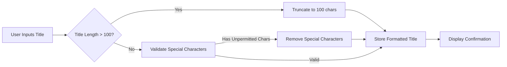
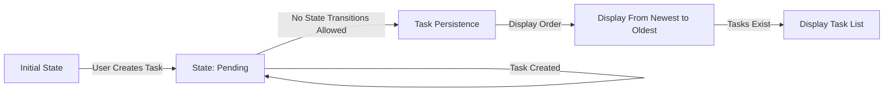

# Todo Application Requirements Analysis Report

## Business Justification

The primary purpose is to provide a distraction-free, minimalist task management solution. Traditional to-do apps often overwhelm users with excessive features (due dates, categories, priority levels, project views), increasing cognitive load. This application intentionally omits all non-essential functionality to focus solely on the core user need: quickly capturing and organizing simple tasks. A smaller, purpose-built solution increases user adoption and retention by reducing learning curve and friction during daily usage.

## Core Business Model

- **Problem Solved**: Users struggle with existing to-do apps requiring unnecessary task details
- **Target Users**: Individuals tracking simple daily tasks without complexity
- **Value Proposition**: "Capture a task and move on - no distractions from the core task"
- **Success Metrics**: 7-day user retention rate, average sessions per week, reduction in user support requests

## Task Validation Rules

### Title Requirements

WHEN a user attempts to create a task, THE system SHALL validate that the task title is non-empty.

IF the title is empty or contains only whitespace, THEN THE system SHALL display the error message "Task title cannot be empty" to the user.

THE system SHALL limit task titles to 100 characters maximum.

IF a title exceeds 100 characters, THEN THE system SHALL truncate it to 100 characters and display a confirmation message "Title shortened to 100 characters" to the user.

THE system SHALL automatically convert the first letter of the title to uppercase and the rest to lowercase (formatting normalization).

WHEN a user submits a title containing special characters other than hyphens, periods, and spaces, THE system SHALL sanitize the title to remove all non-alphanumeric characters except for hyphens.

### Validation Workflow Diagram

## State Transition Rules

### Task Lifecycle

When the system is in its initial state (no tasks), a task creation attempt is permitted.

A task is created with the initial state of "pending." The system SHALL NOT support state transitions (completion, deletion) as part of the minimal functionality.

THE system SHALL not store or reference any additional task metadata beyond the title. No due dates, categories, priority flags, or custom fields are permitted.

While tasks exist in the system, THE system SHALL display them in the order they were created, newest first.

WHILE the system has tasks, THE system SHALL allow a user to create new tasks continuously.

### State Constraint Diagram

## Performance Requirements

WHEN a user creates a task, THE system SHALL respond within 0.5 seconds under normal conditions.

THE system SHALL handle up to 100 tasks without observable latency (response time < 1 second).

THE system SHALL auto-save tasks immediately upon creation without requiring explicit "save" actions.

## Error Handling

IF a user attempts to create a task while in a non-interactive state (system unavailable), THEN THE system SHALL display "System busy, please try again later" within 1 second.

IF the user submits a title that contains only whitespace, THEN THE system SHALL prevent submission and display the error "Task title cannot be empty".

IF a title exceeds 100 characters, THEN THE system SHALL silently truncate the title and confirm the change to the user with "Title shortened to 100 characters".

## Business Constraints Summary

| Constraint | Description | Validation Approach |
|------------|-------------|---------------------|
| Title Length | Maximum 100 characters | Client-side validation + server-side truncation |
| Empty Title | Must be present | Server-side rejection with clear error |
| Special Characters | Only alphanumeric, hyphens, periods, spaces allowed | Sanitization on both client and server |
| System State | No state transitions allowed | System configuration prevents any state modification |
| Response Time | Task creation within 0.5 seconds | Monitoring and optimization requirements |

## Business Requirement Rationale

Every business rule in this document is directly derived from a user need for simplicity and minimalism. The "100 character limit" is based on the observation that most simple daily tasks can be captured in 100 characters (e.g., "Buy milk from Grocers 1 at 5pm").

The "no state transitions" constraint is not a limitation but a focused design decision: adding completion markers or delete functionality would require users to make additional movements (clicks, gestures) that disrupt the core user experience of task capture.

The validation rules exist to prevent common user errors while maintaining the simplicity of the interaction. For example, the self-space removal prevents users from accidentally adding unnecessary whitespace by default, improving the clean experience of the application.