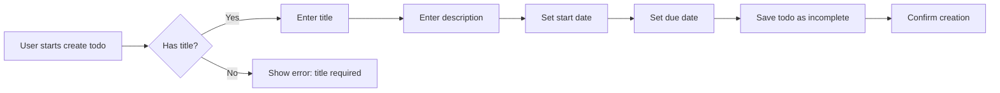

# Multi-User Todo Application Requirements Specification

## 1. Introduction
This comprehensive business requirements document details the specifications for a private, multi-user todo management system. The application enables users to create, manage, and track personal to-do items with full history tracking while maintaining strict privacy controls. All requirements are specified in EARS format with measurable conditions for implementation.

## 2. Todo Management

### 2.1 Creating Todos

WHEN a user initiates the creation of a new todo, THE system SHALL require the title field to be provided (cannot be empty).

WHEN a user leaves the description field empty, THE system SHALL store it as an empty string.

WHEN a user omits start date and due date fields, THE system SHALL initialize them to null values.

WHEN a user creates a new todo, THE system SHALL automatically set the completion status to 'incomplete'.

WHEN a user attempts to create a todo without a title, THE system SHALL display the error message: "Title is required".

### 2.2 Editing Todos

WHEN a user modifies a todo's title, description, start date, or due date, THE system SHALL create a new entry in the edit history with the previous and new values.

WHEN a user saves modified fields, THE system SHALL validate each field against business rules:
- Title: Must be 1-255 characters
- Description: Max 5000 characters

WHEN a user requests a todo's full details, THE system SHALL display the complete description field along with all metadata.

### 2.3 Completing Todos

WHEN a user toggles the completion status of a todo, THE system SHALL update the status from 'incomplete' to 'complete' or vice versa.

WHEN a user marks a todo as complete, THE system SHALL record the timestamp of completion.

### 2.4 Edit History

WHEN a user requests the edit history of a todo, THE system SHALL return all history entries sorted from most recent to oldest.

WHEN a user views an edit history entry for title changes, THE system SHALL display: "Title changed from [old] to [new]".

WHEN a user views an edit history entry for description changes, THE system SHALL display: "Description changed from [old] to [new]".

### 2.5 Deleting and Trash Management

WHEN a user deletes a todo, THE system SHALL mark it as _deleted_ (soft delete) without removing from persistent storage and remove it from the main todo list.

WHEN a user requests the trash list, THE system SHALL return paginated deleted todos (10 per page) with full details.

WHEN a user restores a todo from trash, THE system SHALL change its status from deleted to active and add it back to the main todo list.

WHEN a user permanently deletes a todo from trash, THE system SHALL remove all related entries (including edit history) from all storage systems.

## 3. User Profile

### 3.1 Profile Management

WHEN a user creates an account, THE system SHALL require a valid email format and password meeting complexity requirements.

WHEN a user changes their display name, THE system SHALL validate it against a minimum length of 2 characters and maximum of 50 characters.

WHEN a user requests their profile, THE system SHALL display only their own display name without any other user data.

WHEN a user deletes their account, THE system SHALL permanently remove all related todos (including those in trash) and user profile data.

### 3.2 Privacy Requirements

THE system SHALL ensure no user can view, access, or share another user's todos or profiles.

WHEN a user is not authenticated, THE system SHALL prevent all access to todo management features with a 401 status code.

WHEN a user attempts to access another user's profile, THE system SHALL return a 403 status code with the message: "You do not have permission to view this profile".

## 4. Authentication

### 4.1 Core Authentication Functions

WHEN a user registers with email and password, THE system SHALL validate the credentials before storage.

WHEN a user submits login credentials, THE system SHALL verify the email-password combination against the secured storage.

WHEN a user submits valid authentication credentials, THE system SHALL generate a JWT access token valid for 15 minutes and a refresh token valid for 7 days.

### 4.2 Token Management

THE system SHALL store access tokens in httpOnly cookies with Secure and SameSite=Strict attributes.

WHEN a user is inactive for 30 days, THE system SHALL automatically expire all tokens associated with that account.

WHEN a user requests to change their password, THE system SHALL require the current password before accepting the new password.

## 5. Privacy Rules

### 5.1 Data Isolation

WHEN a user is logged in, THE system SHALL restrict all todo data to the user's own todos only.

WHEN a user views their todo list, THE system SHALL not display any todos from other users.

WHEN a user requests another user's todos, THE system SHALL log the access attempt and return a 403 error.

### 5.2 Security Requirements

THE system SHALL never store passwords in plaintext, only as secure hashes with salt.

WHEN a user deletes their account, THE system SHALL ensure no traces of their data remain in the system.

WHEN a user edits a todo, THE system SHALL verify ownership of the todo before allowing changes.

## Mermaid Diagrams

### Todo Creation Workflow

