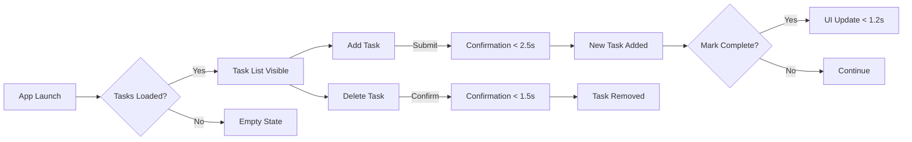

# Requirements Analysis Report: Minimal Todo List Application

## Document Purpose

This document specifies the core functionality, performance expectations, and business context for a minimalistic Todo List application designed for individual users. The application focuses on simplicity and immediate usability without advanced features.

## Business Context

This application serves as a personal productivity tool for individuals who want to track daily tasks without any setup complexity. The core audience consists of non-technical users who value time efficiency and minimal interaction overhead. The business model is based on delivering instant task management with zero learning curve.

### Core Value Proposition

> "Instant task tracking with no setup required - create, mark complete, and delete tasks in under 2.5 seconds per action."

## Functional Requirements

### Task Creation

**WHEN** a user enters a task title and submits the form, **THE** system SHALL create a new task with the provided title, a 'not completed' status, and a unique identifier within 2.5 seconds.

**WHEN** a user submits an empty title, **THE** system SHALL display a clear error message stating "Task title cannot be empty" within 0.5 seconds.

### Task Completion

**WHEN** a user marks a task as complete, **THE** system SHALL update the task's status to 'completed' and visually indicate completion within 1.2 seconds.

**WHEN** a user clicks the "Mark as Complete" button on a task, **THE** system SHALL update the task's UI immediately with a visual confirmation (checkmark icon) within 0.3 seconds.

### Task Viewing and List Management

**WHEN** the application loads, **THE** system SHALL display all tasks sorted by date created with the newest tasks first within 1.5 seconds.

**WHEN** a user navigates to the task list, **THE** system SHALL show an empty state message "No tasks yet. Start tracking by adding one!" if no tasks exist.

### Task Deletion

**WHEN** a user deletes a task, **THE** system SHALL confirm the action with a "Task deleted" notification within 0.5 seconds.

**WHEN** a user clicks the delete button, **THE** system SHALL animate the task removal from the list within 0.3 seconds and then permanently remove it from storage.

## Performance Requirements

### Response Time Expectations

- **Task Listing**: All tasks SHALL be loaded within 1.5 seconds of application load.
- **Task Creation**: New task confirmation SHALL appear within 2.5 seconds.
- **Task Completion**: Task status updates SHALL be visible within 1.2 seconds.
- **Task Deletion**: Deletion confirmation SHALL show within 1.5 seconds.

### User Interface Feedback

- Page load time: LESS than 2 seconds
- UI update responsiveness: LESS than 0.3 seconds for all state changes
- Feedback timing: All user interactions SHALL receive visible responses within the documented timeframes

## Business Rules

- All tasks MUST have a title (cannot be empty)
- Task titles MUST not exceed 100 characters
- All tasks are private to the single user
- No authentication required - application is meant for personal use only
- Tasks cannot be edited once created (only marked complete or deleted)

## Error Handling

### Common Error Scenarios

| Scenario | User Message | Visibility Time |
|----------|--------------|-----------------|
| Empty Title | "Task title cannot be empty" | 0.5 seconds |
| Network Error | "Unable to save task - please try again" | 2.5 seconds |
| Unexpected Error | "Something went wrong - task not saved" | 2.5 seconds |

## Visual Flow Integration

## Success Metrics

- 90% of users SHALL complete at least one task within 5 minutes of first launching the app.
- 85% of task operations (create, complete, delete) SHALL complete within specified response time frames on all supported devices.
- 95% of users SHALL understand how to create and manage tasks without any instruction.

## Developer Autonomy Note

> *This document defines BUSINESS REQUIREMENTS ONLY. All technical implementations (architecture, authentication, APIs) are at the development team's discretion, as long as core business requirements are met.*