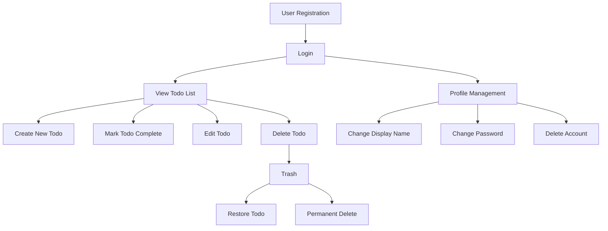

# Multi-User Todo Application - Requirements Specification

## Service Overview

### Core Purpose

The Multi-User Todo Application provides individuals with a personal, private task management solution for organizing daily activities, priorities, and responsibilities. The application maintains complete isolation between user accounts, ensuring that each user has exclusive access to their own tasks and associated data.

### Target Audience

The application is designed for professionals, students, and individuals who need a simple yet comprehensive tool for managing personal work and life responsibilities in a private, secure environment. The solution targets users who prioritize data privacy and do not require team collaboration features.

### Service Vision

To become the most trusted personal task management application through strict data privacy, intuitive interface, and reliable task tracking without any shared data between users.

## Problem Definition

### Current Pain Points

Users face significant challenges with existing task management tools due to:

- **Data Privacy Concerns**: Many popular task applications share user data across services or require excessive personal information.

- **Complexity for Personal Use**: Most applications are designed for teams, making them overly complex for individual use.

- **Lack of Comprehensive History Features**: Limited or no tracking of task modifications over time.

- **Inconsistent Data Handling**: Inconsistent treatment of deleted tasks and lack of restoration capabilities.

### User Frustrations

Users struggle with:

- **Account Management Frustrations**: Difficulty finding options to permanently delete accounts and all associated data.

- **Task Management Inefficiencies**: Inability to easily restore accidentally deleted tasks.

- **Privacy Uncertainty**: Unclear whether others could access their task data.

- **Editing Ambiguity**: Uncertainty about what changes were made to tasks and when.

## Value Proposition

### Unique Differentiators

- **Strict Privacy by Design**: Complete data isolation between user accounts with automatic filtering of user-specific tasks.

- **Comprehensive Edit History**: Full tracking of task modifications, showing what changed and when.

- **Flexible Deletion Workflow**: Complete control over task lifecycle through soft delete, trash management, and permanent deletion.

- **Simple, Secure Authentication**: Intuitive signup/login process with robust security requirements.

### Key Benefits

- **Privacy Assurance**: Users never have to worry about their task data being shared with others.

- **Data Recovery Options**: Accidental deletions can be easily restored.

- **Task Accountability**: Full history of task modifications provides accountability for changes.

- **Streamlined Account Management**: Simple processes for password changes, profile updates, and permanent account deletion.

## Service Operation Overview

### User Workflow

### Basic Interaction Flows

#### Account Management Flow

WHEN a user registers with a valid email and password, THE system SHALL create an account with a verification email and automatically log the user in.

WHEN a user changes their password, THE system SHALL require the current password for verification before accepting the new password.

WHEN a user deletes their account, THE system SHALL confirm the operation and permanently remove all data associated with that user, including all todos and edit history.

#### Todo Management Flow

WHEN a user creates a new todo, THE system SHALL automatically set it to incomplete status and store it with current timestamps.

WHEN a user marks a todo as complete, THE system SHALL toggle the status and record the time of the change.

WHEN a user edits a todo, THE system SHALL create a new entry in the edit history containing the previous and new values of each changed field.

WHEN a user deletes a todo, THE system SHALL move it to the trash without permanently removing it from the database.

WHEN a user restores a todo from the trash, THE system SHALL move it back to the active todo list.

WHEN a user performs permanent deletion on a todo in the trash, THE system SHALL remove the todo and all its edit history.

## Primary User Scenarios

### Scenario 1: User Registration and First Todo Creation

WHEN a new user provides their email address and password at registration, THE system SHALL verify the email format and password strength requirements, then send a confirmation email.

AFTER the user confirms their email address, THE system SHALL automatically log them in and present the empty todo list.

WHEN the user creates their first todo with a title, THE system SHALL set it as incomplete and show it in the list with the current timestamp.

### Scenario 2: Complete Todo Management Including History

WHEN a user views their todo list, THE system SHALL display a paginated list showing title, completion status, and creation date.

WHEN a user selects a todo to view, THE system SHALL show all details including full description, edit history, and dates.

WHEN a user edits a todo (changing title, description, dates), THE system SHALL create a new entry in the edit history containing the previous and current values.

WHEN a user views the edit history of a todo, THE system SHALL display all changes chronologically from most recent to oldest.

### Scenario 3: Task Deletion and Restoration

WHEN a user deletes a todo from the active list, THE system SHALL move it to the trash section without removing it from the database.

WHEN a user views their trash, THE system SHALL display a paginated list of deleted todos with their original titles.

WHEN a user restores a todo from the trash, THE system SHALL move it back to the active todo list.

WHEN a user permanently deletes a todo from the trash, THE system SHALL remove it and its edit history from the database.

## Secondary Scenarios

### Scenario 1: User Profile Management

WHEN a user wants to change their display name, THE system SHALL allow the update after verifying the user is authenticated.

WHEN a user wants to change their password, THE system SHALL verify the current password before allowing the new password.

### Scenario 2: Advanced Sorting and Filtering

WHEN a user wants to sort their todos by due date, THE system SHALL allow selection of either earliest first or latest first.

WHEN a user filters todos to show only incomplete tasks, THE system SHALL display only tasks with completion status set to false.

WHEN a todo has no start date and the user sorts by start date, THE system SHALL display those todos at the end of the list.

### Scenario 3: Account Deletion Process

WHEN a user initiates the account deletion process, THE system SHALL prompt for password verification.

WHEN the user provides the correct password, THE system SHALL confirm account deletion and remove all associated data.

WHEN the account is deleted, THE system SHALL log out the user and respond with HTTP 204 No Content.

## Exception Handling

### Error Scenarios and Responses

#### Duplicate Email Registration

IF a user attempts to register with an email already in use, THEN THE system SHALL respond with HTTP 409 Conflict and message 'This email address is already associated with an account.'

#### Weak Password Validation

IF a password does not meet security requirements, THEN THE system SHALL respond with HTTP 400 Bad Request and message 'Password must be at least 8 characters with one uppercase, one lowercase, and one number.'

#### Invalid Login Credentials

IF a user provides incorrect email or password, THEN THE system SHALL respond with HTTP 401 Unauthorized and message 'Invalid email or password.'

#### Unauthorized Access to Other User's Data

IF a user attempts to access another user's todos or profile, THEN THE system SHALL respond with HTTP 403 Forbidden and message 'You do not have permission to access this resource.'

## Performance Requirements

### Response Time Expectations

- User authentication: SHALL complete within 2 seconds
- Todo list loading (without filter): SHALL complete within 1.5 seconds
- Single todo view: SHALL complete within 1.5 seconds
- Edit history loading: SHALL complete within 2 seconds
- Search operations: SHALL complete within 2.5 seconds

### Data Loading Performance

- Todo list pagination (25 items per page): SHALL load within 1.2 seconds per page
- Trash list pagination: SHALL load within 1.3 seconds per page
- Edit history for a single todo: SHALL load all entries within 1 second

### Scalability Considerations

- System SHALL handle up to 10,000 todos per user without performance degradation
- System SHALL maintain consistent response times with up to 50,000 concurrent users
- Database queries SHALL use indexing for all frequently accessed fields

## Security and Compliance

### Authentication Security

- Passwords SHALL be stored using bcrypt with 12+ rounds of hashing
- JWT tokens SHALL use 30-minute expiration times
- JWT tokens SHALL include user_id, role (default 'user'), and permissions array
- Password verification SHALL be required for sensitive operations

### Data Privacy Requirements

- ALL todo data SHALL be strictly isolated by user
- NO data SHALL be accessible across user accounts
- Database queries SHALL include user_id filters automatically
- Account deletion SHALL permanently remove all user data from the system

### Comprehensive Security Implementation

THE system SHALL enforce all security requirements at the service layer before any data operations are performed.

THE system SHALL store all passwords using bcrypt with a minimum of 12 rounds of hashing.

THE system SHALL generate JWT tokens with a 30-minute expiration period.

THE system SHALL require password verification for all sensitive operations including password change and account deletion.

## Privacy Implementation

### Strict Data Isolation

ALL requests involving todo data SHALL be filtered by the authenticated user's ID.

WHEN a user accesses their todo list, THE system SHALL automatically limit results to only the user's todos.

WHEN a user views a specific todo, THE system SHALL verify that the todo belongs to the authenticated user before showing it.

WHEN processing a todo edit, THE system SHALL confirm that the current user is the owner of the todo before applying changes.

### User Data Privacy Principles

1. **Privacy by Default**: All data is private unless explicitly shared
2. **Data Minimization**: Only necessary data is stored and accessed
3. **User Control**: Users have complete control over their data lifetime
4. **Accountability**: Every data operation is auditable through the system

### System-Wide Privacy Enforcement

THE system SHALL enforce private access for all features by default:
- Users cannot view other users' todos
- Users cannot manage other users' todo items
- Users cannot access other users' edit history
- Users cannot restore or permanently delete other users' todos from trash

THE system SHALL verify user identity at every interaction point where user-specific data is accessed or modified.