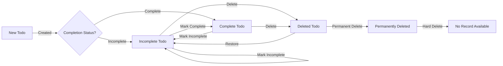

# Multi-User Todo Application: Requirements Specification

## 1. User Account Management

The system shall implement a private account management solution where each user exclusively controls their personal task management without sharing capabilities. All account operations require authentication.

### 1.1 User Registration

WHEN a new user provides valid email and password, THE system SHALL create a new account with verification email sent immediately. WHILE 24 hours elapse without email verification, THE system SHALL automatically set account to expired status. WHEN the user clicks the verification link, THE system SHALL activate the account and log the user in. 

**SUCCESS CRITERIA**: The user is immediately enrolled in the todo service upon successful verification with no additional steps required.

### 1.2 Authentication Security

WHEN a user logs in with valid credentials, THE system SHALL generate a secure session token valid for 30 minutes of inactivity. IF the session expires, THE system SHALL prompt for re-login. WHEN a user requests password reset, THE system SHALL send a verification code to the registered email. IF the user submits the correct verification code, THE system SHALL allow password change.

### 1.3 Account Deletion

WHEN a user requests permanent account deletion, THE system SHALL confirm the action and then perform cascade delete across all associated data. IF confirmed, THE system SHALL delete the user profile, all todos in all states (active, deleted, trash), and associated edit history without exception. 

**SECURITY NOTE**: All account deletion operations shall trigger a system log at CRITICAL severity level documenting the deletion event and user ID for audit purposes.

## 2. User Profile Management

The system shall provide a private profile management interface exclusive to each user. Profile data shall not be visible to any other users or system entities.

### 2.1 Display Name Requirements

WHEN a user attempts to change their display name, THE system SHALL validate that the name meets minimum length requirement of 2 characters and contains no prohibited special characters. IF invalid, THE system SHALL display clear error message "Display name must be at least 2 characters and contain only letters, numbers, or underscores." 

### 2.2 Privacy Enforcement

WHILE the system processes any profile operation, THE system SHALL verify that the requesting user owns the profile data. IF a user attempts to view another user's profile, THE system SHALL return error code 403 Forbidden with message "You cannot view other users' profile information."

## 3. Todo Creation

Todos are the core functional object representing user tasks. Each todo shall be owned exclusively by the creating user.

### 3.1 Mandatory Fields

WHEN a user submits a new todo, THE system SHALL require title to be specified with minimum 1 character and maximum 100 characters. IF the user provides no title, THE system SHALL prevent creation with message "Title is required to create a todo". 

### 3.2 Default Status

WHEN a new todo is created without explicit status, THE system SHALL set its status to "incomplete" by default. THE system SHALL record the timestamp of creation.

### 3.3 Date Field Constraints

WHEN a user attempts to set a start date after the due date, THE system SHALL validate this constraint and display error message "Start date cannot be after the due date". 

## 4. Todo Viewing and Filtering

Users shall view and manage todos through a paginated interface with filtering capabilities.

### 4.1 List Viewing Requirements

WHEN a user views their todo list, THE system SHALL display 10 todos per page with pagination controls. EACH todo shall show title, completion status, start date (if set), due date (if set), and creation date. If a date is not provided (e.g., due date), THE system SHALL display "N/A".

### 4.2 Filtering Criteria

WHEN the user applies "All Todos" filter, THE system SHALL display all todos regardless of status. WHEN applying "Only Complete" filter, THE system SHALL exclude all incomplete todos. WHEN applying "Only Incomplete" filter, THE system SHALL exclude all complete todos. 

**SORTING RULES**: By default, todos shall display in chronological order by creation date.

## 5. Completing and Incomplete Status

Toggling between completion states is a fundamental todo operation without side effects beyond status change.

### 5.1 Status Transition Requirements

WHEN a user toggles a todo from incomplete to complete, THE system SHALL record the completion timestamp. WHEN toggling from complete to incomplete, THE system SHALL record the incompletion timestamp. THE system SHALL update the status display immediately without requiring page refresh.

## 6. Todo Editing

Every edit to a todo shall create a history entry for audit and recovery purposes.

### 6.1 Editing Process

WHEN a user edits a todo field (title, description, start date, due date), THE system SHALL save the changes and immediately create a new history entry. THE system SHALL confirm the edit with a user-facing message "Todo updated successfully". 

### 6.2 Edit History Requirements

WHEN a user views history for a todo, THE system SHALL display all history entries sorted newest to oldest. EACH entry SHALL include: timestamp, previous value, and new value for each modified field. 

**HISTORY EXCEPTION**: Edit history shall not record when no changes were made to the todo data.

## 7. Soft Deletion and Trash Management

Todos that are deleted shall be moved to the trash for potential recovery before permanent deletion.

### 7.1 Soft Delete Workflow

WHEN a user requests to delete an active todo, THE system SHALL move it to trash and notify user "Todo moved to trash". THE system SHALL prevent deletion of items already in trash. 

### 7.2 Trash Restoration Process

WHEN a user requests to restore a todo from trash, THE system SHALL move it back to the active todo list and notify user "Todo restored to active list". THE system SHALL ensure all data integrity by maintaining complete history.

### 7.3 Permanent Deletion

WHEN a user permanently deletes a todo from trash, THE system SHALL remove the todo and all associated history immediately. IF the user attempts to permanently delete a todo that is no longer in trash, THE system SHALL return error message "This todo is no longer in your trash".

## 8. Privacy and Data Isolation

Privacy is a core business requirement, not an optional feature. All data must be strictly isolated.

### 8.1 Data Ownership Enforcement

WHEN a user attempts to access another user's todos, THE system SHALL verify data ownership. IF the ownership check fails, THE system SHALL return error code 403 Forbidden with message "Unauthorized access - you can only view your own todos". 

**AUDIT REQUIREMENT**: EVERY data access operation shall be logged with the requesting user ID and target data ownership status.

### 8.2 Account Deletion Data Impact

WHEN a user permanently deletes their account, THE system SHALL cascade delete all todos (including those in trash or history) without exception. THE system SHALL not leave orphaned data in the database.

## 9. Business Process Mapping

The following Mermaid diagram illustrates the complete workflow for a todo item from creation to permanent deletion:

