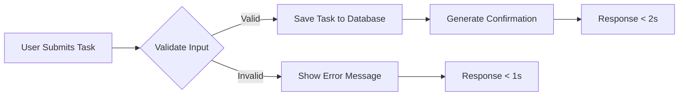

# Requirements Analysis Report

## Business Context
The Todo application is designed for users who need a minimalist to-do list focused solely on capturing temporary tasks without any additional complexity. This product follows the 'keep it simple' principle to deliver a frictionless experience for users who often forget to capture their tasks and do not need advanced features like task completion tracking or deletion. By intentionally omitting these features, the development cycle is shortened, the codebase remains clean, and the application provides immediate value with the most critical functionality.

The target users are non-technical individuals who want an instant solution to capture and manage their short-term tasks. The application is intended for use on mobile and web platforms, with no planned support for advanced integrations or complex workflows.

## Core Business Process
The entire business process revolves around creating tasks, which are the only data entities in the system. The user experience should be so simple that it requires no learning curve:
1. User sees a text input field
2. User types a task description
3. User clicks the 'Add' button
4. System validates the input and responds (either confirming creation or showing an error)

This streamlined process ensures that users can capture tasks in under 5 seconds from the moment they remember it, maximizing usage and satisfaction.

## Functional Requirements
All requirements are documented in EARS format for clarity and testability.

### Task Creation
- **WHEN** a user provides a task title and clicks 'Add Task',
  **THE** system **SHALL**
    a) Validate that the title is non-empty,
    b) Save the task to persistent storage,
    c) Display a confirmation message to the user within 2 seconds of submission.

### Invalid Input Handling
- **WHEN** a user attempts to submit a task with an empty title,
  **THE** system **SHALL**
    a) Immediately display the error message 'Task description cannot be empty',
    b) Ensure this error appears within 1 second of submission,
    c) Not proceed with any database operations.

### Performance Requirements
- **WHEN** the system processes a task creation request,
  **THE** system **SHALL**
    a) Include the HTTP header `X-Response-Time` with the processing duration in milliseconds,
    b) Log any creation requests where the response time exceeds 1.5 seconds as `slow_task_creation` with severity `warning`,
    c) Implement client-side caching for repeated task creation attempts within the same session to reduce perceived latency.

## Business Model Visualization
