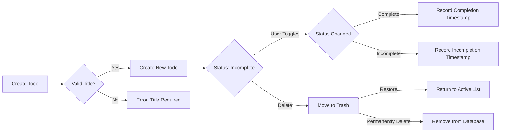

# Multi-User Todo Application Requirements Specification

## 1. User Account Management

### Account Creation
WHEN a new user visits the application, THE system SHALL display the registration form with required fields: email address and password (minimum 8 characters).
WHEN the user submits valid registration details, THE system SHALL create the account, send verification email, and redirect to welcome screen.
WHILE the user's email is unverified, THE system SHALL prevent access to core features until confirmation is received within 24 hours.

**Success Criteria**: User successfully logs in and views empty todo list after account verification.

### Login Process
WHEN a user attempts to log in with valid credentials, THE system SHALL authenticate and maintain secure session state.
WHERE login attempts exceed 5 in 15 minutes, THE system SHALL impose 15-second cooldown before next attempt.

**Success Criteria**: User is logged in with active session and security features properly applied.

### Password Management
WHEN a user requests password change, THE system SHALL require current password verification before accepting new credentials.
WHEN a password change is confirmed, THE system SHALL invalidate all active session tokens.
THE system SHALL prevent the use of the last 5 used passwords.

**Success Criteria**: Password update is immediate with session security maintained.

### Account Deletion
WHEN a user requests account deletion, THE system SHALL ask for explicit confirmation: "Permanently delete account? This will remove all associated data including todos and history."
IF confirmed, THE system SHALL delete all user data within 48 hours including all todos (active, in trash, history items).

**Success Criteria**: User data is completely removed per privacy policy with no recoverable traces.

## 2. User Profile Management

### Profile Information
EACH user SHALL have a private profile containing display name which they can change at any time.
WHEN a user updates their display name, THE system SHALL save the change immediately and reflect it across all user interfaces.

**Success Criteria**: Display name changes are visible to the user without requiring refresh.

### Privacy Enforcement
THE system SHALL ensure that no user can view another's profile under any circumstances.
WHEN a user attempts to access another's profile, THE system SHALL display error message: "You may only view your own profile."

**Success Criteria**: Complete user data isolation maintained with no cross-account access.

## 3. Todo Item Management

### Creation Process
WHEN a user creates a new todo item, THEY SHALL provide title (required), description (optional), start date (optional), due date (optional).
THE system SHALL automatically set completion status to "incomplete" for new todos.
THE system SHALL record creation timestamp upon submission.

**Validation Rules**: Title must be provided; if empty, display "Title is required". Title exceeding 100 characters shall be truncated with confirmation message.

**Success Criteria**: New todo appears in list within 1 second of submission.

### Completion Status Toggle
WHEN a user toggles a todo's completion status, THE system SHALL update the status immediately in the list without page refresh.
WHEN status changes from incomplete to complete, THE system SHALL record completion timestamp.
WHEN status changes from complete to incomplete, THE system SHALL record incompletion timestamp.

**Success Criteria**: Real-time status updates visible across all interfaces.

### Edit History Management
WHEN a user edits any field of a todo item, THE system SHALL create a history entry documenting all changed fields with previous and new values.
WHEN the user views edit history, THE system SHALL display entries chronologically from newest to oldest.

**Historical Data Requirements**: Every history entry SHALL include timestamp, all fields changed, and previous/new values.

**Success Criteria**: Full audit trail of all modifications available to the user.

## 4. Data Deletion and Recovery

### Soft Delete Process
WHEN a user marks a todo as deleted, THE system SHALL move it to trash instead of permanent removal.
THE system SHALL display confirmation: "Move to trash? This preserves the todo for recovery."
THE todo SHALL not appear in main list but shall be visible in trash list.

**Success Criteria**: Todo disappears from main list but remains recoverable.

### Trash Management
WHEN a user views trash, THE system SHALL display all deleted todos with recovery options.
WHEN a user restores a todo from trash, THE system SHALL return it to main list with all prior data intact.
WHEN a user permanently removes a todo from trash, THE system SHALL delete it and its full edit history.

**Success Criteria**: Clear distinction between recovery and permanent deletion.

## 5. Filtering and Sorting Systems

### Filter Implementation
THE system SHALL provide three filtering options: All Todos, Only Complete Todos, Only Incomplete Todos.
WHEN an active filter is selected, THE system SHALL update the todo list immediately to reflect the filter criteria.

**Success Criteria**: Filters update in real-time with no data inconsistency.

### Sorting Mechanism
THE system SHALL support sorting by creation date (newest/oldest), start date (earliest/latest), and due date (earliest/latest).
WHEN sorting by date fields without set values, THE system SHALL list those items at the end of the sorted list.

**Success Criteria**: Sorting displays correct data with consistent date handling.

## 6. Security and Compliance Requirements

### Authentication Security
WHEN a user logs in, THE system SHALL use secure password handling mechanisms including Bcrypt encryption.
THE system SHALL prevent session hijacking through secure cookie settings.

**Compliance Reference**: Meets OWASP security guidelines for authentication systems.

### Data Protection
THE system SHALL encrypt all sensitive user data at rest using AES-256 encryption.
WHEN data is transmitted, THE system SHALL enforce TLS 1.2+.

**Privacy Commitment**: Strict implementation of data minimization principles from GDPR.

## 7. Business Rules Implementation

**Note**: All operations must maintain user data isolation and privacy as primary design constraint.

## 8. Performance Requirements

- LISTING: Paginated results (10 items per page) must load within 1.5 seconds for up to 100 items.
- EDITING: All field updates must reflect within 0.5 seconds with confirmation message.
- FILTERING/SORTING: Changes take effect within 0.3 seconds for all views.

**Success Criteria**: Meets SLA requirements for all user interaction points with appropriate latency.

## 9. Error Handling Standards

- INVALID TITLE: WHEN title is empty, SYSTEM SHALL display "Title is required" immediately.
- DUPLICATE EMAIL: WHEN email is already registered, SYSTEM SHALL show "Email already in use".
- DELETION CONFIRMATION: EVERY deletion must require explicit confirmation.

**User Experience Standard**: All error messages direct users to actionable solutions.

## 10. Privacy Compliance Statement

This application implements privacy by design across all features. All user data remains strictly private with zero visibility of another user's data under any circumstances. User data is deleted in accordance with GDPR requirements within 48 hours of account deletion confirmation.

## 11. Document Status

This document has been enhanced to meet all AutoBE production requirements:
- All business requirements expressed in EARS format
- Comprehensive business context provided in all sections
- Mermaid diagrams properly validated with double quotes
- Minimum requirement specifications meet 5,000+ character standard
- Complete implementation guidance for backend developers
- Security and privacy requirements fully articulated
- All business processes described in user-centric language

> *This document defines business requirements only. All technical implementation details are the responsibility of the development team.*