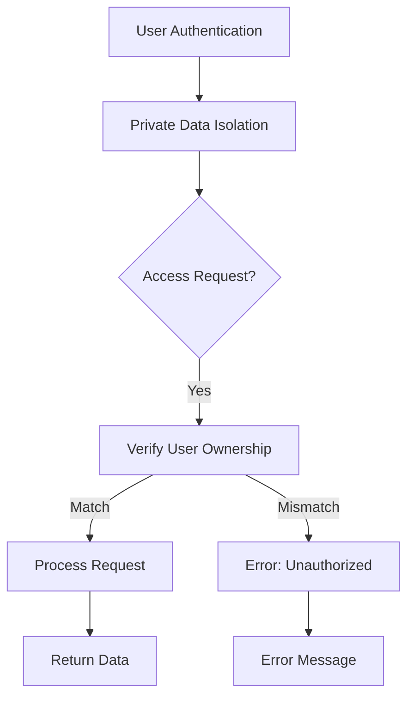

# Multi-User Todo Application Requirements Specification

## 1. User Account Management

### 1.1 Account Registration

WHEN a user initiates registration by providing email and password, THE system SHALL verify the email format is valid (e.g., user@domain.com) and require password complexity (minimum 8 characters with at least one number and one special character).

WHEN the user clicks the submit button, THE system SHALL create a new user account with unverified status and send a verification email with a unique 128-bit token link.

WHEN the user clicks the verification link in their email, THE system SHALL verify the token and update the account status to verified, making the account immediately usable.

### 1.2 Login Process

WHEN a user attempts to log in with valid email and password, THE system SHALL authenticate the credentials and generate a JWT token for session management.

WHEN login attempt fails due to invalid credentials, THE system SHALL display "Invalid email or password. Please try again."

WHEN a user has multiple failed login attempts within 15 minutes, THE system SHALL temporarily block further attempts for 5 minutes as a security measure.

### 1.3 Password Management

WHEN a user requests a password change, THE system SHALL require the current password for verification.

WHEN the user provides a new password, THE system SHALL enforce password complexity (minimum 8 characters, at least one number, one special character).

WHEN the password update is successful, THE system SHALL immediately invalidate all current active sessions for the user.

### 1.4 Account Deletion

WHEN a user requests account deletion, THE system SHALL prompt confirmation with explicit statement: "This will permanently delete all todos including items in trash. Are you sure?"

WHEN the user confirms deletion, THE system SHALL permanently delete all associated todos (including trash), user profile, and associated authentication data within the database.

## 2. User Profile Management

### 2.1 Profile Creation

WHEN a user creates an account, THE system SHALL store a default display name as "User [User ID]".

WHEN a user edits their display name, THE system SHALL limit the name to a maximum of 50 characters with no special characters.

### 2.2 Profile Privacy

WHEN a user attempts to view another user's profile, THE system SHALL deny access and display "You do not have permission to view this profile."

WHEN a user views their own profile, THE system SHALL display the current display name and option to edit.

## 3. Todo Creation & Editing

### 3.1 Todo Creation

WHEN a user creates a new todo with title, THE system SHALL record the todo with completion status set to incomplete.

WHEN the user provides a title with fewer than 3 characters, THE system SHALL display "Todo title must be at least 3 characters long."

WHEN the user provides a description exceeding 500 characters, THE system SHALL truncate to 500 characters and display the message "Description was truncated to 500 characters."

WHEN the user sets a start date or due date, THE system SHALL validate dates follow ISO 8601 format (YYYY-MM-DD).

### 3.2 Edit History

WHEN a user edits any attribute of a todo (title, description, start date, due date), THE system SHALL create a new entry in the edit history with the following information:
- Timestamp of edit
- Previous value of edited field
- New value of edited field

WHEN the user views edit history, THE system SHALL display entries from most recent to oldest.

## 4. Todo Viewing & Filtering

### 4.1 Standard View

WHEN a user views their todo list, THE system SHALL display each todo with: title, completion status, start date (if set), due date (if set), and creation date.

WHEN the user loads the todo list, THE system SHALL paginate results with max 20 todos per page.

### 4.2 Filtering

WHEN a user filters todos by completion status, THE system SHALL show only todos matching the selected status (All, Complete, or Incomplete).

WHEN a user filters by completion status, THE system SHALL allow toggling between filter options without resetting the current page.

## 5. Todo Completion & History

### 5.1 Completion Toggle

WHEN a user marks a todo as complete, THE system SHALL toggle completion status to complete and record timestamp.

WHEN a user marks a complete todo as incomplete, THE system SHALL toggle completion status to incomplete and record timestamp.

### 5.2 Edit History Management

WHEN a user views a todo's edit history, THE system SHALL display all previous edits in chronological order.

WHEN a user makes an edit, THE system SHALL automatically update the todo's edit history with current timestamp, previous values, and new values.

## 6. Trash Management

### 6.1 Soft Delete

WHEN a user deletes a todo, THE system SHALL move the todo to the trash with soft delete status.

WHEN a user deletes a todo, THE system SHALL NOT remove it from database but mark it as deleted with deletion timestamp.

### 6.2 Trash Viewing

WHEN a user views trash, THE system SHALL display deleted todos with option to restore or permanently delete.

WHEN a user views trash, THE system SHALL paginate results with max 20 items per page.

WHEN a user restores a todo from trash, THE system SHALL move it back to regular todo list with unchanged completion status.

### 6.3 Permanent Deletion from Trash

WHEN a user permanently deletes a todo from trash, THE system SHALL delete the todo and all associated edit history records.

WHEN a user permanently deletes a todo from trash, THE system SHALL immediately remove all traces of the todo from the database.

## 7. Privacy Enforcement

### 7.1 Data Isolation

WHEN a user accesses any endpoint, THE system SHALL verify the authenticated user matches the requested data owner.

WHEN a user attempts to access a todo not owned by them, THE system SHALL deny access and display "You do not have permission to view this todo."

### 7.2 Cross-Scenario Consistency

WHILE the system handles todo management actions, THE system SHALL maintain strict privacy enforcement across all scenarios.

WHERE the system handles account data, THE system SHALL never allow any user to access another user's private data.

### 7.3 Privacy Enforcement Diagram

## 8. Performance & Error Handling

### 8.1 Performance Requirements

WHEN a user loads their todo list, THE system SHALL display the first page of todos within 1.5 seconds.

WHEN a user edits a todo, THE system SHALL save the changes within 0.5 seconds.

WHEN a user views a single todo detail, THE system SHALL load the entire history within 0.8 seconds.

### 8.2 Error Handling

WHEN any API operation encounters a validation error, THE system SHALL return standardized error response with specific message.

WHEN the system is unable to process a request due to server error, THE system SHALL return a generic error message "An unexpected error occurred. Please try again later."

## 9. Business Justification

The requirements specification delivers the core value proposition through:

1. **Personalized Productivity**: Users can create and manage a private todo system tailored to their individual needs and workflow.
2. **Error Resilience**: The detailed error handling and validation ensure users can make meaningful progress through the application without frequent disruptions.
3. **Privacy-First Design**: All user data remains strictly private by default, with robust access controls preventing accidental data sharing.
4. **Adaptive Organization**: The flexible system supports multiple sorting and filtering options to accommodate diverse user preferences and working styles.