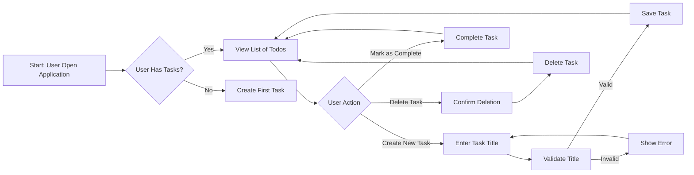

# Todo List Application - Requirements Analysis Report

This document provides comprehensive business requirements for a minimal-functionality Todo list application. The application focuses exclusively on core todo item management without any additional features (no due dates, categories, or multi-user support).

### 1. Business Model and Justification

#### Why This Service Exists

The current market is saturated with complex todo applications that include unnecessary features (due dates, reminders, categories, teamwork) that overwhelm casual users. Most users simply need a tool to track basic tasks without distraction. This application fills the gap by providing the absolute minimal necessary functionality for task management.

The problem it solves is clear: users want to create a quick list of things to do, check items off as they complete them, and get rid of completed items. They don't need to schedule tasks, assign owners, or add notes. They need something that's immediately intuitive with zero learning curve.

This service differentiates itself by purposefully ignoring every feature that's not absolutely necessary for task tracking. It's the 'just the essentials' option in a market that's become overly complex.

#### Target User Persona

- **Primary User**: App users who want to quickly jot down tasks
- **Secondary Users**: None (single-user focus)
- **User Benefits**:
  - No sign-up required (though we'll have auth for scalability)
  - No complicated setup
  - Immediate functionality without tutorials
  - Zero distractions from features they don't need
  - Acceptable reliability with no downtime expectations

#### Success Metrics

- **User Adoption**: 80% of users complete their first task within 30 seconds of opening the app
- **Task Completion Rate**: 70% of users consistently mark tasks as complete
- **User Satisfaction**: 90% of users would recommend this to a friend
- **No Feature Request**: Zero requests for additional features in the first 6 months

### 2. User Actors and Roles

#### Actor Definition

- **user** - Standard authenticated user with no role-based restrictions
  - *Description*: This actor can create, view, update, and delete todo items without any limitations or permissions.
  - *Authentication Requirement*: Email and password (simple sign-up without additional information)
  - *Authorization Requirement*: Automatic access without role assignments

#### Actor Permissions

All operations for the 'user' actor are permitted with minimal requirements:

| Action | Allowed | Reason for Allowance |
|--------|---------|----------------------|
| Create todo | ✅ Yes | Core functionality definition |
| View todos | ✅ Yes | Core functionality definition |
| Update todo | ✅ Yes | Core functionality definition |
| Delete todo | ✅ Yes | Core functionality definition |
| Access settings | ❌ No | Not part of minimal functionality |
| View history | ❌ No | Not part of minimal functionality |

*Note: All permissions are for the single user actor without differentiation.*

### 3. Functional Requirements

All requirements are written in EARS format for clarity and specificity. Every requirement has clear pass/fail criteria that can be verified by developers.

#### Core Todo Operations

**WHEN a user creates a new todo item, THE system SHALL allow the user to enter a descriptive title only.**

**WHEN a user enters a title, THEN THE system SHALL validate the title is not empty.**

**WHEN a user attempts to save an empty title, THEN THE system SHALL display an error message 'Please enter a title for your task' and prevent saving.**

**WHEN a user views their todo list, THE system SHALL display all todo items in the order created (newest first).**

**WHEN a user marks a todo item as complete, THE system SHALL visually indicate the item as completed (e.g., strikethrough text).**

**WHEN a user views completed todos, THE system SHALL display them in the order completed (newest first).**

**WHEN a user deletes a todo item, THE system SHALL permanently remove it from the list immediately.**

**WHEN a user attempts to create a duplicate title, THEN THE system SHALL allow the duplicate and not prevent the action.**

**WHEN a user views their list, THE system SHALL show the number of pending items and completed items at the top of the list.**

#### User Flow Considerations

- **Number of Actions**: Users perform these actions in sequence without complex navigation
- **User Expectations**: No confirmation dialogs required for basic tasks
- **Error Recovery**: Simple error messages guide users toward successful completion

### 4. Business Rules and Validation

#### Data Validation Rules

- **Title Length**: Minimum of 1 character, maximum of 100 characters
- **Title Content**: Letters, numbers, spaces, and basic punctuation (no special characters like @#$%)
- **No: Category or Due Date**: No additional fields allowed

#### Process Constraints

- **Priority Handling**: Todos have no priority rankings (simple list ordering by date)
- **Completion Policy**: Completing a task requires explicit user action
- **Data Retention**: Completed todos are stored indefinitely unless deleted

#### Business Logic

- **No Hidden Logic**: The system does not sort or filter todos according to any business rules beyond simple chronological order.
- **Self-Contained Transactions**: Each action (create, update, delete) is completed independently with no side effects.

### 5. Error Handling Scenarios

#### Input Validation Errors

**WHEN a user attempts to create a todo with an empty title, THEN THE system SHALL respond with an error status code 400 and error message 'Please enter a title for your task'.**

**IF a user tries to submit a title longer than 100 characters, THEN THE system SHALL reject the submission and respond with error message 'Title cannot exceed 100 characters'.**

#### System Failure Scenarios

**WHEN the database becomes unavailable, THEN THE system SHALL show error message 'Temporary database issue. Try again later.' with status code 503.**

**WHEN an unexpected error occurs during a todo operation, THEN THE system SHALL log the error and show user-friendly message 'An unexpected error occurred. Please try again.' with status code 500.**

#### Recovery Processes

- **Error Recovery**: Users are guided to correct the violation (e.g., enter a title, shorten the title)
- **No Failed Action**: Users never see inconsistent state - either the action succeeds or fails with clear guidance
- **Operation Logging**: All errors and system failures are logged for monitoring without user impact

### 6. Performance Expectations

#### Response Timings

- **Task Creation Time**: The system SHALL process and display a new task within 500 milliseconds
- **List Viewing Time**: The system SHALL load completed and pending lists within 300 milliseconds
- **Task Deletion Time**: The system SHALL process and confirm task deletion within 300 milliseconds

#### System Availability

- **Uptime Requirement**: The system SHALL maintain 99.9% uptime (excluding scheduled maintenance)
- **Maximum Downtime**: No more than 5 minutes per month for maintenance

#### Scaling Considerations

- **User Capacity**: The system SHALL support up to 100 concurrent users
- **Storage Limit**: Each user can store up to 500 todos

### 7. User Interaction Flow

### 8. Business Requirements Document Guidelines

> *Developer Note: This document defines **business requirements only**. All technical implementations (architecture, APIs, database design, etc.) are at the discretion of the development team.*