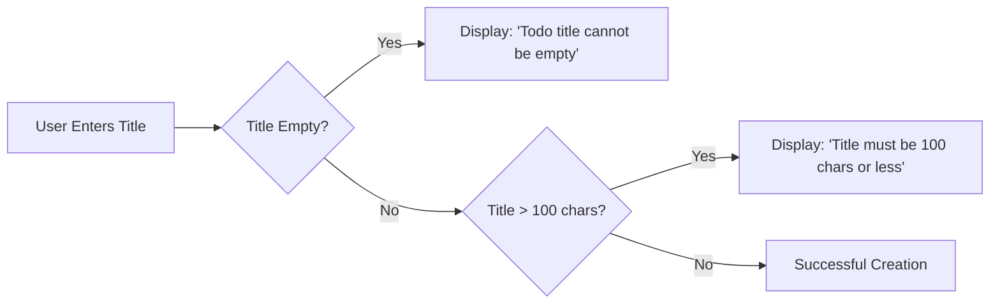
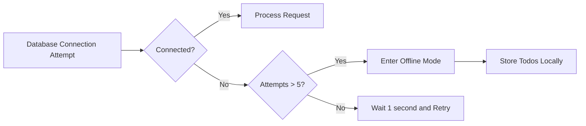
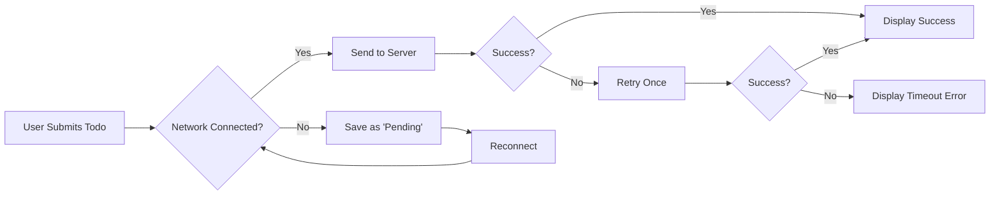

# Todo List Application Error Handling Requirements

## Introduction

This document specifies error handling requirements for the Todo list application. All error handling must align with the core business objective of providing a simple, intuitive todo management experience. The system shall handle all potential error scenarios gracefully while maintaining the minimalistic design philosophy. 

> *Developer Note: This document defines **business requirements only**. All technical implementations (architecture, APIs, database design, etc.) are at the discretion of the development team.*

## Input Validation Errors

### Title Validation Requirements

WHEN a user attempts to create a new todo item, THE system SHALL require a title field.

IF the title is empty (zero characters), THEN THE system SHALL display the error message "Todo title cannot be empty".

WHEN a user attempts to create a new todo item, THE system SHALL validate the title length.

IF the title exceeds 100 characters, THEN THE system SHALL display the error message "Todo title must be 100 characters or less".

WHEN a user attempts to modify an existing todo item, THE system SHALL apply the same title validation rules as create operations.

### Content Validation Requirements

WHEN a user submits a todo item with content, THE system SHALL validate the content length.

IF the content exceeds 500 characters, THEN THE system SHALL display the error message "Todo description must be 500 characters or less".

WHEN a user attempts to update a todo item, THE system SHALL validate updated content using the same rules as initial creation.

### Edge Case Handling

WHEN a user submits a title containing only whitespace characters, THEN THE system SHALL treat it as an empty title and display "Todo title cannot be empty".

WHEN a user submits a title containing special characters not permitted by the system, THEN THE system SHALL display "Todo title can only contain letters, numbers, and basic punctuation".

## System Failure Scenarios

### Database Connection Errors

WHEN the application attempts to access the database and fails to connect, THEN THE system SHALL display the error message "Temporary database error. Please try again in 1 minute".

WHILE the database connection is unavailable, THE system SHALL prevent all data modification operations.

IF database connection remains unavailable after 5 consecutive attempts, THEN THE system SHALL switch to offline mode where users can create new todos that are stored locally.

### Concurrency Errors

WHEN two users attempt to modify the same todo item simultaneously, THEN THE system SHALL display the error message "Another user has updated this todo. Please reload the page to view the latest version".

WHEN an unhandled database exception occurs during todo deletion, THEN THE system SHALL roll back all changes and display "Unexpected error occurred. Todo deletion canceled".

### Unhandled Exceptions

WHEN the system encounters an unexpected error while processing a request, THEN THE system SHALL log the full error details internally for debugging.

THE system SHALL prevent any partial data modification during unhandled exceptions.

IF an unhandled error occurs during todo creation, THEN THE system SHALL display "Unexpected error. Your todo was not created".

## Recovery Processes

### Session Recovery

WHEN a user's session expires after 30 minutes of inactivity, THEN THE system SHALL display the message "Your session has expired. Please log in again to continue".

WHILE the user is logged out, THE system SHALL automatically redirect to the login page.

IF a user attempts to refresh the page while session expired, THEN THE system SHALL immediately redirect to login without any error message.

### Data Recovery

WHEN a user's todo item fails to sync to the server due to temporary network issues, THEN THE system SHALL store the item locally as "pending".

WHEN the user regains network connectivity, THE system SHALL automatically sync all pending todo items.

THE system SHALL display a notification upon successful synchronization of pending items: "Your todos have been synced to the server".

### Error Message Consistency

WHEN an error occurs, THE system SHALL use a consistent error message format: [Error type]: [Action description].

EXAMPLE: "Validation Error: Todo title can only contain letters, numbers, and basic punctuation".

## Network Issues

### Connection Timeout Handling

WHEN the system does not receive a response from the server within 10 seconds, THEN THE system SHALL display "Connection timeout. Please check your internet connection".

WHEN a request times out, THE system SHALL automatically retry the request once.

IF the second attempt also times out, THEN THE system SHALL display the error and stop retrying.

### Disconnection State Handling

WHEN the application detects a loss of internet connection, THEN THE system SHALL display the notification "Offline mode enabled. Your todos are being saved locally".

WHILE offline, THE system SHALL allow all todo management operations without network dependency.

WHEN network connectivity is restored, THE system SHALL automatically begin synchronization with a progress indicator.

### Reconnection Protocols

WHEN the system reestablishes network connection, THEN THE system SHALL queue all pending todo operations for automatic synchronization.

THE system SHALL attempt to sync all pending operations within 5 minutes of connection restoration.

IF sync fails multiple times, THEN THE system SHALL display a persistent notification "Unable to sync todos. Please check your connection and try again later".

## Error Handling Flow Diagrams

### Input Validation Error Flow

### Database Error Recovery Flow

### Network Failure Recovery Flow

## Conclusion

The error handling system must maintain the Todo application's core promise of simplicity while providing a robust user experience through predictable error scenarios. All error messages should be helpful and non-technical, allowing users to understand and recover from issues without technical knowledge. The system shall never expose technical details to the user, and all backend error handling must be fully consistent with these business requirements.

## Business Justification for Error Handling Approach

A robust error handling strategy is critical to maintaining user trust in our minimalistic application. The application's success depends on users feeling in control even when errors occur. By providing clear, non-technical error messages and consistent recovery processes, we ensure users remain engaged with the application rather than becoming frustrated and abandoning it. This approach directly supports our business objective of delivering a frictionless user experience that requires zero learning curve while maintaining enterprise-grade reliability.

## Validation Approach

All error handling requirements can be validated through the following test scenarios:

1. **Validate input error handling**: Attempt to create a todo with empty title, verify error message and prevention of creation.
2. **Validate database error handling**: Simulate database connection failure, verify error display and offline mode functionality.
3. **Validate network error handling**: Disconnect from network, verify offline mode, then reconnect and verify sync functionality.
4. **Validate error message consistency**: Test all error cases and verify messages follow required format.

Each test case must pass with the expected error message and system behavior as specified in these requirements.