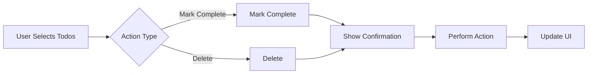

# Multi-User Todo Application

## 1. Service Overview

The multi-user todo application enables individuals to create, manage, and organize personal to-do lists with complete privacy and advanced functionality. This service delivers a seamless experience for managing tasks across devices with robust synchronization and data integrity features.

### Business Justification
Individuals consistently struggle with task management applications that lack cross-device synchronization and privacy controls. This application addresses the need for a personal, secure to-do list that adapts to users' workflow patterns without sharing data with others.

### Core Value Proposition
Users get a private, multi-device to-do list with:
- Complete data privacy (no sharing with other users)
- Real-time cross-device synchronization
- Comprehensive task organization features
- Robust history tracking
- Intuitive interface for common and advanced task management scenarios

## 2. User Actors

| Actor | Permissions | Description |
|-------|-------------|-------------|
| User | Full access to their own todos | Regular application users who create, manage, and view their personal to-do lists |

*All operations are restricted to the current user's todos only.*

## 3. Functional Requirements

### 3.1 User Account Management

#### 3.1.1 User Registration

WHEN a new user visits the registration page, THE system SHALL:

- Present a form for email and password input
- Validate email address format using standard email validation rules
- Require a password with minimum 8 characters, including at least one uppercase letter, one lowercase letter, and one special character
- Show real-time password strength feedback
- Create a new user account in the database upon successful form submission
- Send a confirmation email with validation link
- Redirect the user to their default todo list upon successful registration

#### 3.1.2 User Login

WHEN a user attempts to log in with their credentials, THE system SHALL:

- Verify the email address and password combination
- Generate an authentication token upon successful verification
- Set a secure, HTTP-only cookie for session management
- Redirect the user to their default todo list
- Return a meaningful error message if credentials are invalid
- Implement rate limiting after 5 unsuccessful login attempts

#### 3.1.3 Password Change

WHEN a user requests to change their password, THE system SHALL:

- Require the current password to verify identity
- Validate the new password against strength requirements
- Display a success message upon successful password change
- Invalidate the current session and force re-login with new password
- Prevent password reuse for the previous 5 versions

#### 3.1.4 Account Deletion

WHEN a user requests account deletion, THE system SHALL:

- Display a confirmation modal asking for explicit permission
- Delete the user account from the database
- Permanently delete all associated todos and edit history
- Remove all associated data from the system without retention
- Prevent the user from recovering deleted data after confirmation
- Send a final confirmation email after successful deletion

### 3.2 User Profile Management

#### 3.2.1 Profile Creation

WHEN a user completes registration, THE system SHALL:

- Create a default profile with display name 'New User'
- Allow the user to immediately edit their display name

#### 3.2.2 Display Name Editing

WHEN a user changes their display name, THE system SHALL:

- Accept alphanumeric characters with spaces and underscores
- Validate name length to 1-50 characters
- Update the profile in the database
- Reflect the new display name across all user interfaces immediately
- Preserve all data integrity while updating profile information

### 3.3 Todo Management

#### 3.3.1 Todo Creation

WHEN a user creates a new todo, THE system SHALL:

- Require at least a title (minimum 1 character)
- Allow optional description (maximum 500 characters)
- Allow optional start date (future date only)
- Allow optional due date (must be later than start date or empty)
- Default to incomplete status
- Assign a unique timestamp
- Return the new todo in the response with all details
- Record new todo in the user's edit history

#### 3.3.2 Todo Viewing (List)

WHEN a user views their todo list, THE system SHALL:

- Paginate results with default page size 10
- Display title, completion status, start date (if set), due date (if set), and creation date
- Support filtering by completion status (all, complete, incomplete)
- Support sorting by creation date (newest/oldest), start date, or due date
- Show todos without start/due dates at the end in their respective sorting categories

#### 3.3.3 Todo Viewing (Detail)

WHEN a user views a specific todo, THE system SHALL:

- Display all fields including title, description, creation date, completion status, start date, and due date
- Show the full edit history with timestamps and changes
- Allow edit access for the user who created the todo
- Prevent any editing capabilities for other users or other todos

#### 3.3.4 Todo Completion Toggle

WHEN a user toggles a todo's completion status, THE system SHALL:

- Mark the todo as complete when toggled 'on'
- Mark the todo as incomplete when toggled 'off'
- Update the completion status in the database
- Record the change in the edit history
- Immediately update the UI across all devices

#### 3.3.5 Todo Editing

WHEN a user edits any field of an existing todo, THE system SHALL:

- Allow modification of title (1-200 characters), description (max 500 characters), start date, and due date
- Prevent edit on deleted todos
- Record all field changes in the edit history
- Validate date constraints (start date must be before due date when both set)
- Update the current edit version timestamp

#### 3.3.6 Edit History

WHEN a user views edit history, THE system SHALL:

- Show all edits in descending chronological order
- Include timestamp, changed fields, and before/after values for each edit
- Limit history to most recent 100 edits per todo
- Allow users to view historical versions as needed
- Maintain edit history even after deletion until permanent deletion

#### 3.3.7 Todo Deletion

WHEN a user deletes a todo, THE system SHALL:

- Mark the todo as deleted with a timestamp
- Remove the todo from the active list
- Move the todo to the trash (un-deleted state)
- Maintain all edit history for the todo
- Record the deletion action in the system audit log

#### 3.3.8 Trash Management

WHEN a user views trash, THE system SHALL:

- Paginate results with default page size 10
- Display same information as active todos (title, creation date, etc.)
- Allow restoration of deleted todos
- Allow permanent deletion from trash (which deletes history)
- Include the delete timestamp in trash view

### 3.4 Bulk Operations (Secondary Scenarios)

#### 3.4.1 Bulk Mark Complete

WHEN a user selects multiple todos and requests to mark them all as complete, THE system SHALL:

- Show confirmations with 'Marking X todos as complete'
- Perform atomic update across all selected todos
- Immediately update all selected todos to 'complete' status
- Return success response with count of processed todos
- Maintain all edit history records

#### 3.4.2 Bulk Delete

WHEN a user selects multiple todos for deletion, THE system SHALL:

- Show confirmation with 'Deleting X todos from your list'
- Move all selected todos to trash without individual confirmation
- Update active todo count instantly
- Record each deletion in system audit log with user ID and timestamp
- Provide undo option for 15 minutes in trash view

