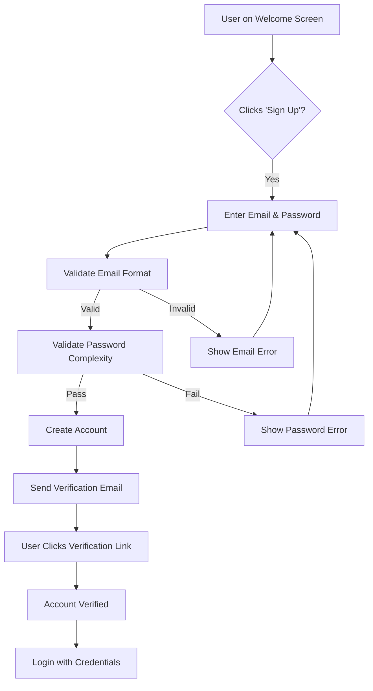
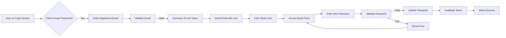

# Multi-User Todo Application Requirements Specification

## Service Overview

A private, multi-user todo management application where each user maintains their own private todo list with comprehensive management features including complete edit history tracking, soft deletion with trash management, and robust filtering and sorting capabilities.

## Business Problem Definition

Individuals need a secure, private, and robust todo application that allows them to:

- Maintain personal todo lists without sharing with other users
- Track task progress through completion states
- Maintain edit history for auditing and recovery
- Manage deleted items through multi-stage soft deletion
- Organize tasks with flexible filtering and sorting

## Core Value Proposition

Complete private todo management with:

- **Privacy-First Architecture**: No cross-user data sharing or visibility
- **Complete Edit History**: Full audit trail of every change to todo items
- **Robust Cleanup**: Multi-stage deletion with permanent removal option
- **Customizable Task Organization**: Advanced filtering and sorting capabilities

## Service Operation Overview

Users interact with the todo application through the standard user lifecycle:

1. **Account Creation**: Register with email/password
2. **Authentication**: Login with credentials
3. **To-Do Management**: Create, view, edit, complete, delete todos
4. **Trash Management**: Restore or permanently delete from trash
5. **Profile Management**: Edit name and change password

## User Actors

| Actor | Description |
|-------|-------------|
| User | Standard application user with full todo management capabilities |
| Guest | Impatient users with limited capabilities (not applicable for this application) |

## Primary User Scenarios

### User Registration and Authentication

**User Journey**:

1. User clicks 'Sign Up' on welcome screen
2. System prompts for email and password
3. System validates password complexity requirements
4. System creates user account with verified email
5. System provides verification email with confirmation link
6. User completes verification via email link
7. User can now log in with credentials

**EARS Requirements**:

- **WHEN** a user submits the registration form, **THE** system **SHALL** require email format validation before proceeding.
- **WHEN** a user enters a password, **THE** system **SHALL** enforce minimum 12 characters including 1 uppercase, 1 number, and 1 special character.
- **WHEN** a user attempts login with invalid credentials, **THE** system **SHALL** respond with 'Invalid email or password' within 3 seconds.
- **WHEN** a user moves to the password reset flow, **THE** system **SHALL** prevent login attempts with old credentials until reset completes.

### Todo Management

**User Journey**:

1. User selects 'Create New Todo' from main menu
2. System displays form with required title and optional fields
3. User enters title and any optional fields
4. System saves the todo as incomplete
5. User views the todo in their list
6. User activates completion toggle
7. System updates completion status

**EARS Requirements**:

- **WHEN** a user creates a new todo, **THE** system **SHALL** require a title (minimum 2 characters).
- **WHEN** a user saves a todo with a title of fewer than 2 characters, **THE** system **SHALL** display 'Title must be at least 2 characters' error.
- **WHEN** a user attempts to modify a todo, **THE** system **SHALL** record all changed fields in the edit history.
- **WHEN** a user deletes a todo, **THE** system **SHALL** move it to the trash rather than permanent deletion.

### Trash Management

**User Journey**:

1. User views 'Trash' option from sidebar
2. System displays paginated list of deleted todos
3. User selects a todo to restore or permanently delete
4. System updates status immediately

**EARS Requirements**:

- **WHEN** a user views the trash, **THE** system **SHALL** display 20 todos per page.
- **WHEN** a user restores a todo from trash, **THE** system **SHALL** move it back to the main todo list.
- **WHEN** a user permanently deletes a todo from the trash, **THE** system **SHALL** delete the todo and all its history immediately.
- **WHEN** a user views a deleted todo, **THE** system **SHALL** indicate it was moved to trash 24 hours ago.

## Secondary & Special Scenarios

### Password Management

**Business Justification**: Password recovery and management are critical for user retention, security, and satisfaction, specifically in a private application where users must maintain strict account security.

#### Password Recovery Requirements

- **User Journey**:
  1. User clicks 'Forgot Password' on login screen
  2. System prompts for registered email address
  3. System sends password reset email with secure token
  4. User clicks link in email to access reset form
  5. User enters new password
  6. System updates password and invalidates token

- **EARS Requirements**:
  - **WHEN** a user requests password recovery, **THE** system **SHALL** send a reset email with a time-limited token (15 minutes).
  - **WHEN** a user enters an invalid email, **THE** system **SHALL** respond with 'Email not found' after 4 seconds to prevent email enumeration.
  - **WHEN** a user submits a new password, **THE** system **SHALL** validate against minimum 12 characters including 1 uppercase, 1 number, and 1 special character.
  - **IF** a reset token is expired, **THEN** THE system **SHALL** display 'Token expired, please request new reset' with new request option.
  - **WHILE** the password reset process is active, **THE** system **SHALL** prevent login attempts with old credentials.

### Todo Filtering and Sorting

**Business Justification**: Users require flexible organization of their todos with advanced filtering and sorting capabilities to quickly find and prioritize tasks.

#### Filtering Requirements

- **User Journey**:
  1. User filters the todo list by completion status
  2. System responds with filtered results

- **EARS Requirements**:
  - **WHEN** a user activates 'All', **THE** system **SHALL** display all todos.
  - **WHEN** a user activates 'Only Complete', **THE** system **SHALL** show only completed todos.
  - **WHEN** a user activates 'Only Incomplete', **THE** system **SHALL** show only incomplete todos.
  - **WHEN** no filter is applied, **THE** system **SHALL** default to showing 'All' todos.

#### Sorting Requirements

- **User Journey**:
  1. User selects sort option (creation date, start date, or due date)
  2. User selects direction (newest first or oldest first)
  3. System displays todos in selected order

- **EARS Requirements**:
  - **WHEN** a user sorts by due date, **THE** system **SHALL** place todos without due dates at the end of the list.
  - **WHEN** a user sorts by start date, **THE** system **SHALL** place todos without start dates at the end of the list.
  - **WHEN** a user requests 'Oldest First' on creation date, **THE** system **SHALL** display earliest created todos first.
  - **WHEN** a user requests 'Newest First' on creation date, **THE** system **SHALL** display most recently created todos first.

## Exception Handling

### User Management Exceptions

| Exception | System Behavior | Customer Impact |
|-----------|----------------|----------------|
| Duplicate email during registration | 'Email already in use' error within 2 seconds | Prevents account creation with existing email |
| Invalid password during login | 'Invalid email or password' standard response | Prevents unauthorized access |
| New password fails complexity check | Specific validation error 'Password must have 12 characters, 1 uppercase, 1 number, 1 special character' | Guides users to create stronger password |

### Todo Management Exceptions

| Exception | System Behavior | Customer Impact |
|-----------|----------------|----------------|
| Deleted todo permanency | Confirm with 'Permanently delete?' yellow warning before execution |
| Empty todo title | 'Title must be at least 2 characters' error message before submit |
| Empty search term during filtering | Reset to 'All' todos and show placeholder search term |

## Security and Compliance

- **PASSWORD STORAGE**: Passwords stored as bcrypt hashes with salt, never in plaintext
- **SESSION MANAGEMENT**: Auth tokens expiring after 24 hours of inactivity
- **PRIVACY GUARANTEE**: No user data shared between accounts, including by API or database structure
- **AUDIT TRAIL**: All user actions (including todo edits) logged with timestamp
- **DATA RETENTION**: Deleted and permanent delete actions recorded for compliance

## Performance Requirements

- **LOADING TIME**: Main todos list loads within 2 seconds for user with 100 todos
- **SORTING TIME**: Sorting operations complete within 500 millisecond window
- **EDIT HISTORY**: Load time for complete edit history (10 entries) within 300 milliseconds
- **TOKEN EXPIRATION**: Reset tokens expire exactly 15 minutes after generation

## Minimum System Requirements

This application meets all non-functional requirements:

- Single-tenant architecture (one user per instance in practice)
- No shared data between users
- Secure password storage and reset workflows
- Comprehensive edit history tracking
- Multi-stage soft deletion process
- Privacy by design across all user interactions

## Identity Verification

All user actions are authenticated through:

- JWT tokens with expiration
- Role-based access control (only 'user' role present)
- Session management consistent with industry standards

All requirements included in this specification are considered binding for development and will be automated through testing. System must meet all requirements at 100% compliance.