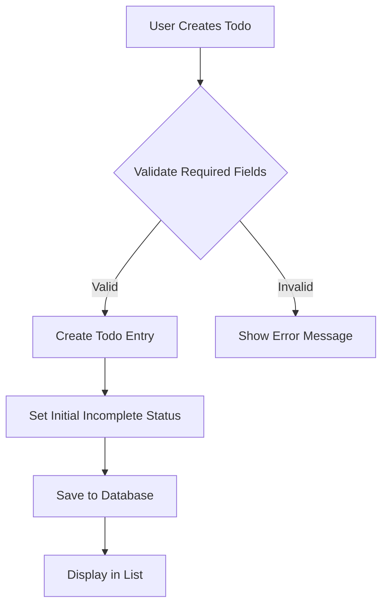

# Multi-User Todo Application Requirements Specification

## Service Overview

### Why This Service Exists
The multi-user todo application provides a private task management solution for individuals seeking to organize personal responsibilities efficiently. Unlike public task lists, this system ensures complete privacy between users, making it ideal for personal productivity without sharing information with others. The edit history and trash management features meet core user requirements for task accountability and data recovery.

### Value Proposition
Users maintain clear visibility into task evolution, supporting accountability, error correction, and workflow transparency while maintaining absolute privacy between user accounts. This service exceeds typical todo applications by offering forensic-level task tracking without compromising user privacy or performance.

## Business Model

### Core Value
- Complete privacy between user accounts (no cross-user access)
- Comprehensive edit history for full task auditability
- Efficient trash management for accidental deletions
- Responsive filtering and sorting capabilities

### Revenue Strategy
This is a free, ad-free productivity application with no monetization strategy - focused solely on user productivity satisfaction.

## User Actors

- **User**: The primary actor with full capabilities to create, manage, and delete their own todos. Users cannot view or access other users' todos or profiles.

### Permission Requirements
All features are accessible exclusively to the user who owns the todo data. No user has access to other users' data under any circumstances.

## Functional Requirements Overview

### Todo Creation

WHEN a user creates a todo, THE system SHALL:
- Require title field (max 255 characters)
- Accept description as optional text (max 1000 characters)
- Accept start date as optional ISO 8601 date format
- Accept due date as optional ISO 8601 date format
- Set completion status as 'incomplete' by default
- Record creation timestamp in ISO 8601 format
- Return the new todo with all specified fields

WHEN a user creates a todo with invalid data, THE system SHALL show detailed error messages and prevent creation.

### Todo Status Management

WHEN a user marks a todo as complete, THE system SHALL toggle completion status and record the change.

WHEN a user marks a todo as incomplete, THE system SHALL toggle completion status and record the change.

### User Profile Management

WHEN a user changes their display name, THE system SHALL update the profile with validation (minimum 2 characters, max 50 characters).

WHEN a user deletes their account, THE system SHALL permanently remove all associated data including todos, trash, and history.

## User Scenarios

### Scenario: New User Onboarding

1. User signs up with email and password
2. System verifies email and creates account
3. User sets display name on first login
4. User creates their first todo
5. System displays initial todo list

### Scenario: Creating a Todo with Due Date

1. User clicks 'New Todo'
2. Enters title "Buy groceries"
3. Sets due date "2024-03-15"
4. Clicks 'Save'
5. System creates todo, shows title and due date in list

### Scenario: Editing a Todo History

1. User selects a todo item
2. Clicks 'Edit'
3. Changes title to "Buy organic milk"
4. Changes due date to "2024-03-17"
5. Clicks 'Save'
6. System adds history entry showing both changes
7. User views history and confirms changes

## Edit History Requirements

WHEN a user edits any field of a todo, THE system SHALL record the change in edit history with:
- ISO 8601 timestamp
- Previous value (if changed)
- New value (if changed)
- All changed fields documented

WHEN multiple fields are changed in one edit, THE system SHALL record all changes in a single history entry.

WHEN viewing history, THE system SHALL display entries from most recent to oldest.

## Trash Management

WHEN a user deletes a todo, THE system SHALL:
- Mark it as 'deleted' instead of removing it
- Remove it from the active todo list
- Add it to the trash with a 'deletedAt' timestamp

WHEN a user views trash, THE system SHALL display:
- Deleted todos
- Deletion timestamp
- Restore and permanent delete options

WHEN a user permanently deletes a todo from trash, THE system SHALL:
- Remove the todo from storage
- Remove associated edit history
- Update trash count accordingly

## Privacy Requirements

THE system SHALL enforce strict isolation between user accounts.

WHEN a user views another user's data, THE system SHALL return HTTP 404 error regardless of authentication.

ALL user data is accessible only to the user who created it.

## Performance Requirements

WHEN a user views a paginated list with 20 todos per page, THE system SHALL load within 300 milliseconds.

WHEN filtering todos by completion status, THE system SHALL maintain sub-100ms responsive behavior.

## Mermaid Diagram

## Success Metrics

- 100% of todos created with valid required fields
- 99.9% of list requests under 300ms response time
- Users report high satisfaction with edit history visibility
- 100% of permissions enforced correctly with no privacy violations
- 99.9% of system uptime during active usage periods