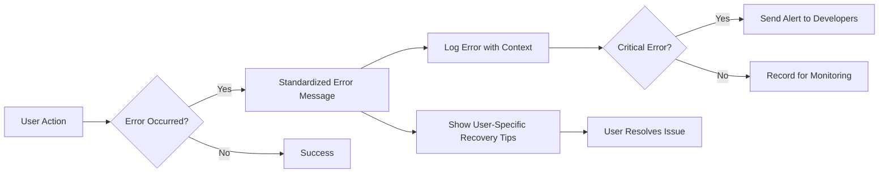
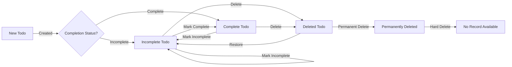

# Multi-User Todo Application Requirements Specification

## 1. Service Overview

The Multi-User Todo Application provides a completely private task management solution where each user maintains exclusive ownership of their personal to-do list. The system ensures absolute data isolation between users, with no possibility of cross-user data access or sharing. All features are designed to support individual task management with zero social or collaborative functionality.

### Core Value Proposition

> *'A private, personal workspace where your to-do list remains exclusively yours - never shared, never visible to others, and fully under your control.'*

Users can create, manage, and permanently delete todos without any risk of exposure to other users. The application focuses on providing a simple, secure, and fully private task management experience.

## 2. User Actors

### Core User Actor: User

The *User* is the only actor type in the system and represents an authenticated individual who owns and manages their personal to-do list. The User actor has the following business-level permissions and capabilities:

#### Core Permissions Matrix

| Functionality | Permission Status | Business Justification |
|---------------|-------------------|------------------------|
| Create New Todo | ✅ Allowed | Enables core task management purpose |
| View Own Todos | ✅ Allowed | Essential to application's primary value |
| Edit Own Todos | ✅ Allowed | Necessary for task update operations |
| Delete Own Todos (to trash) | ✅ Allowed | Core data manipulation capability |
| Restore Deleted Todos | ✅ Allowed | Required for data integrity recovery |
| Permanently Delete from Trash | ✅ Allowed | Ensures complete data elimination |
| View Other Users' Profiles | ❌ Forbidden | Critical privacy requirement |
| View Other Users' Todos | ❌ Forbidden | Essential data privacy rule |

#### User Data Isolation Requirements

1. **Complete Data Separation**

   WHEN a user accesses the application, THE system SHALL enforce complete separation of user data such that NO data from any other user is ever displayed, processed, or accessible to the current user.

   IF a user attempts to access another user's todos, THEN THE system SHALL deny access and display a user-friendly error message *'You can only view your own todos. This action has been blocked for your security.'*.

2. **Account Deletion Impact**

   WHEN a user requests to delete their account, THE system SHALL permanently delete their profile, todos, and all associated data including edit history.

   IF a user confirms account deletion, THEN THE system SHALL perform a cascade delete operation affecting all related data, with confirmation *'Your entire account and todos have been permanently deleted. This action cannot be undone.'*.

## 3. Primary User Scenarios

### 3.1. User Registration and Initialization

#### Scenario: New User Sign Up

1. WHEN a new user visits the application, THE system SHALL display a registration form with fields for email and password.
2. WHEN the user submits valid email and password, THE system SHALL store the user's credentials securely with hashing.
3. IF the email is already registered, THEN THE system SHALL display *'This email is already in use. Please choose another or click "Forgot Password" to retrieve access.'*.
4. AFTER account creation, THE system SHALL redirect the user to a welcome screen showing *'Welcome to your private Todos, [Display Name]!'* and guide them to create their first todo.

#### Scenario: User Login

1. WHEN a user opens the login page, THE system SHALL display fields for email and password.
2. IF the user provides a valid email format, THEN THE system SHALL accept it for login attempt.
3. WHEN a user submits incorrect credentials, THE system SHALL display *'Invalid email or password. Please try again.'* without revealing which part was incorrect.
4. IF 5 login attempts fail within 15 minutes, THEN THE system SHALL lock the account for 15 minutes with message *'Too many failed login attempts. Account locked for 15 minutes.'*.

### 3.2. Todo Management Workflows

#### Scenario: Creating a New Todo Item

1. WHEN a user wants to create a todo, THE system SHALL present a form with title (required), description (optional), start date (optional), and due date (optional).
2. IF title is empty, THEN THE system SHALL prevent creation and display *'Title is required to create a todo.'*.
3. WHEN a user submits a title exceeding 100 characters, THEN THE system SHALL truncate it and display *'Todo title was shortened to 100 characters: [truncated title]'*.
4. IF user sets a start date after due date, THEN THE system SHALL prevent submission and display *'Start date cannot be after due date.'*.
5. AFTER creation, THE system SHALL set completion status to *incomplete* and display *'Todo created successfully!'* with immediate addition to user's main todo list.

#### Scenario: Managing Todo Status

1. WHEN a user marks a todo as complete, THE system SHALL update its status to *complete* and display *'Todo marked as complete.'*.
2. WHEN a user marks a todo as incomplete, THE system SHALL update its status to *incomplete* and display *'Todo marked as incomplete.'*.
3. IF a user attempts to mark a todo as complete that doesn't exist in their list, THEN THE system SHALL display *'Unable to find this todo. It may have been deleted.'*.

#### Scenario: Editing an Existing Todo

1. WHEN a user edits a todo's title, description, start date, or due date, THE system SHALL create a new history entry documenting each change.
2. IF a user attempts to use a title already existing for another incomplete todo, THEN THE system SHALL display *'A todo with this title already exists. Please choose another title.'*.
3. AFTER the edit is saved, THE system SHALL display *'Todo updated successfully.'* with the updated details visible in the todo list.

### 3.3. Managing Archived Items

#### Scenario: Deleting to Trash

1. WHEN a user deletes a todo item, THE system SHALL convert it to a deleted state and move it to the user's trash.
2. THE system SHALL display *'Todo moved to trash.'* with an undo option *'Undo' (5-second timeout) or Permanent Delete'.*.
3. AFTER deletion, THE system SHALL no longer display the todo in the main todo list.

#### Scenario: Restoring from Trash

1. WHEN a user selects *'Restore'* on a todo in trash, THE system SHALL move it back to the active todo list with all previous completion status and edit history intact.
2. THE system SHALL display *'Todo restored successfully to your main list.'* with a 3-second auto-dismiss.

#### Scenario: Permanent Deletion from Trash

1. WHEN a user selects *'Permanently delete'*, THE system SHALL show a confirmation dialog with *'This action cannot be undone. All associated edit history will be permanently deleted.'*.
2. IF the user confirms the action, THEN THE system SHALL destroy all traces of the todo item and its history.
3. THE system SHALL display *'Todo permanently deleted. This cannot be recovered.'*.

## 4. Exception Handling Requirements

### Common Error Situations

#### Authentication Errors

- **Invalid Credentials**

  WHEN a user submits login credentials that don't match records, THE system SHALL display *'Invalid email or password. Please try again.'*.

- **Account Lockdown**

  WHEN a user attempts more than 5 login failures within 15 minutes, THE system SHALL display *'Too many failed login attempts. Account locked for 15 minutes.'*.

#### Data Access Errors

- **Todo Not Found**

  WHEN a user tries to access or edit a todo that has been permanently deleted or belongs to another user, THE system SHALL display *'The requested todo could not be found. It may have been permanently deleted or belongs to another user.'*.

- **Concurrent Edit Conflict**

  WHEN two users attempt to edit the same todo simultaneously, THE system SHALL display *'This todo is currently being edited by another user. Please try again later.'*.

### System Error Handling Workflow

### Error Code Specification

| Error Code | User Message | Actionable Message |
|------------|--------------|-------------------|
| AUTH_INVALID_CREDENTIALS | Invalid email or password | Try again or reset password |
| TODO_NOT_FOUND | Todo could not be found | Check filters or restore from trash |
| DUPLICATE_TITLE | Title conflict detected | Choose a different title |
| HISTORY_UNAVAILABLE | Edit history unavailable | This entry may have been deleted |
| DATA_INTEGRITY_ERROR | Data conflict during save | Try again or contact support |

## 5. Business Rules & Constraints

### 5.1. Validation Rules

#### Todo Creation Validation

1. WHEN a user creates a new todo item, THE system SHALL require that the title field is provided with at least 1 character.
2. WHEN a todo title exceeds 100 characters, THE system SHALL automatically truncate it to exactly 100 characters and display a notification.
3. WHEN a user sets a start date after the due date, THE system SHALL prevent creation and require valid date ordering.

#### User State Validation

1. WHILE the user attempts to manage todos, THE system SHALL continuously verify the user's authenticated status.
2. IF the user is not authenticated, THEN THE system SHALL redirect to the login screen with *'You must be logged in to manage todos.'*.

### 5.2. Workflow Constraints

#### Todo Status Workflow

The complete state transition lifecycle of a todo item is defined as follows:

#### Filtering and Sorting Rules

1. WHEN a user applies the "only complete todos" filter, THE system SHALL display only todos with completion status *complete*.
2. WHEN sorting by due date and a todo has no due date, THE system SHALL list that todo at the end of the sorted list.
3. WHEN sorting by start date and a todo has no start date, THE system SHALL list that todo at the end of the sorted list.

### 5.3. History and Edit Rules

#### History Recording Requirements

1. WHEN a user edits any field of a todo item, THE system SHALL create a history entry documenting each change with timestamp.
2. WHEN a user permanently deletes a todo from trash, THE system SHALL create a history entry indicating the permanent deletion event and immediately remove all history entries associated with that todo.
3. EVERY history entry SHALL include timestamp and changed fields.

#### History Display Requirements

1. THE system SHALL display the most recent history entries first, sorted newest to oldest.
2. WHEN a user views edit history, THE system SHALL display all entries chronologically from most recent to oldest.

### 5.4. Privacy and Security Rules

1. THE system SHALL never display any personal information about other users when viewing todos.
2. THE system SHALL enforce that all todos include a valid user identifier with no exceptions.
3. WHEN a user deletes their account, THE system SHALL permanently delete all todos associated with that account including those in trash and their edit history.

> *Business Note: This document defines all requirements from a business perspective. Implementation details and technical specifications will be handled in subsequent development phases.*