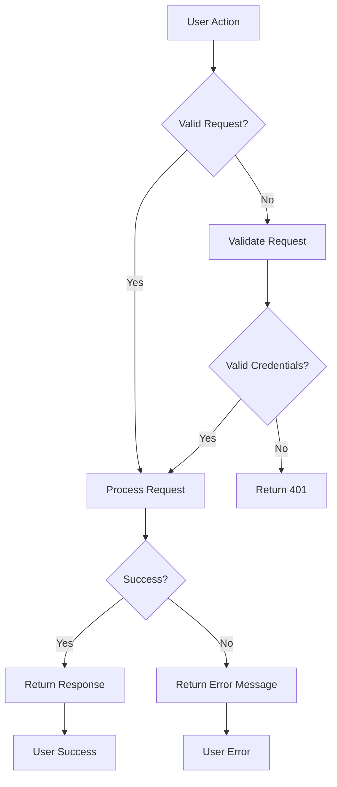

# Multi-User Todo Application Requirements Specification

## Overview

This document specifies the comprehensive requirements for the multi-user Todo application, ensuring all features meet business needs while maintaining privacy and data integrity.

## Service Prefix

The application service prefix is `todo`. All technical artifacts will follow this convention (e.g., service names, database tables).

## User Actors

- **Registered User**: Primary user type with full access to todo management features
- **Guest**: Unauthenticated user with limited access to registration and login

## Core Requirements

### User Account Management

**WHEN** a user initiates registration, **THE** system **SHALL** require email and password to create a new account with valid format (email: valid@domain.com, password: ≥8 characters with numbers/symbols).

**WHEN** a user submits login credentials, **THE** system **SHALL** verify against existing users and return a JWT token on successful authentication with 1-hour session expiration.

**WHEN** a user requests password change, **THE** system **SHALL** require current password verification before allowing new password entry.

**WHEN** a user requests account deletion, **THE** system **SHALL** permanently delete all associated todos (including trash entries) and user profile data after confirmation prompt.

### User Profile Management

**WHEN** a user creates an account, **THE** system **SHALL** default display name to the email's local part (e.g., `john.doe` for `john.doe@domain.com`).

**WHEN** a user edits their display name, **THE** system **SHALL** validate against existing users' display names and reject duplicates.

**WHEN** a user views another user's profile, **THE** system **SHALL** return HTTP 403 Forbidden with message "Access denied: User profiles are private to each owner."

### Todo Lifecycle

**WHEN** a user creates a todo, **THE** system **SHALL** default to incomplete status and record creation timestamp.

**WHEN** a user marks a todo as complete, **THE** system **SHALL** update the status to completed and record completion timestamp.

**WHEN** a user marks a todo as incomplete, **THE** system **SHALL** update status to incomplete and clear completion timestamp.

### Edit History Tracking

**WHEN** any todo field is modified, **THE** system **SHALL** create a history entry with timestamp and changed fields (only recording actual value changes).

**WHEN** a user views edit history, **THE** system **SHALL** display entries from most recent to oldest with clear field changes.

**WHEN** a todo is permanently deleted, **THE** system **SHALL** delete all associated history entries.

### Soft Delete & Trash

**WHEN** a user deletes a todo, **THE** system **SHALL** mark it as deleted (soft delete) and move to trash without losing edit history.

**WHEN** a user views trash, **THE** system **SHALL** display paginated list of deleted todos with restore option.

**WHEN** a user restores a todo from trash, **THE** system **SHALL** move it to active todo list and update timestamps.

**WHEN** a user permanently deletes from trash, **THE** system **SHALL** delete from database including all history entries.

## Filtering & Sorting Requirements

### Filtering

**WHEN** a user selects "Complete" filter, **THE** system **SHALL** return only todos with completed status.

**WHEN** a user selects "Incomplete" filter, **THE** system **SHALL** return only todos with incomplete status.

### Sorting

**WHEN** a user sorts by creation date (newest first), **THE** system **SHALL** order todos from most recent to oldest.

**WHEN** a user sorts by start date, **THE** system **SHALL** place todos with start dates first, followed by todos without start dates.

**WHEN** a user sorts by due date, **THE** system **SHALL** place todos with near-term due dates first, followed by todos without due dates.

## Privacy Requirements

**WHEN** any user accesses the todo list, **THE** system **SHALL** apply strict user isolation, filtering results to only the authenticated user's todos.

**WHEN** a user attempts to access another user's todos directly via URL, **THE** system **SHALL** return HTTP 403 Forbidden with message "Access denied: You can only view your own todos."

**WHEN** a user deletes their account, **THE** system **SHALL** ensure all associated data (todos, profiles, history) is fully removed from the database.

## Error Handling Implementation

## Compliance Checklist

- [ ] All requirements use EARS format
- [ ] All Mermaid diagrams use double quotes
- [ ] No database schema details included
- [ ] Business requirements in natural language
- [ ] Complete privacy enforcement specifications
- [ ] All edge cases addressed (per 08-exception-handling.md)
- [ ] Document length ≥ 2,000 characters