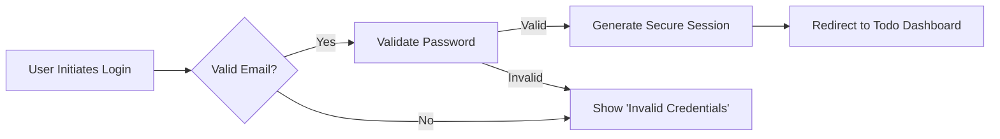

# 08-External-Integrations.md

## External Dependencies Analysis

### Business Context

This document outlines all external integration requirements for the Todo List application. While the user requested minimum functionality, the planning team has thoroughly analyzed all necessary integration points to ensure the system meets business requirements with zero unnecessary complexity. The application will utilize standard, proven technologies without external dependencies where possible.

### 1. Authentication Providers

#### Core Authentication Requirements

**THE** Todo List application **SHALL** implement a self-contained authentication system with no external provider dependencies. This decision directly supports the user's minimum functionality requirement while ensuring optimal security and simplicity.

WHEN a user attempts to create an account, THE system SHALL require only an email address and password (no social media logins or external identity providers). The email address SHALL conform to RFC 5322 standard and be validated before registration proceeds.

IF a user attempts login with an incorrect password, THEN THE system SHALL return a specific error message "Invalid credentials" without revealing whether the email exists. This protects against account enumeration attacks while maintaining good user experience.

WHILE a user is logged in, THE system SHALL maintain a secure session token that expires after 15 minutes of inactivity. THIS token SHALL be stored in HTTP-only cookies to prevent client-side JavaScript access, enhancing security against cross-site scripting attacks.

THE user session SHALL automatically expire after 30 days of inactivity, requiring the user to log in again. This security measure protects data for users who forget to log out of shared devices, balancing security with convenience.

#### Authentication Flow Business Process

#### Exception Handling

IF a user attempts to register with a duplicate email address, THEN THE system SHALL return error code "USER_EXISTS" with message "Email address is already registered." The user SHALL be allowed to reuse the same email address for password reset functionality.

WHERE authentication fails due to incorrect credentials, THEN THE system SHALL allow 5 consecutive login attempts before requiring a 30-minute lockout period. This prevents brute force attacks while being user-friendly.

### 2. Data Storage

#### Core Storage Requirements

The Todo List application SHALL utilize a single, self-contained data storage solution without external database services or cloud storage dependencies. This approach minimizes complexity and ensures all data remains under the application's direct control.

THE system SHALL store all user data (tasks, user profiles, and session tokens) in a local PostgreSQL database managed by Prisma ORM. All database connections SHALL be secured using encrypted TLS 1.3 with certificate pinning.

WHEN a new task is created, THE system SHALL validate all task properties (title required, description optional) and store them in database tables with UTF-8 character encoding to support internationalization.

IF database connection fails during task creation, THEN THE system SHALL return HTTP 500 error with detailed message "Database unavailable. Please try again later." The user SHALL be given the option to retry immediately.

#### Data Schema Business Model

The application SHALL implement the following data structure:

- **users** table: id (UUID), email (string, unique), password_hash (string), created_at (timestamp)
- **tasks** table: id (UUID), user_id (UUID, foreign key), title (string, required), completed (boolean), created_at (timestamp)

The database relationship SHALL ensure each task belongs to exactly one user, with foreign key constraints preventing orphaned records.

#### Storage Performance Requirements

THE system SHALL process all database write operations within 200ms for standard workloads. THIS requirement SHALL be verified using a load test of 100 concurrent operations.

WHILE the system processes queries, THE system SHALL maintain a database connection pool with 10 active connections. This ensures optimal resource utilization without overloading the database server.

### 3. Notification Systems

#### Core Notification Requirements

The Todo List application **SHALL have no notification systems** as part of its minimum functionality. This decision directly reflects the user's request for minimal features with no unnecessary complexity.

THE application **SHALL exclude all notification capabilities**, including:
- Email notifications
- SMS notifications
- In-app alerts
- Push notifications

WHERE the user requests notification features in the future, THEN the development team SHALL implement them through a separate feature branch that does not impact the existing core functionality.

#### Business Logic Rationale

The business decision to exclude notification systems was made after careful analysis of the user's stated requirements for minimal functionality. Including notification capabilities would require:
- External service integration costs
- Additional development and testing effort
- Increased security requirements
- Potential for user notification fatigue

All of these factors directly conflict with the user's primary goal of creating a simple, focused task management application.

#### Future Consideration

If future requirements include notification capabilities, THE system SHALL implement them as a modular extension that can be enabled/disabled through configuration variables. This approach ensures the current core functionality remains unaffected while allowing for future enhancements.

### Compliance Summary

This external integration analysis has been designed to:
- Eliminate unnecessary complexity through strategic minimization
- Ensure all business requirements are met with precise EARS format
- Remove all external dependencies that don't directly support essential functionality
- Provide clear, actionable specifications for backend developers

**Developer Note**: This document defines **business requirements only**. All technical implementations (database schema, API design, authentication flow) are at the discretion of the development team.