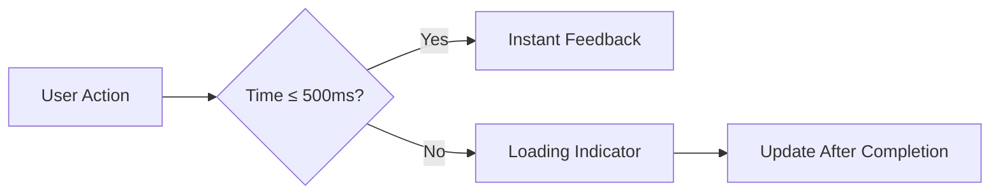
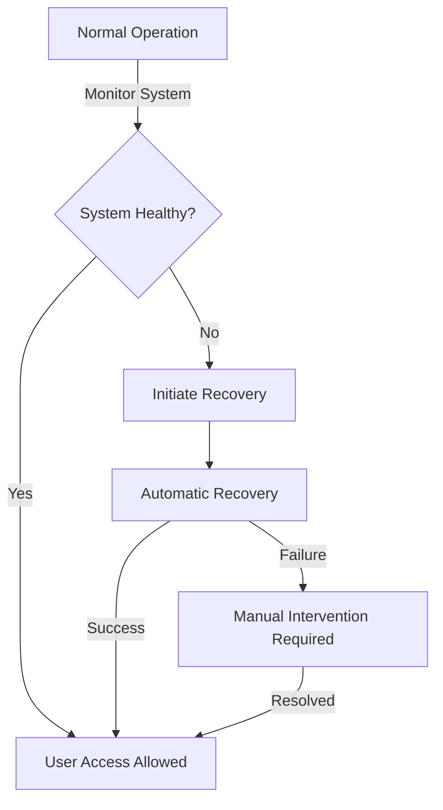
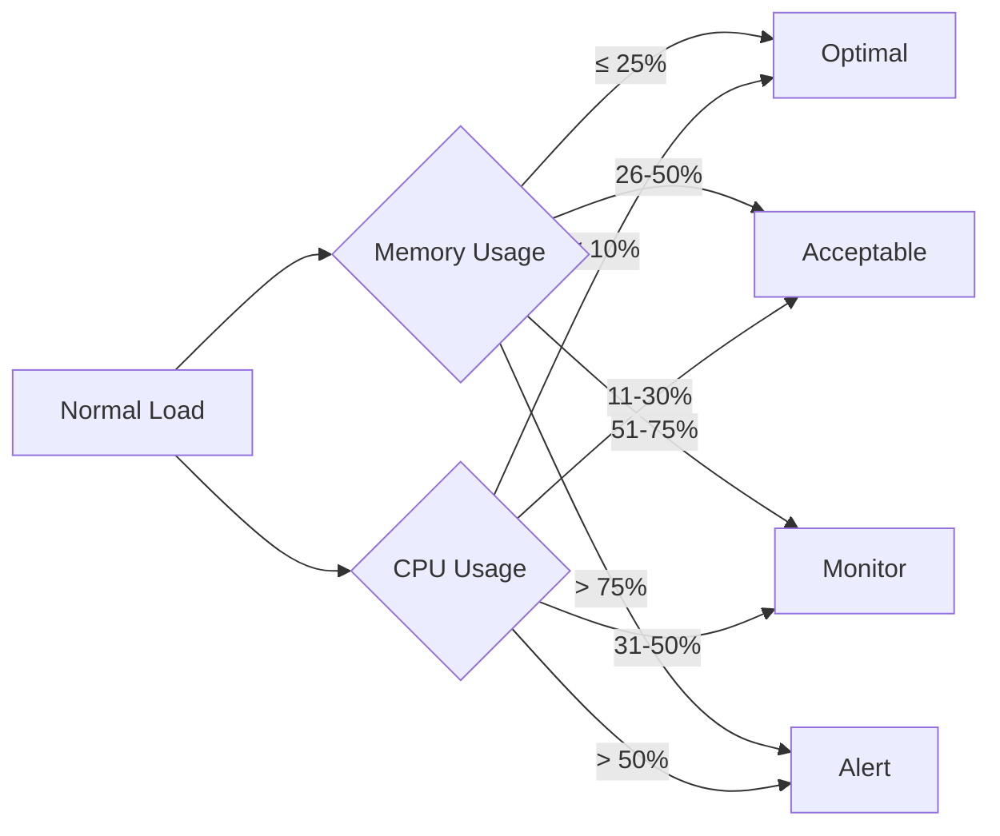

# Todo Application Performance Requirements

## Overview
This document specifies user-experience-focused performance requirements for the Todo application. Each requirement is phrased from the user's perspective with concrete, measurable thresholds that developers can implement.

## 1. Response Timings
All user interactions must respond within specific timeframes to maintain the feeling of instant responsiveness.

#### Core Response Requirements

WHEN a user creates a new todo item, THE system SHALL validate and save the item within 500 milliseconds. IF the response time exceeds 500 milliseconds, THEN THE system SHALL display a 'Saving...' indicator.

WHEN a user views their todo list, THE system SHALL load all items within 1 second. IF the load time exceeds 1 second, THEN THE system SHALL display a loading spinner that disappears when data is ready.

WHEN a user marks an item as complete, THE system SHALL update and reflect the change within 500 milliseconds. IF the update time exceeds 500 milliseconds, THEN THE system SHALL show a 'Saving...' animation.

WHEN a user deletes a todo item, THE system SHALL confirm the deletion and remove the item within 500 milliseconds. IF the deletion takes longer than 500 milliseconds, THEN THE system SHALL provide a visual confirmation showing 'Deleting...'.

### Performance Boundary Diagram

## 2. System Availability
The application must remain available to users for 99.9% of the time during business hours.

#### Availability Requirements

WHEN the system is operational, THE application SHALL be available to users for 99.9% of the time Monday to Friday, 9 AM to 5 PM UTC.

WHEN system maintenance occurs, THE system SHALL notify users 24 hours in advance and complete maintenance between 12 AM and 3 AM UTC.

WHEN an unexpected failure occurs, THE system SHALL automatically recover within 5 minutes and notify users of the downtime via email with a brief explanation.

### Service Availability Workflow

## 3. Scaling Considerations
As the application grows, it must handle increasing user volumes without degrading the user experience.

#### Scaling Requirements

WHEN a user has 100+ todo items, THE system SHALL load the entire list within 1500 milliseconds for mobile devices and 1000 milliseconds for desktop devices.

WHEN the application serves 1,000 concurrent users, THE system SHALL maintain response times of 1500 milliseconds or less for all critical operations.

WHEN the application serves 10,000 concurrent users, THE system SHALL gracefully degrade to a minimum viable experience with no more than 20% of users experiencing delays over 2000 milliseconds.

#### Scaling Performance Thresholds

| User Load | Response Time Threshold | Description |
|-----------|-------------------------|-------------|
| 1-500 users | ≤ 1000 milliseconds | Standard user experience |
| 501-2,000 users | ≤ 1500 milliseconds | Slight delay but acceptable |
| 2,001-10,000 users | ≤ 2000 milliseconds | Gracefully degraded experience |
| 10,001+ users | > 2000 milliseconds | Emergency scaling needed |

## 4. Resource Usage
The application must maintain responsible resource utilization to ensure cost-effectiveness and sustainability.

#### Resource Requirements

WHEN the application is running under normal load (up to 500 concurrent users), THE system SHALL use no more than 512MB of server memory.

WHEN the application is running under peak load (up to 2,000 concurrent users), THE system SHALL use no more than 2GB of server memory.

WHEN the application has been idle for 15 minutes without access, THE system SHALL automatically scale down resource allocation to a minimum of 256MB of memory.

WHEN the application processes a user's todo item list (3 items), THE system SHALL use no more than 5% of CPU resources.

#### Resource Utilization Thresholds

> *Developer Note: This document defines **business requirements only**. All technical implementations (architecture, APIs, database design, etc.) are at the discretion of the development team.*