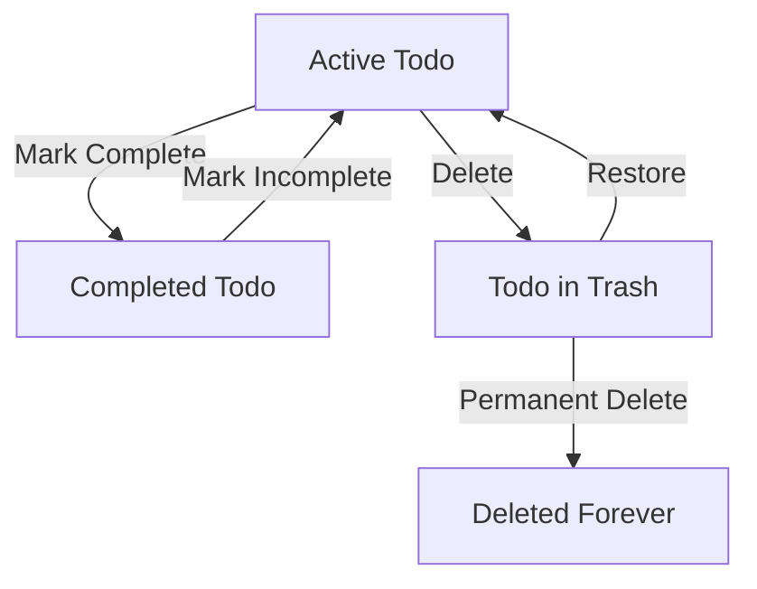

# Multi-User Todo Application Functional Requirements Specification

## 1. User Account Management

### 1.1 Account Creation
WHEN a new user registers WITH email and password, THE system SHALL:
- Validate email format using RFC 5322 standard
- Enforce password complexity: minimum 8 characters with uppercase, lowercase, and special character
- Send confirmation email with verification link
- Create a new account record with registration timestamp
- Mark account status as "pending verification" until email confirmed

### 1.2 Login Process
WHEN a user attempts to log in WITH valid email and password, THE system SHALL:
- Authenticate credentials against stored hashed passwords
- Generate a secure JWT token with 24-hour expiration
- Return token in response body with 'Authorization' header schema
- Update last login timestamp
- Implement rate limiting: max 5 failed attempts/hour before temporary lockout

### 1.3 Password Change
WHEN a user requests password change WITH current password and new password, THE system SHALL:
- Verify current password matches stored hash
- Enforce new password complexity requirements
- Notify user of password change via email with timestamp
- Invalidate all active sessions for the user
- Update password hash with new value

### 1.4 Account Deletion
WHEN a user requests account deletion WITH confirmation, THE system SHALL:
- Delete all associated todos including trash items
- Remove all user profile data
- Invalidate all active authentication tokens
- Record deletion in audit log with user ID and timestamp
- Send confirmation email with final deletion message

## 2. User Profile Management

### 2.1 Profile Creation and Update
WHEN a user creates or updates their display name, THE system SHALL:
- Allow alphanumeric characters with spaces and underscores
- Enforce maximum 30 characters length
- Update profile record in database immediately
- Notify user of successful update
- Prevent profile name from matching reserved keywords

### 2.2 Profile Privacy
WHEN a user views another user's profile, THE system SHALL:
- Display error message with '403 Forbidden' status code
- Never return any profile data except 'not found' message
- Maintain full data isolation between user accounts
- Log attempted access in security audit trail

## 3. Todo Creation

### 3.1 Title and Description
WHEN a user creates a todo WITH title, THE system SHALL:
- Store title as non-empty string (max 100 characters)
- Treat description as optional field with default null
- Mark new todo as "incomplete" by default
- Assign creation timestamp at time of save

### 3.2 Date Fields
WHEN a user sets start or due date, THE system SHALL:
- Accept dates in ISO 8601 format (YYYY-MM-DD)
- Validate dates are future-dated relative to current time
- Store as nullable date fields (default null)
- Return error if invalid date format submitted

## 4. Todo Viewing

### 4.1 Paginated List
WHEN a user views their todo list, THE system SHALL:
- Return paginated results with 10 items per page
- Include total count and page number in response headers
- Sort by creation date (newest first) by default
- Return all necessary fields: title, completion status, start date, due date, creation date

### 4.2 Single Todo Details
WHEN a user requests details for a single todo, THE system SHALL:
- Return all fields including full description
- Include edit history count in response
- Show current completion status
- Display all date fields with proper formatting

## 5. Todo Completion

### 5.1 Toggle Completion
WHEN a user toggles a todo's completion status, THE system SHALL:
- Update the completion status in database
- Record current timestamp in completion history
- Return updated status in response body
- Notify user via system message

## 6. Todo Editing

### 6.1 Edit History
WHEN a user edits a todo, THE system SHALL:
- Store all modified fields with current timestamp
- Track previous values as history entries
- Prevent simultaneous edits by other users on the same todo
- Return history count in edit response

### 6.2 Validations
WHEN a user submits edited todo, THE system SHALL:
- Enforce title max length of 100 characters
- Validate new dates in ISO format
- Ensure start date ≤ due date if both specified
- Reject edits that would cause data inconsistency

## 7. Trash Management

### 7.1 Trash View
WHEN a user accesses trash, THE system SHALL:
- Return paginated list with 10 items per page
- Include all fields with deletion timestamp
- Sort by deletion date (newest first) by default
- Add 'deleted on [date]' subtitle to each item

### 7.2 Restoration
WHEN a user restores a todo from trash, THE system SHALL:
- Move todo from trash to active status
- Preserve original edit history
- Mark restoration as new history entry
- Return updated status with success message

### 7.3 Permanent Deletion
WHEN a user permanently deletes from trash, THE system SHALL:
- Remove todo from all data stores
- Delete associated edit history
- Return confirmation message
- Record audit log entry with 'permanent deletion' action

## 8. Querying and Sorting

### 8.1 Filtering
WHEN a user filters by completion status, THE system SHALL:
- Accept 'all', 'completed', 'incomplete' options
- Return only matching todos
- Set filter value in user session
- Return current filter context in response

### 8.2 Sorting
WHEN a user sorts by any field, THE system SHALL:
- Support creation date (oldest/newest), start date (earliest/latest), due date (earliest/latest)
- Place todos with missing dates at end of sorted list
- Maintain sorting parameters in user session
- Return sorted results with 'sort' metadata

## 9. Privacy and Security

### 9.1 Data Isolation
WHEN a user accesses todos, THE system SHALL:
- Only return todos belonging to the authenticated user
- Verify user ownership on all operations
- Reject requests for other user's data with '404 Not Found' response
- Apply strict authorization checks against all endpoints

### 9.2 Audit Logging
EVERY user operation SHALL be logged with:
- Timestamp of operation
- User ID
- Action type
- Target resource ID
- IP address of origin

## 10. Performance Requirements

### 10.1 Response Times
THE system SHALL:
- Return todo lists within 1.5 seconds under normal load
- Process edit requests within 0.8 seconds
- Handle trash operations within 1.2 seconds
- Maintain error rates below 0.1% during peak usage

### 10.2 Concurrency
WHEN multiple users access the same data, THE system SHALL:
- Avoid data races using database transaction isolation
- Handle read conflicts through consistent snapshot views
- Prevent simultaneous edits to the same todo
- Maintain consistent data across all user sessions

## 11. Business Process Diagrams

### 11.1 Todo State Diagram
