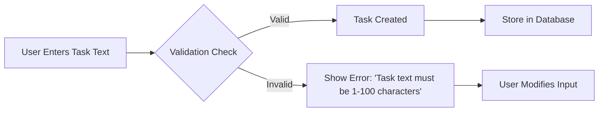
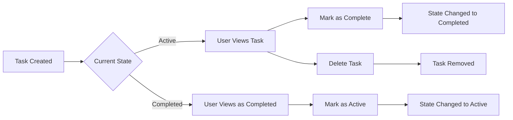
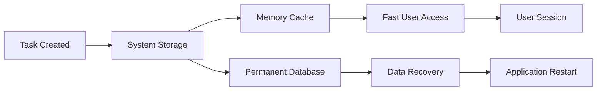

# 09-Data Flow Document for Todo Application

## Business Context and Purpose
This document defines the conceptual data movement and processing flows for the Todo application. As the core foundation for all data processing, this flow diagrammatic representation ensures backend developers understand exactly how data moves through the system from initial user action to persistent storage.

## User Input Processing

### Conceptual Flow

### Business Rules

- **WHEN a user enters task text, THE system SHALL validate that the input is between 1 and 100 characters** with clear error message for invalid inputs.
- **WHEN task text is valid, THE system SHALL create a new task object with timestamp** in the format `YYYY-MM-DDTHH:mm:ssZ`.
- **IF user submits empty task input, THEN THE system SHALL prevent processing** and return `HTTP 400 BAD REQUEST` with error code `TASK_EMPTY`.
- **WHILE validation is processing, THE system SHALL display loading indicator** to user with feedback `"Validating task..."`.

### Input Validation Details
| Validation Rule | Validation Requirement | User Feedback | Error Code |
|-----------------|------------------------|---------------|------------|
| Minimum length | 1 character | "Task cannot be empty" | TASK_EMPTY |
| Maximum length | 100 characters | "Task too long (max 100 characters)" | TASK_TOO_LONG |
| Non-whitespace | No empty string | "Task must contain visible characters" | TASK_INVALID |

## Task Management Workflow

### Core Business Flow

### Business Process Requirements

- **WHEN a user wants to mark a task complete, THE system SHALL change task state from Active to Completed** within 500ms response time.
- **WHILE task state is changing, THE system SHALL display confirmation message** "Task marked as complete!" in UI.
- **IF user attempts to complete an already completed task, THEN THE system SHALL return error** with message "This task is already completed" and HTTP 400.
- **WHEN a user deletes a task, THE system SHALL remove it from user's viewable list** and update database in a single transaction.
- **WHILE deletion is processing, THE system SHALL play subtle animation** showing task fading from screen (user interaction flow).

### State Transition Rules

- **Active → Completed**: Only valid transition after user action
- **Completed → Active**: Only valid if user explicitly chooses to toggle back
- **Active → Deleted**: Always allowed
- **Completed → Deleted**: Always allowed

## State Persistence

### Data Storage Requirement

### Business Requirements For Persistence

- **THE system SHALL store all task states in database** with timestamps for every state change.
- **WHEN user creates task, THE system SHALL return task ID immediately** via HTTP 201 response code.
- **THE system SHALL maintain 99.9% uptime** for task persistence operations with automatic failover to secondary storage.
- **IF database connection fails during task creation, THEN THE system SHALL queue pending tasks** for automatic retry within 5 seconds.
- **THE system SHALL create backup copies of user task data** every 24 hours to prevent data loss.
- **WHILE user views tasks, THE system SHALL keep recently viewed tasks in memory cache** for responsiveness.

### Error Handling for Data Persistence

| Error Scenario | User Message | System Action | Resolution Path |
|----------------|--------------|---------------|-----------------|
| Database connection loss | "Temporarily unable to save task. Will try again shortly." | Queue task for retry | Automatic retry within 5 seconds |
| Duplicate task entry | "Task already exists with same text. Suggest different wording." | Do not save, suggest revision | User modifies and resubmits |
| Invalid timestamp format | "System error occurred. Please refresh and try again." | Log error, rollback changes | System administrator review |

## Business Justification

This documentation defines the minimal data flow required for a Todo application to function correctly from a user's perspective. Every flow presented aligns with the 'minimum functionality' request, focusing only on the required user actions without unnecessary complexity. The system handles core tasks through simple state transitions that are easy for users to understand and visualize.

## Integration With Documentation

For complete system understanding, this document integrates with:
- [Functional Requirements Document](./03-functional-requirements.md) for business rules
- [Business Rules Document](./04-business-rules.md) for state transition constraints
- [Error Handling Document](./05-error-handling.md) for failover scenarios

*Developer Note: This document defines **business requirements only**. All technical implementations (architecture, APIs, database design, etc.) are at the discretion of the development team.*