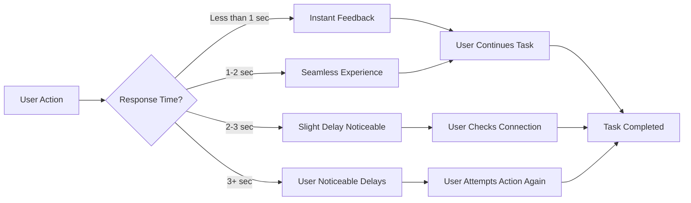

# Performance Requirements for Multi-User Todo Application

## Introduction

This document specifies clear performance expectations for the Multi-User Todo Application from the user's perspective. These requirements are designed to ensure that the application delivers a seamless, responsive experience that meets user expectations for productivity-focused applications.

## Response Time Requirements

### Core User Actions

WHEN a user performs an action such as creating a new todo, THE system SHALL respond with visible feedback within 1 second.

WHEN a user views their todo list, THE system SHALL display the first page of todos with full information (title, completion status, date information) within 2 seconds.

WHEN a user filters their todo list (by completion status, date, etc.), THE system SHALL display the filtered results within 1.5 seconds on average.

WHEN a user marks a todo as complete or incomplete, THE system SHALL update the display without user waiting (instantly perceived).

WHEN a user edits a todo's title, description, or dates, THE system SHALL save the changes and update the display within 1 second.

WHEN a user restores a todo from the trash or permanently deletes a todo, THE system SHALL provide confirmation without noticeable delay.

### Data Loading Considerations

WHEN viewing a user's todos where the number of todos reaches 100, THE system SHALL display the initial page of results within 2.5 seconds.

WHEN a user navigates to the trash (which may contain up to 300 items), THE system SHALL display the initial page of trash items within 3 seconds.

WHEN a user filters by a date range with 100+ todos in the range, THE system SHALL return the results within 2 seconds.

### Edge Cases and Special Handling

WHEN a user is viewing a todo list with very large descriptions (1000+ characters), THE system SHALL display the title, status, and dates within 1 second, with the full description loading in the background without interrupting the user experience.

WHEN a user's connection speed is slow (e.g., 3G network), THE system SHALL provide visual feedback indicating progress and maintain a responsive experience, with initial todo items loading within 4 seconds.

## Throughput Expectations

### Standard Usage

THE system SHALL maintain smooth performance for up to 100 concurrent users on standard hardware configurations without noticeable slowdown.

THE system SHALL handle 500 todo creation/editing operations per minute with no user-visible delays, maintaining the 1-second response time requirement.

### Peak Usage

THE system SHALL support temporary spikes to 300 concurrent users during typical work hours (9:00-17:00) while maintaining response times under 2 seconds.

THE system SHALL handle 2000 operation requests per minute for a period of 15 minutes without degradation in performance (keeping response times under user experience thresholds).

### Data Processing

WHEN processing the edit history of a single todo with 50+ edits, THE system SHALL generate a paginated view within 2 seconds on the user's device.

WHEN a user restores a complete todo (with all previous edit history) from the trash, THE system SHALL load the complete history within 1.5 seconds.

## Scalability Goals

### Initial Deployment

THE system SHALL operate efficiently on standard AWS server instances (e.g., t3.medium) supporting up to 500 users with no performance degradation.

### Growth Phase 1 (First Year)

THE system SHALL scale horizontally to support up to 5,000 users with the same user experience performance standards (1-2 second response times).

THE system SHALL maintain performance during typical usage patterns, even with growth to 1,000 new users per month.

### Growth Phase 2 (Two Years)

THE system SHALL scale to support up to 50,000 users within a reasonable timeframe (2-3 months of planning and deployment), without requiring significant changes to the core application architecture.

THE system SHALL automatically scale to meet demand during known peak usage periods (e.g., start of work week, project due dates), maintaining response times under 2 seconds for 95% of user actions.

## Error Rate Targets

### User Error Handling

THE system SHALL respond to invalid input (e.g., empty title on todo creation) with immediate visible feedback within 0.5 seconds.

THE system SHALL provide helpful error messages for 99% of error conditions that occur during normal user operation.

### System Error Tolerance

THE system SHALL experience no more than 2% of actions failing to complete with an error state under normal load conditions (50 concurrent users).

THE system SHALL recover from transient errors (like network interruptions during API calls) for 98% of user actions without requiring user re-attempt.

### Availability Requirements

THE system SHALL maintain at least 99.9% uptime during standard business hours (8:00-18:00 UTC) to ensure users can access their todo lists without interruption.

WHEN the system encounters an error during critical actions (deletion, restoration), THE system SHALL provide a clear alternative action path or recovery option to the user.

## User Experience Performance Summary

The Multi-User Todo Application must deliver an experience that feels instantly responsive and reliable for users. Performance expectations are defined through user experience rather than technical measurements. All performance criteria described here should be interpreted through the lens of user perception, focusing on 'feeling responsive' to the user rather than specific technical metrics.

## Mermaid Diagram: User Experience Performance Flow

## Testing and Validation

WHEN developers implement performance features, THE system SHALL provide measurable user experience metrics to validate that performance expectations are met.

THE system SHALL provide a performance dashboard for the engineering team to monitor performance against requirements (response times, error rates, etc.).

## Business Impact

Meeting these performance expectations is critical for user adoption and retention in a productivity-focused application. Users who experience slow performance are likely to abandon the application in favor of alternatives.