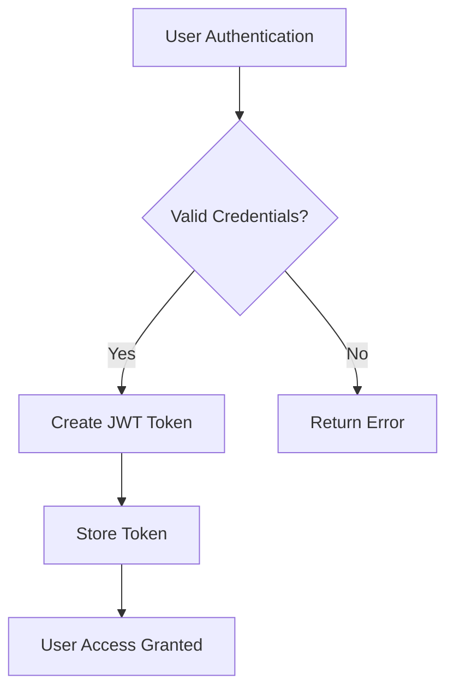
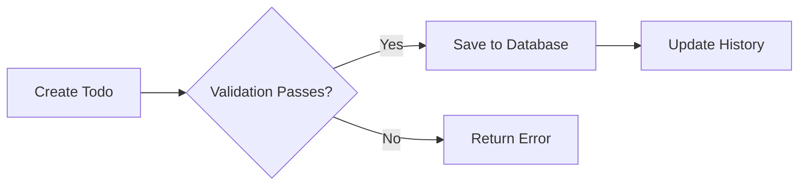

# Multi-User Todo Application Requirements

## 1. User Account Management

### Registration and Authentication

WHEN a user attempts to sign up, THE system SHALL require:
- A valid email address format
- A password meeting complexity requirements (min 12 characters, uppercase, lowercase, numbers, special characters)
- Confirmation of the password

THE system SHALL send a confirmation email with a validation link.

WHEN a user submits login credentials, THE system SHALL verify:
- Email exists in the system
- Password matches the stored hash
- Account is not locked due to security events

IF login fails, THEN THE system SHALL return HTTP 401 Unauthorized with error code CREDENTIALS_INVALID.

### Password Management

WHEN a user requests password change, THE system SHALL require:
- Current password verification
- A new password meeting complexity requirements
- Confirmation of the new password

THE system SHALL prevent password reuse within the last 5 iterations.

WHEN a user deletes their account, THE system SHALL:
- Permanently delete all todos and associated data
- Remove user profile information including display name
- Invalidate all active sessions
- Delete user-specific entries from audit logs

## 2. User Profile Management

### Profile Requirements

WHEN a user creates an account, THE system SHALL store a display name as an optional attribute.

THE user SHALL have the ability to edit their display name within the profile settings.

### Privacy Enforcement

WHEN a user retrieves their profile, THE system SHALL return only the user's own profile data.

IF a user attempts to access another user's profile, THEN THE system SHALL return HTTP 403 Forbidden with error code PROFILE_ACCESS_DENIED.

## 3. Todo Creation

### Core Requirements

WHEN a user creates a new todo, THE system SHALL require:
- Title (must be at least 1 character)
- Optional description
- Optional start date
- Optional due date

THE system SHALL automatically set new todos as incomplete by default.

### Validation Rules

WHEN a todo creation request contains an invalid start date, THE system SHALL reject it with HTTP 400 Bad Request and error code INVALID_DATE_FORMAT.

WHEN a due date precedes the start date, THE system SHALL reject it with HTTP 400 Bad Request and error code DUE_DATE_EARLIER_THAN_START.

## 4. Todo Management

### Viewing and Filtering

WHEN a user requests their todo list, THE system SHALL return paginated results with:
- Title
- Completion status
- Start date (if set)
- Due date (if set)
- Creation date

THE user SHALL be able to filter by:
- All todos
- Only completed todos
- Only incomplete todos

### Sorting Capabilities

WHEN a user sorts by creation date, THE system SHALL accept "newest first" or "oldest first".

WHEN sorting by start date, THE system SHALL place todos without start dates at the end of results.

WHEN sorting by due date, THE system SHALL place todos without due dates at the end of results.

## 5. Todo Editing

### Real-time Editing

WHEN a user edits a todo, THE system SHALL record:
- The timestamp of the edit
- Any changes to title, description, start date, or due date

THE system SHALL automatically update the todo's history entry count.

### History Preservation

WHEN a user edits a todo, THE system SHALL not modify existing history entries.

THE history SHALL include all changes, with entries sorted from most recent to oldest.

## 6. Trash Management

### Soft Deletion

WHEN a user deletes a todo, THE system SHALL:
- Mark it as deleted
- Remove it from the main todo list
- Preserve all history entries

THE system SHALL provide a trash view accessible through a dedicated endpoint.

### Restoration and Permanent Deletion

WHEN a user restores a todo from trash, THE system SHALL:
- Move it back to the normal todo list
- Restore its completion status
- Preserve all history entries

WHEN a user permanently deletes a todo from trash, THE system SHALL:
- Remove all data associated with the todo
- Delete its history entries
- Update all related counts

## 7. Privacy Requirements

### Data Isolation

THE system SHALL guarantee that each user's todos are completely private and isolated from other users.

WHEN a user access any todo data, THE system SHALL verify the requesting user matches the todo's owner before returning results.

IF a data access request attempts to circumvent isolation, THEN THE system SHALL return HTTP 403 Forbidden with error code PRIVACY_VIOLATION.

### Audit Requirements

WHEN a user performs security-relevant actions (delete, edit, auth), THE system SHALL log:
- Timestamp
- User ID
- Action performed
- IP address
- Device information

Audit logs SHALL be maintained for a minimum of 90 days with write-once storage to prevent tampering.

## 8. Performance Requirements

### Pagination

THE system SHALL implement paginated results with:
- Default page size of 10 items
- Maximum page size of 50 items
- Offset-based paging

WHEN a user requests an invalid page number, THE system SHALL return HTTP 400 Bad Request with error code INVALID_PAGE_NUMBER.

### Response Time

THE system SHALL return typical todo list requests within 300ms for 95% of successful requests under normal load.

WHEN processing large datasets (over 1000 todos), THE system SHALL return partial results within 500ms.

## Mermaid Diagrams

## Critical Compliance Summary

| Requirement | Type | Enforced | Failure Consequence |
|-------------|------|----------|---------------------|
| Data Isolation | Privacy | Strict | HTTP 403 Forbidden |
| Password Policies | Security | Mandatory | Account lock after 5 failed attempts |
| Audit Logging | Security | Comprehensive | 90-day log retention |
| Todo Deletion | Privacy | Complete | All user data removed permanently |
| Pagination | Performance | Standard | HTTP 400 for invalid requests |